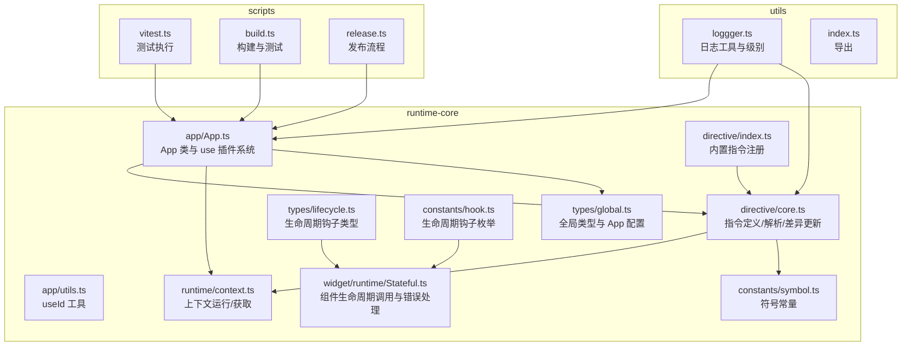
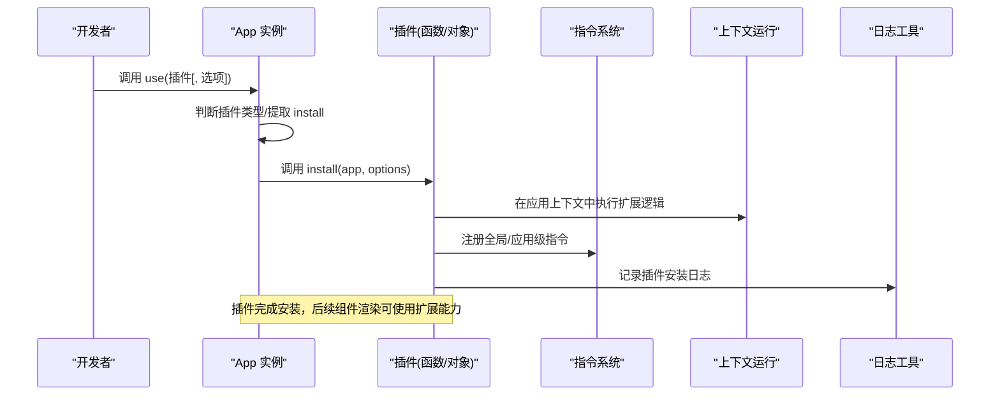
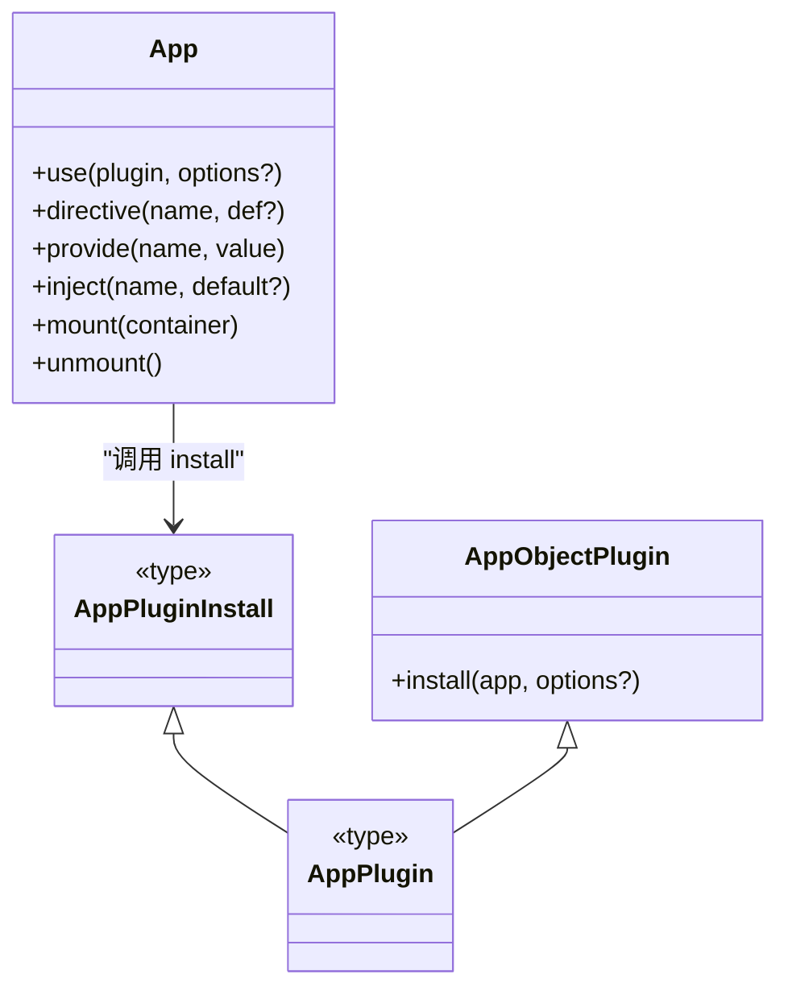
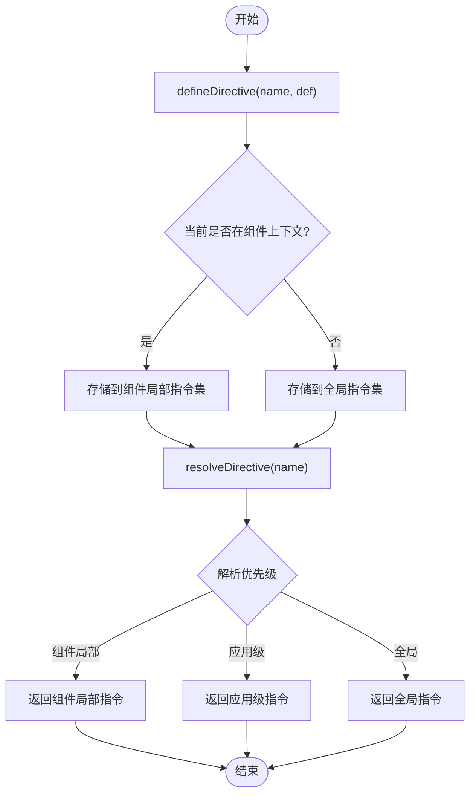
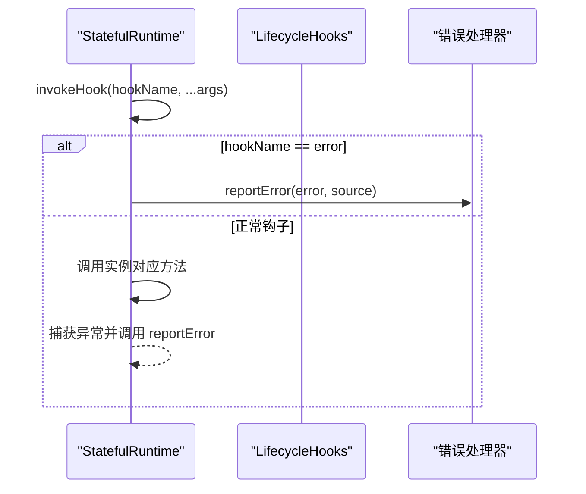
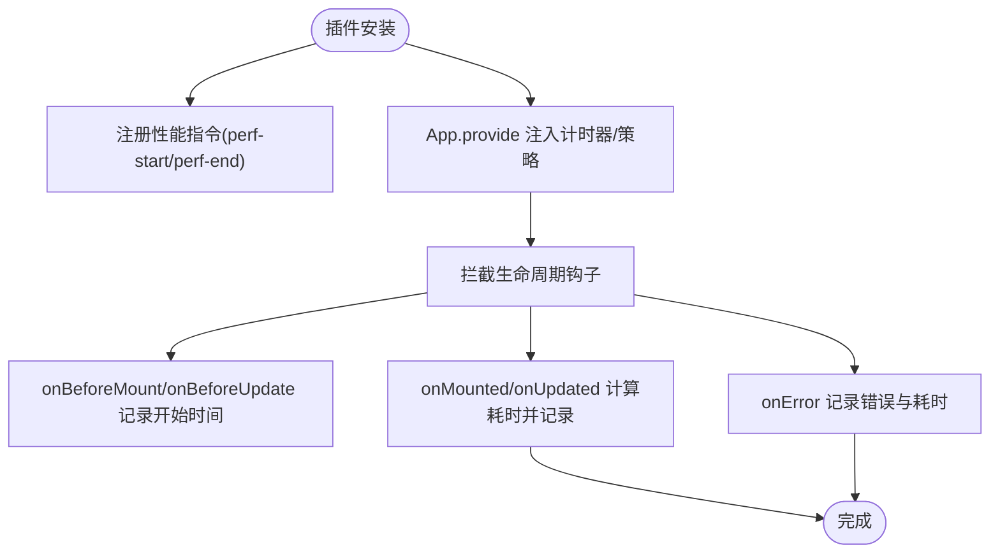
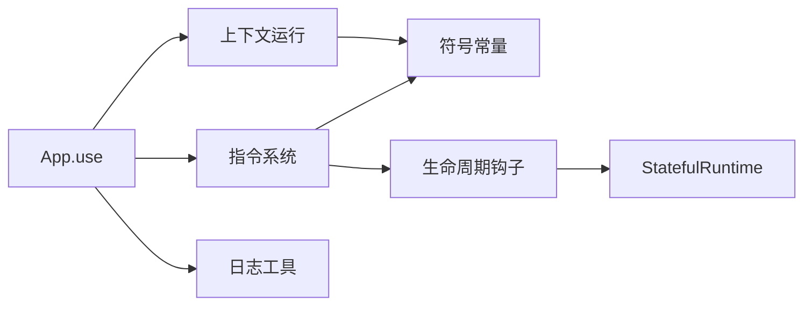

# 插件开发

<cite>
**本文引用的文件**
- [packages/runtime-core/src/app/App.ts](file://packages/runtime-core/src/app/App.ts)
- [packages/runtime-core/src/app/utils.ts](file://packages/runtime-core/src/app/utils.ts)
- [packages/runtime-core/src/types/global.ts](file://packages/runtime-core/src/types/global.ts)
- [packages/runtime-core/src/constants/symbol.ts](file://packages/runtime-core/src/constants/symbol.ts)
- [packages/runtime-core/src/directive/core.ts](file://packages/runtime-core/src/directive/core.ts)
- [packages/runtime-core/src/directive/index.ts](file://packages/runtime-core/src/directive/index.ts)
- [packages/runtime-core/src/runtime/context.ts](file://packages/runtime-core/src/runtime/context.ts)
- [packages/runtime-core/src/types/lifecycle.ts](file://packages/runtime-core/src/types/lifecycle.ts)
- [packages/runtime-core/src/constants/hook.ts](file://packages/runtime-core/src/constants/hook.ts)
- [packages/runtime-core/src/widget/runtime/Stateful.ts](file://packages/runtime-core/src/widget/runtime/Stateful.ts)
- [packages/utils/src/loggger.ts](file://packages/utils/src/loggger.ts)
- [packages/utils/src/index.ts](file://packages/utils/src/index.ts)
- [scripts/vitest.ts](file://scripts/vitest.ts)
- [scripts/build.ts](file://scripts/build.ts)
- [scripts/release.ts](file://scripts/release.ts)
- [packages/runtime-core/__tests__/app/App.test.ts](file://packages/runtime-core/__tests__/app/App.test.ts)
- [packages/runtime-core/__tests__/directive/core.test.ts](file://packages/runtime-core/__tests__/directive/core.test.ts)
- [packages/runtime-core/__tests__/constants/constants.test.ts](file://packages/runtime-core/__tests__/constants/constants.test.ts)
</cite>

## 目录
1. [简介](#简介)
2. [项目结构](#项目结构)
3. [核心组件](#核心组件)
4. [架构总览](#架构总览)
5. [详细组件分析](#详细组件分析)
6. [依赖分析](#依赖分析)
7. [性能考虑](#性能考虑)
8. [故障排查指南](#故障排查指南)
9. [结论](#结论)
10. [附录](#附录)

## 简介
本指南围绕 Vitarx 的插件系统，系统讲解 App 实例的 use 方法如何注册插件、install 函数的设计模式；如何通过全局 API（全局组件、指令、mixin）扩展框架能力；并给出一个基于生命周期钩子的性能监控日志插件实现思路。文档还涵盖插件类型定义、依赖管理与加载顺序控制、命名冲突规避、测试策略与发布规范，帮助 TypeScript 用户获得良好的类型推导与工程实践。

## 项目结构
Vitarx 采用多包工作区组织，插件系统主要位于 runtime-core 包中，配合 utils 提供日志能力，scripts 提供测试与发布脚本。

图表来源
- [packages/runtime-core/src/app/App.ts](file://packages/runtime-core/src/app/App.ts#L1-L394)
- [packages/runtime-core/src/app/utils.ts](file://packages/runtime-core/src/app/utils.ts#L1-L40)
- [packages/runtime-core/src/directive/core.ts](file://packages/runtime-core/src/directive/core.ts#L1-L329)
- [packages/runtime-core/src/directive/index.ts](file://packages/runtime-core/src/directive/index.ts#L1-L7)
- [packages/runtime-core/src/runtime/context.ts](file://packages/runtime-core/src/runtime/context.ts#L1-L52)
- [packages/runtime-core/src/types/lifecycle.ts](file://packages/runtime-core/src/types/lifecycle.ts#L1-L139)
- [packages/runtime-core/src/constants/hook.ts](file://packages/runtime-core/src/constants/hook.ts#L1-L16)
- [packages/runtime-core/src/types/global.ts](file://packages/runtime-core/src/types/global.ts#L1-L242)
- [packages/runtime-core/src/constants/symbol.ts](file://packages/runtime-core/src/constants/symbol.ts#L1-L39)
- [packages/runtime-core/src/widget/runtime/Stateful.ts](file://packages/runtime-core/src/widget/runtime/Stateful.ts#L153-L237)
- [packages/utils/src/loggger.ts](file://packages/utils/src/loggger.ts#L1-L230)
- [packages/utils/src/index.ts](file://packages/utils/src/index.ts#L1-L8)
- [scripts/vitest.ts](file://scripts/vitest.ts#L92-L133)
- [scripts/build.ts](file://scripts/build.ts#L175-L211)
- [scripts/release.ts](file://scripts/release.ts#L1-L230)

章节来源
- [packages/runtime-core/src/app/App.ts](file://packages/runtime-core/src/app/App.ts#L1-L394)
- [packages/runtime-core/src/types/global.ts](file://packages/runtime-core/src/types/global.ts#L1-L242)

## 核心组件
- App 类与 use 插件系统：提供插件安装入口，支持函数式与对象式插件，支持可选/必填配置选项。
- 指令系统：defineDirective/resolveDirective/withDirectives，支持组件局部、应用级与全局指令，以及差异更新。
- 生命周期与错误处理：LifecycleHooks 枚举、LifecycleHookNames/LifecycleHookMethods 类型、Stateful 组件的 invokeHook 与错误上报。
- 上下文运行：runInAppContext/getAppContext/runInNodeContext/getCurrentVNode，支撑插件在应用/节点上下文中执行。
- 日志工具：logger 提供统一日志输出，支持级别与源码位置信息。
- 工具函数：useId 生成应用内唯一 ID，受 app.config.idPrefix 控制。

章节来源
- [packages/runtime-core/src/app/App.ts](file://packages/runtime-core/src/app/App.ts#L1-L394)
- [packages/runtime-core/src/directive/core.ts](file://packages/runtime-core/src/directive/core.ts#L1-L329)
- [packages/runtime-core/src/runtime/context.ts](file://packages/runtime-core/src/runtime/context.ts#L1-L52)
- [packages/runtime-core/src/types/lifecycle.ts](file://packages/runtime-core/src/types/lifecycle.ts#L1-L139)
- [packages/runtime-core/src/constants/hook.ts](file://packages/runtime-core/src/constants/hook.ts#L1-L16)
- [packages/utils/src/loggger.ts](file://packages/utils/src/loggger.ts#L1-L230)
- [packages/runtime-core/src/app/utils.ts](file://packages/runtime-core/src/app/utils.ts#L1-L40)

## 架构总览
插件系统通过 App.use 将插件安装到应用实例，插件在安装时可注册全局指令、组件、mixin 等扩展点。指令系统支持多级解析优先级（组件局部 > 应用级 > 全局），并通过差异更新高效处理指令变更。生命周期钩子贯穿组件渲染与更新过程，错误处理统一由组件运行时处理。

图表来源
- [packages/runtime-core/src/app/App.ts](file://packages/runtime-core/src/app/App.ts#L338-L392)
- [packages/runtime-core/src/directive/core.ts](file://packages/runtime-core/src/directive/core.ts#L1-L191)
- [packages/runtime-core/src/runtime/context.ts](file://packages/runtime-core/src/runtime/context.ts#L1-L27)
- [packages/utils/src/loggger.ts](file://packages/utils/src/loggger.ts#L1-L230)

## 详细组件分析

### App.use 插件系统与 install 设计模式
- 支持三种插件形态：
  - 函数式插件：install(app, options?)，options 可选。
  - 对象式插件：{ install(app, options?) }。
  - 必填配置插件：install(app, options) 且 options 必填。
- 安装流程：
  - 校验插件非空与 install 类型。
  - 调用 install(this, options!)，this 指向 App 实例。
- 类型定义：
  - AppPluginInstall<T>：三类 install 的联合类型。
  - AppObjectPlugin<T>：包含 install 的对象式插件。
  - AppPlugin<T>：函数式或对象式插件的联合类型。

图表来源
- [packages/runtime-core/src/app/App.ts](file://packages/runtime-core/src/app/App.ts#L22-L60)
- [packages/runtime-core/src/app/App.ts](file://packages/runtime-core/src/app/App.ts#L338-L392)

章节来源
- [packages/runtime-core/src/app/App.ts](file://packages/runtime-core/src/app/App.ts#L22-L60)
- [packages/runtime-core/src/app/App.ts](file://packages/runtime-core/src/app/App.ts#L338-L392)
- [packages/runtime-core/__tests__/app/App.test.ts](file://packages/runtime-core/__tests__/app/App.test.ts#L195-L228)

### 全局 API 扩展：全局组件、指令、mixin
- 全局指令：
  - defineDirective：将指令定义到当前 VNode 上下文，若在有状态组件上下文中则存储于组件局部指令集，否则存储于全局指令集。
  - resolveDirective：按“组件局部 > 应用级 > 全局”的优先级解析指令。
  - withDirectives：为 VNode 添加指令，支持指令、值、参数的组合。
  - diffDirectives：比较新旧节点指令差异，触发 beforeMount/mounted/beforeUpdate/updated/beforeUnmount/unmounted 等钩子。
- 应用级指令注册：
  - App.directive(name, def)：注册应用级指令，供后续组件解析使用。
- 全局组件与 mixin：
  - 通过 App.provide/inject 提供全局数据与能力，结合组件生命周期钩子实现全局 mixin 效果（例如在 onMounted/onBeforeMount 中注入行为）。

图表来源
- [packages/runtime-core/src/directive/core.ts](file://packages/runtime-core/src/directive/core.ts#L1-L191)
- [packages/runtime-core/src/app/App.ts](file://packages/runtime-core/src/app/App.ts#L280-L336)

章节来源
- [packages/runtime-core/src/directive/core.ts](file://packages/runtime-core/src/directive/core.ts#L1-L329)
- [packages/runtime-core/src/app/App.ts](file://packages/runtime-core/src/app/App.ts#L280-L336)
- [packages/runtime-core/src/directive/index.ts](file://packages/runtime-core/src/directive/index.ts#L1-L7)

### 生命周期钩子与错误处理
- 生命周期钩子枚举：LifecycleHooks 定义了完整的钩子名称集合。
- 生命周期钩子类型：LifecycleHookNames/LifecycleHookMethods 与参数/返回值类型定义，确保类型安全。
- 组件运行时：Stateful.invokeHook 统一调用生命周期钩子，捕获异常并交由 reportError 处理，保证错误传播与恢复。

图表来源
- [packages/runtime-core/src/constants/hook.ts](file://packages/runtime-core/src/constants/hook.ts#L1-L16)
- [packages/runtime-core/src/types/lifecycle.ts](file://packages/runtime-core/src/types/lifecycle.ts#L1-L139)
- [packages/runtime-core/src/widget/runtime/Stateful.ts](file://packages/runtime-core/src/widget/runtime/Stateful.ts#L153-L237)

章节来源
- [packages/runtime-core/src/constants/hook.ts](file://packages/runtime-core/src/constants/hook.ts#L1-L16)
- [packages/runtime-core/src/types/lifecycle.ts](file://packages/runtime-core/src/types/lifecycle.ts#L1-L139)
- [packages/runtime-core/src/widget/runtime/Stateful.ts](file://packages/runtime-core/src/widget/runtime/Stateful.ts#L153-L237)

### 日志插件实现示例（性能监控）
目标：通过拦截组件生命周期钩子，统计渲染/更新耗时并记录日志，辅助性能监控。

实现思路（步骤说明，不包含具体代码）：
- 在插件 install 中：
  - 注册全局指令（如 perf-start/perf-end）用于标记关键阶段。
  - 使用 App.provide 注入性能计时器与采样策略。
- 在组件生命周期钩子：
  - onBeforeMount/onBeforeUpdate：记录开始时间戳。
  - onMounted/onUpdated：计算耗时并调用 logger 输出。
  - onError：记录错误来源与耗时，便于定位瓶颈。
- 指令差异更新：
  - 使用 diffDirectives 的 only/skip 控制仅对 perf 相关指令进行差异更新，减少无关指令开销。
- 日志级别：
  - 生产环境默认 ERROR，开发环境 DEBUG，可通过 logger.setConfig 调整。

图表来源
- [packages/runtime-core/src/directive/core.ts](file://packages/runtime-core/src/directive/core.ts#L193-L301)
- [packages/utils/src/loggger.ts](file://packages/utils/src/loggger.ts#L1-L230)
- [packages/runtime-core/src/widget/runtime/Stateful.ts](file://packages/runtime-core/src/widget/runtime/Stateful.ts#L153-L237)

章节来源
- [packages/runtime-core/src/directive/core.ts](file://packages/runtime-core/src/directive/core.ts#L193-L301)
- [packages/utils/src/loggger.ts](file://packages/utils/src/loggger.ts#L1-L230)
- [packages/runtime-core/src/widget/runtime/Stateful.ts](file://packages/runtime-core/src/widget/runtime/Stateful.ts#L153-L237)

### 类型定义与 TypeScript 推导
- AppPluginInstall<T>/AppObjectPlugin<T>/AppPlugin<T>：确保插件 install 的类型安全与可选配置推导。
- AppConfig：包含 errorHandler 与 idPrefix，影响 useId 生成的前缀。
- 生命周期钩子类型：LifecycleHookNames/LifecycleHookMethods、参数与返回值类型，保障 onMounted/onBeforeUpdate 等钩子的类型安全。
- 全局类型：Vitarx.AppConfig、JSX.ElementType 等，确保 TS 能正确识别全局扩展。

章节来源
- [packages/runtime-core/src/app/App.ts](file://packages/runtime-core/src/app/App.ts#L22-L60)
- [packages/runtime-core/src/types/global.ts](file://packages/runtime-core/src/types/global.ts#L161-L178)
- [packages/runtime-core/src/types/lifecycle.ts](file://packages/runtime-core/src/types/lifecycle.ts#L1-L139)

### 插件间依赖管理与加载顺序
- 加载顺序：App.use 的调用顺序即为插件安装顺序。建议将基础能力（如日志、错误处理）置于更早位置，业务插件在其后。
- 依赖声明：插件应在 install 中显式注册所需扩展（指令、provide 等），并在文档中声明前置依赖。
- 命名冲突规避：
  - 指令：优先使用组件局部指令，其次应用级，最后全局；通过 resolveDirective 的优先级避免冲突。
  - provide/inject：使用 Symbol 作为键名，或约定前缀，降低命名碰撞风险。
  - useId：通过 app.config.idPrefix 与全局前缀控制 ID 前缀，避免跨应用冲突。

章节来源
- [packages/runtime-core/src/directive/core.ts](file://packages/runtime-core/src/directive/core.ts#L174-L191)
- [packages/runtime-core/src/app/utils.ts](file://packages/runtime-core/src/app/utils.ts#L1-L40)
- [packages/runtime-core/src/types/global.ts](file://packages/runtime-core/src/types/global.ts#L161-L178)

## 依赖分析
- App.use 依赖：
  - 指令系统：通过 App.directive 注册应用级指令，供 resolveDirective 解析。
  - 上下文运行：runInAppContext/getAppContext 保证插件在应用上下文中执行。
  - 日志工具：logger 用于插件安装与运行时日志输出。
- 指令系统依赖：
  - 符号常量：APP_CONTEXT_SYMBOL/VNODE_CONTEXT_SYMBOL 用于上下文标识。
  - 生命周期钩子：diffDirectives 触发指令生命周期钩子。
- 组件生命周期依赖：
  - invokeHook 统一调用生命周期钩子，错误处理通过 reportError。

图表来源
- [packages/runtime-core/src/app/App.ts](file://packages/runtime-core/src/app/App.ts#L338-L392)
- [packages/runtime-core/src/directive/core.ts](file://packages/runtime-core/src/directive/core.ts#L1-L329)
- [packages/runtime-core/src/runtime/context.ts](file://packages/runtime-core/src/runtime/context.ts#L1-L52)
- [packages/runtime-core/src/constants/symbol.ts](file://packages/runtime-core/src/constants/symbol.ts#L1-L39)
- [packages/runtime-core/src/widget/runtime/Stateful.ts](file://packages/runtime-core/src/widget/runtime/Stateful.ts#L153-L237)

章节来源
- [packages/runtime-core/src/app/App.ts](file://packages/runtime-core/src/app/App.ts#L338-L392)
- [packages/runtime-core/src/directive/core.ts](file://packages/runtime-core/src/directive/core.ts#L1-L329)
- [packages/runtime-core/src/runtime/context.ts](file://packages/runtime-core/src/runtime/context.ts#L1-L52)
- [packages/runtime-core/src/constants/symbol.ts](file://packages/runtime-core/src/constants/symbol.ts#L1-L39)
- [packages/runtime-core/src/widget/runtime/Stateful.ts](file://packages/runtime-core/src/widget/runtime/Stateful.ts#L153-L237)

## 性能考虑
- 指令差异更新：diffDirectives 支持 only/skip，仅对必要指令进行更新，减少不必要的钩子调用。
- 生命周期钩子批处理：Stateful.update 通过调度器异步批量更新，避免重复渲染。
- 日志级别控制：生产环境默认 ERROR，降低日志输出对性能的影响；开发环境 DEBUG 便于定位问题。
- useId：在组件上下文内独立计数，避免全局竞争带来的额外开销。

章节来源
- [packages/runtime-core/src/directive/core.ts](file://packages/runtime-core/src/directive/core.ts#L193-L301)
- [packages/runtime-core/src/widget/runtime/Stateful.ts](file://packages/runtime-core/src/widget/runtime/Stateful.ts#L196-L237)
- [packages/utils/src/loggger.ts](file://packages/utils/src/loggger.ts#L1-L230)
- [packages/runtime-core/src/app/utils.ts](file://packages/runtime-core/src/app/utils.ts#L1-L40)

## 故障排查指南
- 插件安装失败：
  - 确认插件非空且 install 为函数；参考 App.use 的类型约束与错误抛出。
- 指令解析失败：
  - resolveDirective 会在未找到时发出警告；检查指令注册顺序与名称。
- 生命周期钩子报错：
  - Stateful.invokeHook 捕获异常并调用 reportError；检查 onError 钩子返回值与错误来源。
- 日志输出不符合预期：
  - 检查 logger.setConfig 的 level 与 includeSourceInfo；确认运行环境变量 DEV。

章节来源
- [packages/runtime-core/src/app/App.ts](file://packages/runtime-core/src/app/App.ts#L376-L392)
- [packages/runtime-core/src/directive/core.ts](file://packages/runtime-core/src/directive/core.ts#L174-L191)
- [packages/runtime-core/src/widget/runtime/Stateful.ts](file://packages/runtime-core/src/widget/runtime/Stateful.ts#L153-L194)
- [packages/utils/src/loggger.ts](file://packages/utils/src/loggger.ts#L1-L230)

## 结论
Vitarx 的插件系统以 App.use 为核心，结合指令系统与生命周期钩子，提供了强大的全局扩展能力。通过明确的类型定义、上下文运行与日志工具，插件开发者可以在保证类型安全的前提下，实现全局组件、指令、mixin 等扩展，并通过性能监控插件提升可观测性。遵循加载顺序与命名冲突规避策略，可有效管理插件依赖与运行时行为。

## 附录

### 测试策略
- 单元测试：
  - 插件系统：验证 use 的函数式/对象式插件与配置选项传递。
  - 指令系统：验证 defineDirective/resolveDirective/withDirectives 的行为与差异更新。
  - 生命周期常量：验证 LifecycleHooks 枚举与名称一致性。
- 执行方式：通过 scripts/vitest.ts 与 scripts/build.ts 统一执行测试与覆盖率统计。

章节来源
- [packages/runtime-core/__tests__/app/App.test.ts](file://packages/runtime-core/__tests__/app/App.test.ts#L195-L228)
- [packages/runtime-core/__tests__/directive/core.test.ts](file://packages/runtime-core/__tests__/directive/core.test.ts#L1-L187)
- [packages/runtime-core/__tests__/constants/constants.test.ts](file://packages/runtime-core/__tests__/constants/constants.test.ts#L50-L86)
- [scripts/vitest.ts](file://scripts/vitest.ts#L92-L133)
- [scripts/build.ts](file://scripts/build.ts#L175-L211)

### 发布规范
- 发布流程：scripts/release.ts 负责版本校验、登录检查、打包、发布与推送。
- 建议：
  - 先在本地执行测试与构建，确保 __tests__/tests 目录存在并可通过 vitest 运行。
  - 发布前检查 CHANGELOG 与 package.json 版本号，遵循语义化版本。

章节来源
- [scripts/release.ts](file://scripts/release.ts#L1-L230)
- [scripts/build.ts](file://scripts/build.ts#L175-L211)