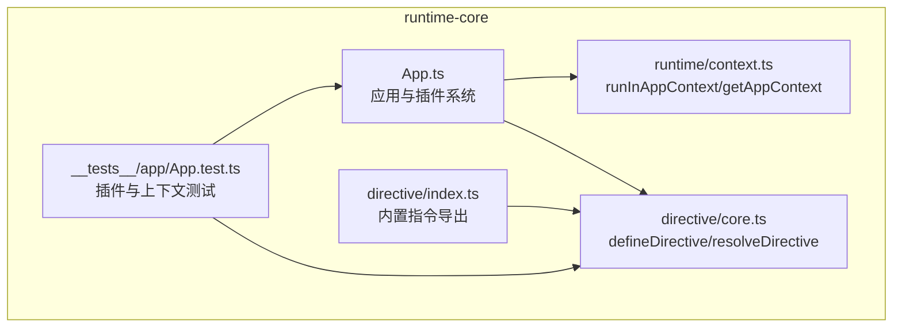
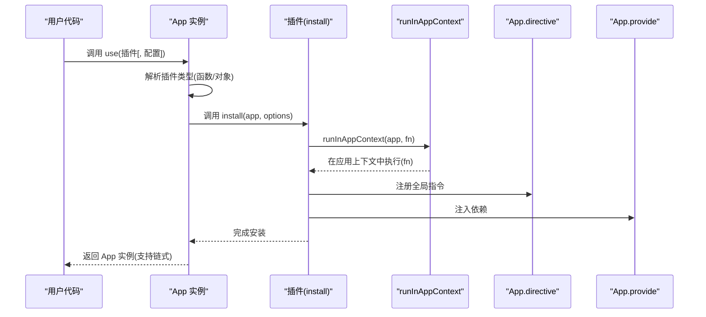
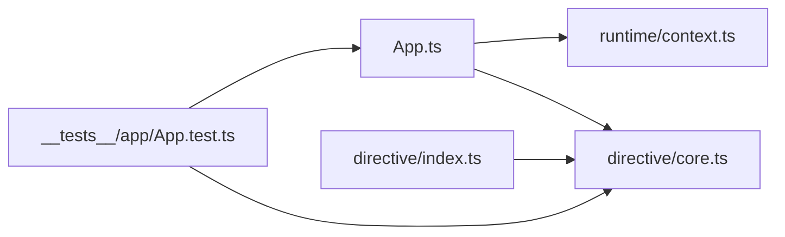

# install 函数实现

<cite>
**本文引用的文件**
- [App.ts](file://packages/runtime-core/src/app/App.ts)
- [context.ts](file://packages/runtime-core/src/runtime/context.ts)
- [index.ts](file://packages/runtime-core/src/directive/index.ts)
- [core.ts](file://packages/runtime-core/src/directive/core.ts)
- [App.test.ts](file://packages/runtime-core/__tests__/app/App.test.ts)
</cite>

## 目录
1. [引言](#引言)
2. [项目结构](#项目结构)
3. [核心组件](#核心组件)
4. [架构总览](#架构总览)
5. [详细组件分析](#详细组件分析)
6. [依赖关系分析](#依赖关系分析)
7. [性能考量](#性能考量)
8. [故障排查指南](#故障排查指南)
9. [结论](#结论)
10. [附录](#附录)

## 引言
本文件围绕插件系统中的 install 函数设计与实现进行深入解析，重点说明：
- install 函数必须接收 App 实例作为第一个参数，并可选地接收配置对象
- 如何在 install 函数内部通过 app.directive() 注册全局指令、通过 app.provide() 注入依赖、或扩展全局 API
- 通过 runInAppContext 确保代码在正确的应用上下文中运行
- install 函数的副作用管理及其与应用生命周期的关系

为便于理解，本文提供一个“路由插件”的完整示例思路：在 install 中注册 <RouterView> 组件和 v-link 指令，并说明如何在插件中安全地使用应用上下文。

## 项目结构
本仓库采用多包结构，与插件 install 相关的关键文件位于 runtime-core 包中：
- 应用核心：App 类及插件系统
- 运行时上下文：runInAppContext、getAppContext
- 指令系统：defineDirective、resolveDirective、withDirectives
- 测试：对 App.use、directive、provide 等行为进行验证

图表来源
- [App.ts](file://packages/runtime-core/src/app/App.ts#L1-L394)
- [context.ts](file://packages/runtime-core/src/runtime/context.ts#L1-L52)
- [index.ts](file://packages/runtime-core/src/directive/index.ts#L1-L8)
- [core.ts](file://packages/runtime-core/src/directive/core.ts#L1-L329)
- [App.test.ts](file://packages/runtime-core/__tests__/app/App.test.ts#L1-L252)

章节来源
- [App.ts](file://packages/runtime-core/src/app/App.ts#L1-L120)
- [context.ts](file://packages/runtime-core/src/runtime/context.ts#L1-L52)
- [index.ts](file://packages/runtime-core/src/directive/index.ts#L1-L8)
- [core.ts](file://packages/runtime-core/src/directive/core.ts#L1-L120)
- [App.test.ts](file://packages/runtime-core/__tests__/app/App.test.ts#L1-L120)

## 核心组件
- App.use：统一安装插件的入口，支持函数式插件与对象式插件（含 install 方法），并透传配置对象
- App.directive：注册/获取全局指令
- App.provide/inject：应用级依赖注入
- runInAppContext：在应用上下文中执行函数，确保上下文一致性

章节来源
- [App.ts](file://packages/runtime-core/src/app/App.ts#L337-L392)
- [App.ts](file://packages/runtime-core/src/app/App.ts#L235-L336)
- [context.ts](file://packages/runtime-core/src/runtime/context.ts#L1-L27)

## 架构总览
install 函数的执行路径与上下文关系如下：

图表来源
- [App.ts](file://packages/runtime-core/src/app/App.ts#L375-L391)
- [context.ts](file://packages/runtime-core/src/runtime/context.ts#L1-L15)
- [core.ts](file://packages/runtime-core/src/directive/core.ts#L1-L54)

## 详细组件分析

### App.use 与 install 函数签名
- 支持三种插件形态：
  - 无配置插件：(app: App) => void
  - 可选配置插件：(app: App, options?: T) => void
  - 必填配置插件：(app: App, options: T) => void
- 对象式插件需提供 install 方法，签名与上述一致
- App.use 会将 options 透传给 install

章节来源
- [App.ts](file://packages/runtime-core/src/app/App.ts#L22-L36)
- [App.ts](file://packages/runtime-core/src/app/App.ts#L45-L50)
- [App.ts](file://packages/runtime-core/src/app/App.ts#L58-L60)
- [App.ts](file://packages/runtime-core/src/app/App.ts#L337-L391)
- [App.test.ts](file://packages/runtime-core/__tests__/app/App.test.ts#L195-L228)

### install 函数内部的典型操作
- 注册全局指令：通过 app.directive(name, options|fn)
- 注入依赖：通过 app.provide(name, value)，并在组件内通过 app.inject(name, defaultValue) 获取
- 扩展全局 API：可在 install 中向 app 暴露方法或常量（例如路由 API）

章节来源
- [App.ts](file://packages/runtime-core/src/app/App.ts#L235-L336)
- [index.ts](file://packages/runtime-core/src/directive/index.ts#L1-L8)
- [core.ts](file://packages/runtime-core/src/directive/core.ts#L1-L54)

### 示例：路由插件（思路）
- RouterView 组件：在 install 中通过 app.component 或 app.widget 注册（若框架支持全局组件注册），或在插件中提供工厂方法供用户使用
- v-link 指令：在 install 中通过 app.directive('link', ...) 注册，指令内部可读取 appContext 以访问路由状态
- 依赖注入：通过 app.provide('router', routerInstance) 注入路由实例，组件内通过 app.inject('router') 获取

注意：以上为实现思路，具体 API 名称以实际框架能力为准。本节不展示具体代码内容，仅给出可落地的步骤。

### 上下文执行：runInAppContext
- runInAppContext 将函数包裹在应用上下文中执行，确保 getContext/getAppContext 能正确获取 App 实例
- App.runInContext 包装了 runInAppContext，便于在插件中统一使用

章节来源
- [context.ts](file://packages/runtime-core/src/runtime/context.ts#L1-L27)
- [App.ts](file://packages/runtime-core/src/app/App.ts#L225-L234)

### 指令系统与 install 的协作
- defineDirective：在组件上下文中定义指令时，优先写入组件局部缓存；否则写入全局缓存
- resolveDirective：解析指令时按“组件局部 > 应用级 > 全局”顺序查找
- withDirectives：将指令绑定到 VNode，形成指令集合

章节来源
- [core.ts](file://packages/runtime-core/src/directive/core.ts#L1-L120)
- [core.ts](file://packages/runtime-core/src/directive/core.ts#L156-L191)
- [index.ts](file://packages/runtime-core/src/directive/index.ts#L1-L8)

### 生命周期与副作用管理
- App 构造时会为根节点树注入 appContext，确保后续渲染与指令解析能访问应用实例
- 指令的生命周期钩子（mounted/updated/beforeUnmount 等）在节点渲染/更新/卸载时触发
- 在 install 中注册的全局指令与 provide 的副作用，应在应用启动阶段完成，避免在渲染过程中产生不可控的副作用

章节来源
- [App.ts](file://packages/runtime-core/src/app/App.ts#L151-L167)
- [core.ts](file://packages/runtime-core/src/directive/core.ts#L232-L301)

## 依赖关系分析
- App.use 依赖 AppPlugin 类型与 install 签名
- App.directive 依赖 normalizeDirective 与内置指令注册
- runInAppContext 依赖响应式上下文工具，提供上下文隔离与恢复
- 测试用例验证插件安装、指令注册、provide/inject 的行为

图表来源
- [App.ts](file://packages/runtime-core/src/app/App.ts#L1-L120)
- [context.ts](file://packages/runtime-core/src/runtime/context.ts#L1-L27)
- [index.ts](file://packages/runtime-core/src/directive/index.ts#L1-L8)
- [core.ts](file://packages/runtime-core/src/directive/core.ts#L1-L54)
- [App.test.ts](file://packages/runtime-core/__tests__/app/App.test.ts#L1-L120)

章节来源
- [App.ts](file://packages/runtime-core/src/app/App.ts#L1-L120)
- [context.ts](file://packages/runtime-core/src/runtime/context.ts#L1-L27)
- [index.ts](file://packages/runtime-core/src/directive/index.ts#L1-L8)
- [core.ts](file://packages/runtime-core/src/directive/core.ts#L1-L54)
- [App.test.ts](file://packages/runtime-core/__tests__/app/App.test.ts#L1-L120)

## 性能考量
- 指令注册与依赖注入发生在应用启动阶段，避免在渲染热路径上重复注册
- runInAppContext 仅在需要访问上下文时使用，减少不必要的上下文切换
- 指令差异更新（diffDirectives）按需处理，可通过 only/skip 控制更新范围

章节来源
- [core.ts](file://packages/runtime-core/src/directive/core.ts#L232-L301)

## 故障排查指南
- 插件未传入或类型不合法：App.use 会抛出错误，检查插件是否为函数或对象且包含 install 方法
- 指令名称为空：注册指令时会抛出错误，确保指令名非空
- 选择器不存在导致挂载失败：App.mount 在选择器不存在时抛出错误
- 上下文丢失：在插件中需要访问 App 实例时，使用 runInAppContext 包裹逻辑

章节来源
- [App.ts](file://packages/runtime-core/src/app/App.ts#L375-L391)
- [core.ts](file://packages/runtime-core/src/directive/core.ts#L28-L54)
- [App.test.ts](file://packages/runtime-core/__tests__/app/App.test.ts#L115-L123)
- [context.ts](file://packages/runtime-core/src/runtime/context.ts#L1-L15)

## 结论
- install 函数必须接收 App 实例作为第一个参数，可选配置对象，这是插件系统统一的约定
- 在 install 中可通过 app.directive() 注册全局指令、通过 app.provide() 注入依赖、并通过 runInAppContext 确保上下文正确
- 指令解析遵循“组件局部 > 应用级 > 全局”的优先级，生命周期钩子在渲染/更新/卸载时触发
- 建议在应用启动阶段完成 install 的副作用，避免在渲染热路径引入额外开销

## 附录
- 关键 API 路径参考
  - 插件安装入口：[App.use](file://packages/runtime-core/src/app/App.ts#L337-L391)
  - 指令注册/获取：[App.directive](file://packages/runtime-core/src/app/App.ts#L235-L336)
  - 依赖注入：[App.provide/inject](file://packages/runtime-core/src/app/App.ts#L307-L336)
  - 上下文执行：[runInAppContext](file://packages/runtime-core/src/runtime/context.ts#L1-L15)
  - 指令定义与解析：[defineDirective/resolveDirective](file://packages/runtime-core/src/directive/core.ts#L1-L191)
  - 内置指令导出：[directive/index](file://packages/runtime-core/src/directive/index.ts#L1-L8)
  - 行为验证测试：[App.test](file://packages/runtime-core/__tests__/app/App.test.ts#L195-L228)