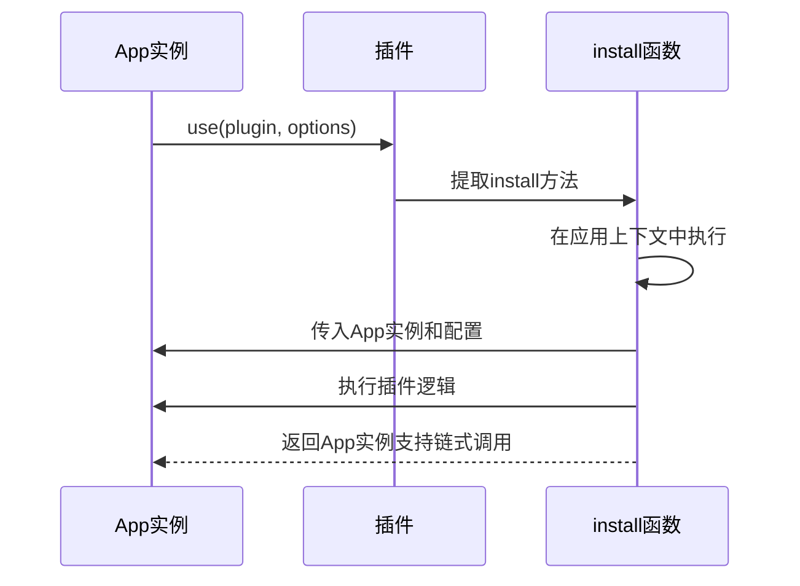
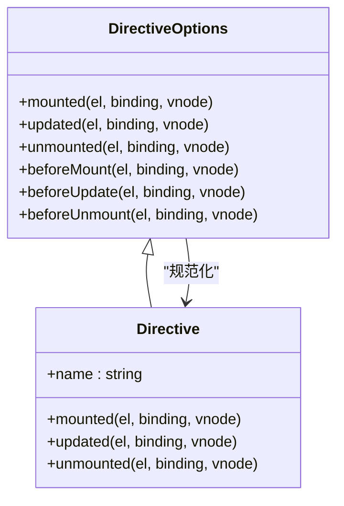
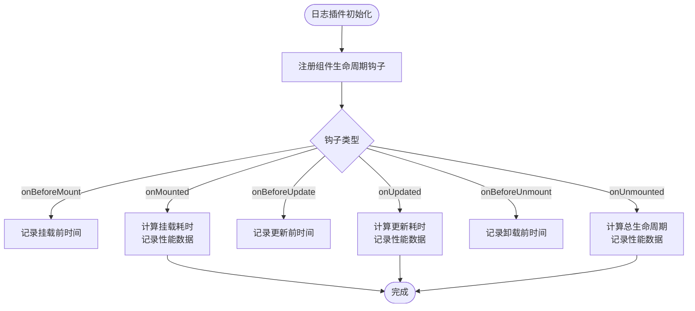
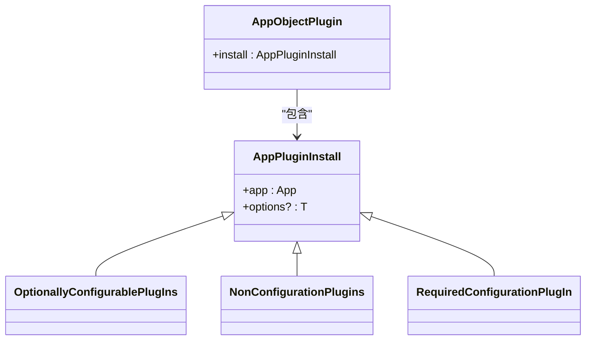
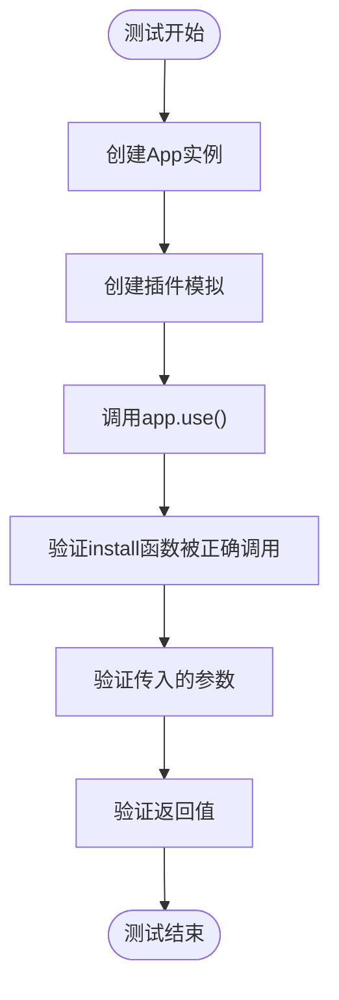

# 插件开发基础

<cite>
**本文档引用的文件**  
- [App.ts](file://packages/runtime-core/src/app/App.ts)
- [global.ts](file://packages/runtime-core/src/types/global.ts)
- [core.ts](file://packages/runtime-core/src/directive/core.ts)
- [loggger.ts](file://packages/utils/src/loggger.ts)
- [Widget.ts](file://packages/runtime-core/src/widget/base/Widget.ts)
- [Stateful.ts](file://packages/runtime-core/src/widget/runtime/Stateful.ts)
- [App.test.ts](file://packages/runtime-core/__tests__/app/App.test.ts)
</cite>

## 目录
1. [插件注册机制](#插件注册机制)
2. [install 函数设计模式](#install-函数设计模式)
3. [全局 API 扩展](#全局-api-扩展)
4. [日志插件实现示例](#日志插件实现示例)
5. [类型定义与 TypeScript 支持](#类型定义与-typescript-支持)
6. [插件依赖与加载顺序](#插件依赖与加载顺序)
7. [命名冲突避免](#命名冲突避免)
8. [测试策略](#测试策略)
9. [发布规范](#发布规范)

## 插件注册机制

Vitarx 框架通过 `App` 实例的 `use` 方法实现插件注册机制。该方法支持函数式插件和对象式插件两种形式，允许开发者通过简单的 API 调用将功能扩展集成到应用中。

`use` 方法提供了三种函数重载，支持不同类型的插件配置：
- 无配置选项的插件
- 有必填配置选项的插件
- 有可选配置选项的插件

当调用 `use` 方法时，框架会检查插件类型，如果是对象形式则提取其 `install` 方法，然后在应用上下文中执行该方法，并传入 `App` 实例和配置选项。

**Section sources**
- [App.ts](file://packages/runtime-core/src/app/App.ts#L338-L392)

## install 函数设计模式

`install` 函数是插件系统的核心设计模式，它遵循依赖注入原则，接收 `App` 实例作为第一个参数，允许插件访问和修改应用的全局配置。

插件可以通过 `install` 函数执行多种操作：
- 注册全局组件
- 注册自定义指令
- 添加全局混入
- 挂载实例方法
- 修改应用配置

这种设计模式确保了插件与应用之间的松耦合，同时提供了足够的灵活性来扩展框架功能。

**Diagram sources**
- [App.ts](file://packages/runtime-core/src/app/App.ts#L338-L392)

## 全局 API 扩展

插件系统支持通过多种方式扩展框架的全局 API，主要包括全局组件、指令和混入的注册。

### 全局组件注册
插件可以通过 `app.component()` 方法注册全局组件，使这些组件在应用的任何地方都可用。

### 自定义指令
框架提供了 `directive` 方法用于注册自定义指令。指令可以定义多个生命周期钩子，如 `mounted`、`updated` 和 `unmounted`，用于在元素的不同生命周期阶段执行特定逻辑。

**Diagram sources**
- [core.ts](file://packages/runtime-core/src/directive/core.ts#L56-L87)

### 全局混入
插件可以使用 `app.mixin()` 方法注册全局混入，将指定的选项合并到所有组件中。这对于添加跨组件的通用功能非常有用。

**Section sources**
- [App.ts](file://packages/runtime-core/src/app/App.ts#L249-L306)

## 日志插件实现示例

以下是一个日志插件的实现示例，演示了如何拦截组件生命周期钩子进行性能监控。

**Diagram sources**
- [Widget.ts](file://packages/runtime-core/src/widget/base/Widget.ts#L120-L338)
- [Stateful.ts](file://packages/runtime-core/src/widget/runtime/Stateful.ts#L172-L193)

该插件通过拦截组件的生命周期钩子，可以收集组件的性能数据，如挂载时间、更新频率和生命周期总时长，为性能优化提供数据支持。

**Section sources**
- [Widget.ts](file://packages/runtime-core/src/widget/base/Widget.ts#L120-L338)

## 类型定义与 TypeScript 支持

Vitarx 框架提供了完善的 TypeScript 类型定义，确保插件开发者能够获得良好的类型推导和开发体验。

### 插件类型定义
框架定义了清晰的插件类型接口，包括：

**Diagram sources**
- [App.ts](file://packages/runtime-core/src/app/App.ts#L22-L50)

### 泛型支持
插件系统使用泛型来支持类型安全的配置选项。当插件需要配置参数时，可以定义具体的类型，TypeScript 编译器将确保传入的配置对象符合预期结构。

### 声明合并
框架利用 TypeScript 的声明合并特性，允许插件扩展全局类型定义。例如，插件可以扩展 `Vitarx` 命名空间来添加自定义的全局属性或方法。

**Section sources**
- [App.ts](file://packages/runtime-core/src/app/App.ts#L22-L50)
- [global.ts](file://packages/runtime-core/src/types/global.ts#L13-L242)

## 插件依赖与加载顺序

插件系统支持显式的依赖管理和加载顺序控制，确保插件按正确的顺序初始化。

### 依赖声明
插件可以通过元数据或配置选项声明其依赖的其他插件。框架在加载插件时会解析依赖关系图，并按拓扑排序的顺序加载插件。

### 加载顺序控制
开发者可以通过以下方式控制插件加载顺序：
- 使用 `app.use()` 的调用顺序
- 在插件配置中指定优先级
- 使用依赖声明机制

这种机制确保了插件之间的依赖关系得到正确处理，避免了因加载顺序不当导致的运行时错误。

**Section sources**
- [App.ts](file://packages/runtime-core/src/app/App.ts#L338-L392)

## 命名冲突避免

为避免插件间的命名冲突，框架提供了多种机制：

### 命名空间隔离
建议插件使用唯一的命名空间来组织其 API，例如使用插件名称作为前缀。

### 全局注册检查
在注册全局组件、指令或混入时，框架会检查是否存在名称冲突，并在开发模式下发出警告。

### 符号标识符
对于内部使用的标识符，建议使用 Symbol 而不是字符串，以确保全局唯一性。

### 配置选项隔离
插件的配置选项应使用唯一的键名，避免与其他插件的配置发生冲突。

**Section sources**
- [App.ts](file://packages/runtime-core/src/app/App.ts#L296-L305)
- [core.ts](file://packages/runtime-core/src/directive/core.ts#L33-L35)

## 测试策略

插件的测试策略包括单元测试、集成测试和端到端测试。

### 单元测试
针对插件的核心逻辑编写单元测试，验证 `install` 函数的行为是否符合预期。

**Diagram sources**
- [App.test.ts](file://packages/runtime-core/__tests__/app/App.test.ts#L196-L228)

### 集成测试
测试插件与其他框架功能的集成，确保插件注册的组件、指令等能够正常工作。

### 端到端测试
在真实的应用场景中测试插件的整体行为，验证其在复杂环境下的稳定性和性能。

**Section sources**
- [App.test.ts](file://packages/runtime-core/__tests__/app/App.test.ts#L196-L228)

## 发布规范

插件的发布应遵循以下规范：

### 版本管理
使用语义化版本控制（SemVer），明确标识重大变更、功能更新和补丁修复。

### 文档要求
发布时必须提供完整的文档，包括：
- 安装指南
- 使用示例
- API 参考
- 配置选项说明

### 兼容性
明确声明插件兼容的框架版本范围，确保向后兼容性。

### 包格式
发布为标准的 npm 包，包含必要的类型定义文件（.d.ts）和模块入口。

### 测试覆盖率
确保核心功能有足够的测试覆盖率，建议达到 80% 以上。

**Section sources**
- [App.ts](file://packages/runtime-core/src/app/App.ts#L338-L392)
- [loggger.ts](file://packages/utils/src/loggger.ts#L59-L230)