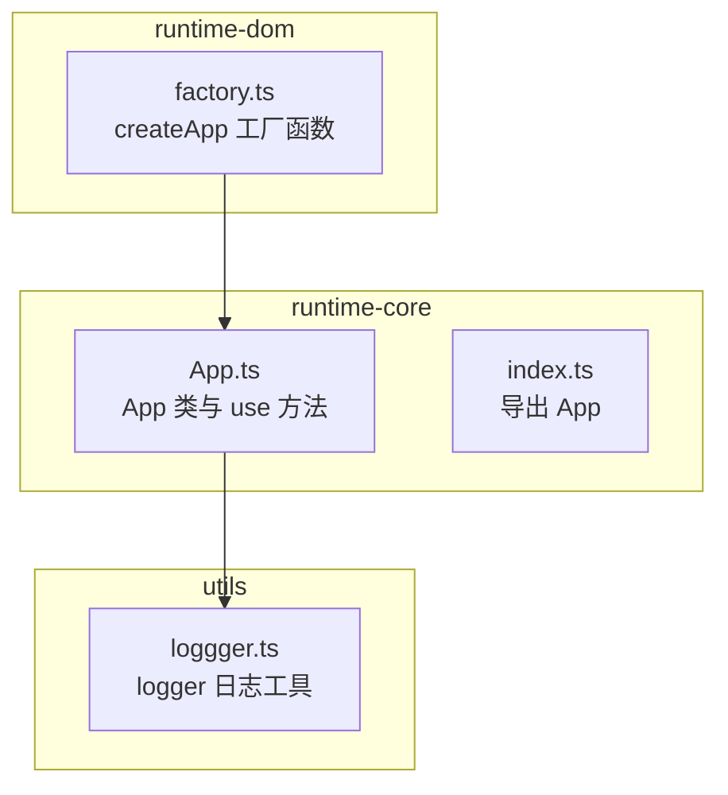
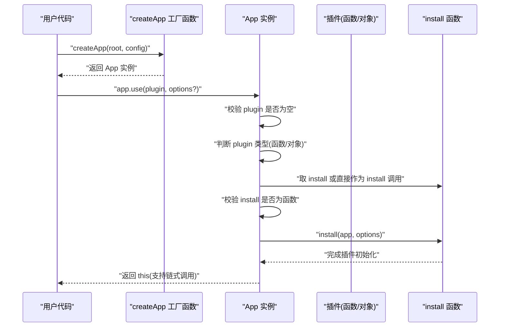
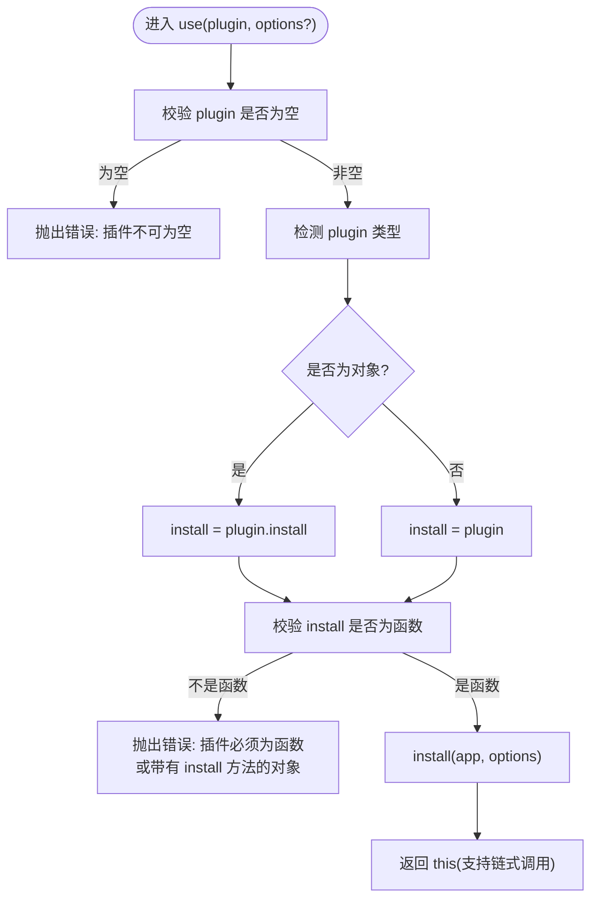
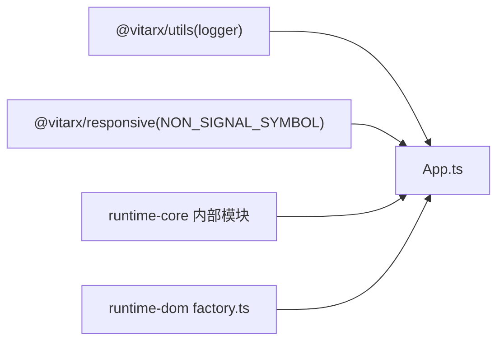

# 插件注册与使用

<cite>
**本文引用的文件列表**
- [App.ts](file://packages/runtime-core/src/app/App.ts)
- [index.ts](file://packages/runtime-core/src/app/index.ts)
- [App.test.ts](file://packages/runtime-core/__tests__/app/App.test.ts)
- [factory.ts](file://packages/runtime-dom/src/factory.ts)
- [loggger.ts](file://packages/utils/src/loggger.ts)
</cite>

## 目录
1. [简介](#简介)
2. [项目结构](#项目结构)
3. [核心组件](#核心组件)
4. [架构总览](#架构总览)
5. [详细组件分析](#详细组件分析)
6. [依赖关系分析](#依赖关系分析)
7. [性能考量](#性能考量)
8. [故障排查指南](#故障排查指南)
9. [结论](#结论)
10. [附录](#附录)

## 简介
本文件围绕 Vitarx 框架的插件系统，系统性阐述 App 类中的 use 方法如何实现插件注册与使用。重点说明：
- use 方法支持函数式插件与对象式插件两种形态
- 类型定义 AppPlugin<T> 与 AppPluginInstall<T> 的设计意图与约束
- install 函数的调用流程与参数传递
- 错误处理机制（插件为空、install 不是函数等）
- 链式调用能力与在应用初始化阶段的典型使用场景

## 项目结构
与插件系统直接相关的核心文件位于 runtime-core 包的 app 子目录，同时 runtime-dom 提供 createApp 工厂函数完成渲染器与驱动器的初始化，utils 包提供日志工具 logger，便于在插件中进行日志记录。

图表来源
- [App.ts](file://packages/runtime-core/src/app/App.ts#L1-L120)
- [index.ts](file://packages/runtime-core/src/app/index.ts#L1-L3)
- [factory.ts](file://packages/runtime-dom/src/factory.ts#L1-L24)
- [loggger.ts](file://packages/utils/src/loggger.ts#L1-L230)

章节来源
- [App.ts](file://packages/runtime-core/src/app/App.ts#L1-L120)
- [index.ts](file://packages/runtime-core/src/app/index.ts#L1-L3)
- [factory.ts](file://packages/runtime-dom/src/factory.ts#L1-L24)

## 核心组件
- App 类：应用主类，提供 use 方法实现插件注册；提供 provide/inject、directive、mount/unmount 等能力。
- AppPlugin<T> 与 AppPluginInstall<T>：插件类型定义，支持函数式与对象式两种形态。
- createApp 工厂函数：在宿主平台包中完成渲染器与驱动器初始化，并返回 App 实例。

章节来源
- [App.ts](file://packages/runtime-core/src/app/App.ts#L19-L60)
- [App.ts](file://packages/runtime-core/src/app/App.ts#L338-L392)
- [factory.ts](file://packages/runtime-dom/src/factory.ts#L1-L24)

## 架构总览
下图展示了从应用创建到插件注册的整体流程，以及 use 方法在其中的位置。

图表来源
- [factory.ts](file://packages/runtime-dom/src/factory.ts#L1-L24)
- [App.ts](file://packages/runtime-core/src/app/App.ts#L338-L392)

## 详细组件分析

### use 方法与插件类型体系
- 类型定义
  - AppPluginInstall<T>：表示“插件安装函数”的类型别名，支持三种重载：无配置、可选配置、必填配置。
  - AppObjectPlugin<T>：对象式插件，必须提供 install 方法。
  - AppPlugin<T>：联合类型，允许插件既可是函数式，也可是对象式（带 install）。
- use 方法行为
  - 参数校验：若 plugin 为空，抛出明确错误。
  - 形态识别：若 plugin 为对象，取其 install 字段；若为函数，直接作为 install 使用。
  - install 校验：若 install 不是函数，抛出明确错误。
  - 调用 install：以 (app, options) 形式调用，options 来自 use 的第二个参数。
  - 返回 this：支持链式调用。

图表来源
- [App.ts](file://packages/runtime-core/src/app/App.ts#L338-L392)

章节来源
- [App.ts](file://packages/runtime-core/src/app/App.ts#L22-L60)
- [App.ts](file://packages/runtime-core/src/app/App.ts#L338-L392)

### 函数式插件与对象式插件
- 函数式插件
  - 作为 use 的第一个参数传入，use 会直接将其当作 install 调用。
  - 适用于无需额外配置或配置可选的场景。
- 对象式插件
  - 作为对象传入，use 会读取其 install 字段作为安装函数。
  - 适用于需要封装更多元信息或复杂初始化逻辑的场景。
- 配置选项
  - 当传入 options 时，use 会将其透传给 install。
  - 三种重载分别对应无配置、可选配置、必填配置的插件形态。

章节来源
- [App.ts](file://packages/runtime-core/src/app/App.ts#L338-L392)
- [App.test.ts](file://packages/runtime-core/__tests__/app/App.test.ts#L195-L228)

### install 函数的调用流程
- 参数传递
  - 第一个参数固定为 App 实例，便于插件访问应用上下文与能力。
  - 第二个参数为 use 传入的 options，可选。
- 调用时机
  - 在 use 完成类型与形态判定、并通过 install 校验后立即调用。
- 返回值
  - install 通常不返回值，use 仅关心其副作用（如注册指令、注入依赖、提供服务等）。

章节来源
- [App.ts](file://packages/runtime-core/src/app/App.ts#L376-L392)

### 错误处理机制
- 插件为空
  - 抛出错误，提示插件不可为空。
- install 不是函数
  - 抛出错误，提示插件必须为函数或带有 install 方法的对象。
- 默认错误处理
  - App 内部提供默认错误处理函数，结合 logger 输出未捕获异常信息，便于定位问题。

章节来源
- [App.ts](file://packages/runtime-core/src/app/App.ts#L376-L392)
- [App.ts](file://packages/runtime-core/src/app/App.ts#L61-L68)
- [loggger.ts](file://packages/utils/src/loggger.ts#L1-L230)

### 链式调用与初始化场景
- 链式调用
  - use 返回 this，因此可连续多次调用，形成链式注册。
- 典型初始化场景
  - 在应用创建后、挂载前，集中注册各类插件（如日志、状态管理、指令等）。
  - 结合 createApp 工厂函数，先完成渲染器与驱动器初始化，再进行插件注册与应用挂载。

章节来源
- [App.ts](file://packages/runtime-core/src/app/App.ts#L376-L392)
- [factory.ts](file://packages/runtime-dom/src/factory.ts#L1-L24)

### 实际使用示例（路径指引）
以下为基于仓库中现有测试与类型定义的“示例路径”，不直接展示代码内容：
- 函数式插件示例
  - 参考测试用例对函数式插件的调用与断言路径：[App.test.ts](file://packages/runtime-core/__tests__/app/App.test.ts#L195-L204)
- 对象式插件示例
  - 参考测试用例对对象式插件（带 install）的调用与断言路径：[App.test.ts](file://packages/runtime-core/__tests__/app/App.test.ts#L206-L216)
- 向插件传递配置选项
  - 参考测试用例对带配置插件的调用与断言路径：[App.test.ts](file://packages/runtime-core/__tests__/app/App.test.ts#L218-L227)
- 日志插件思路
  - 可在插件内部使用 logger 输出日志，参考日志工具定义路径：[loggger.ts](file://packages/utils/src/loggger.ts#L1-L230)
- 状态管理插件思路
  - 可在插件内部通过 app.provide 注入状态管理服务，参考 App 的 provide/inject 能力路径：[App.ts](file://packages/runtime-core/src/app/App.ts#L308-L336)

章节来源
- [App.test.ts](file://packages/runtime-core/__tests__/app/App.test.ts#L195-L228)
- [loggger.ts](file://packages/utils/src/loggger.ts#L1-L230)
- [App.ts](file://packages/runtime-core/src/app/App.ts#L308-L336)

## 依赖关系分析
- App.ts 依赖
  - @vitarx/utils：引入 logger，用于默认错误处理与插件内日志输出。
  - @vitarx/responsive：引入符号常量，用于 App 实例标记。
  - @vitarx/runtime-core 内部模块：指令归一化、渲染器获取、运行时上下文、VNode 挂载/卸载等。
- 工厂函数依赖
  - runtime-dom 的 createApp 会设置渲染器并初始化默认驱动器，随后返回 App 实例供 use 注册插件。

图表来源
- [App.ts](file://packages/runtime-core/src/app/App.ts#L1-L20)
- [factory.ts](file://packages/runtime-dom/src/factory.ts#L1-L24)

章节来源
- [App.ts](file://packages/runtime-core/src/app/App.ts#L1-L20)
- [factory.ts](file://packages/runtime-dom/src/factory.ts#L1-L24)

## 性能考量
- use 方法为轻量级包装，主要职责是形态识别与参数透传，调用 install 的开销取决于插件自身实现。
- 建议插件内部避免在 install 中执行阻塞操作，确保应用初始化阶段的流畅性。
- 若插件需要全局注册（如指令、provide），建议在 install 中一次性完成，减少重复初始化成本。

## 故障排查指南
- 症状：调用 app.use() 抛出“插件不可为空”
  - 排查：确认传入的 plugin 非空；检查变量作用域与导入是否正确。
- 症状：调用 app.use() 抛出“插件必须为函数或带有 install 方法的对象”
  - 排查：若传入对象，请确认其包含 install 方法；若传入函数，请确保类型正确。
- 症状：插件未生效
  - 排查：确认插件在 app.mount() 之前完成注册；检查插件内部是否正确使用 app 上下文（如 directive、provide 等）。
- 症状：日志未输出
  - 排查：确认插件内部使用 logger 输出日志；检查 logger 的配置（级别、前缀、源码位置信息）。

章节来源
- [App.ts](file://packages/runtime-core/src/app/App.ts#L376-L392)
- [loggger.ts](file://packages/utils/src/loggger.ts#L1-L230)

## 结论
- App.use 提供了统一、安全、可链式的插件注册入口，兼容函数式与对象式插件。
- 类型定义 AppPlugin<T> 与 AppPluginInstall<T> 明确了插件形态与配置策略，便于扩展与维护。
- 通过 createApp 工厂函数完成渲染器与驱动器初始化后，即可在应用初始化阶段集中注册各类插件，形成清晰的初始化流程。

## 附录
- 导出入口
  - runtime-core 的 app 目录导出 App，便于外部按需引入：[index.ts](file://packages/runtime-core/src/app/index.ts#L1-L3)