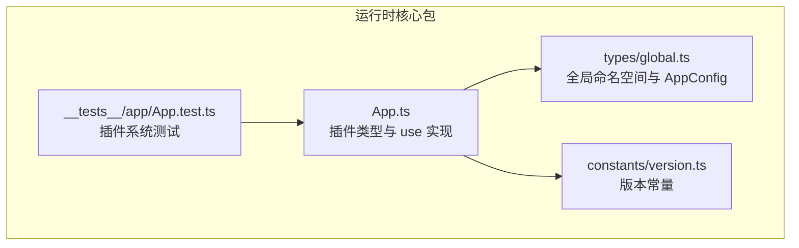
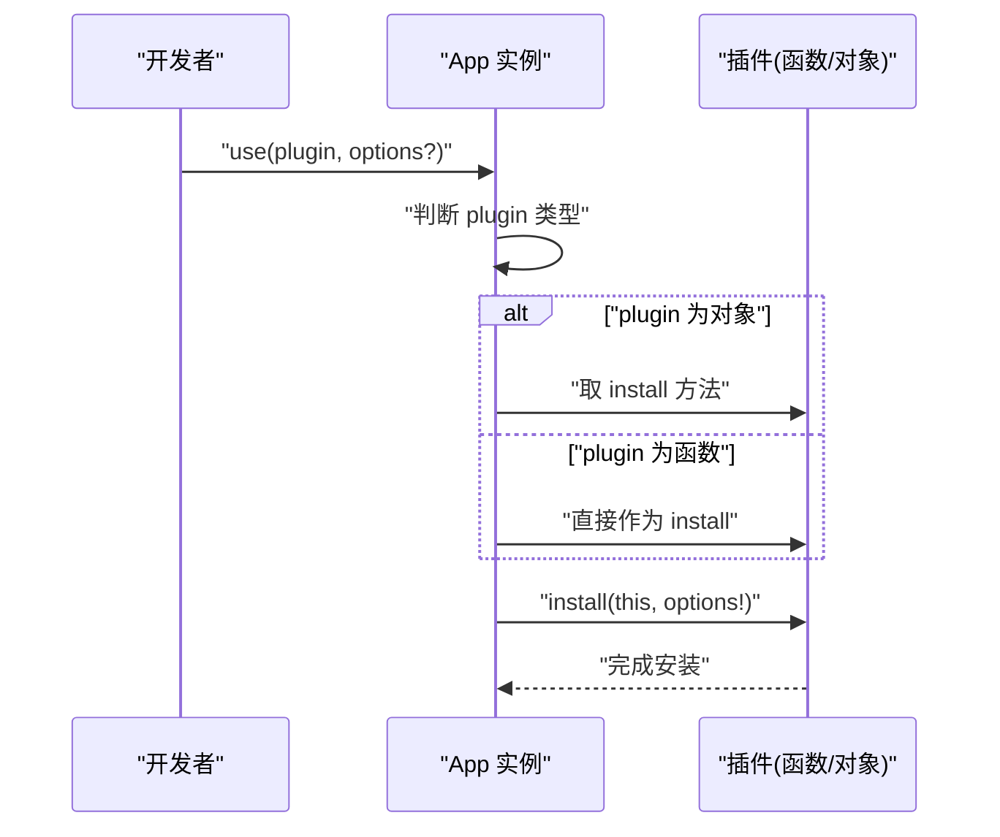
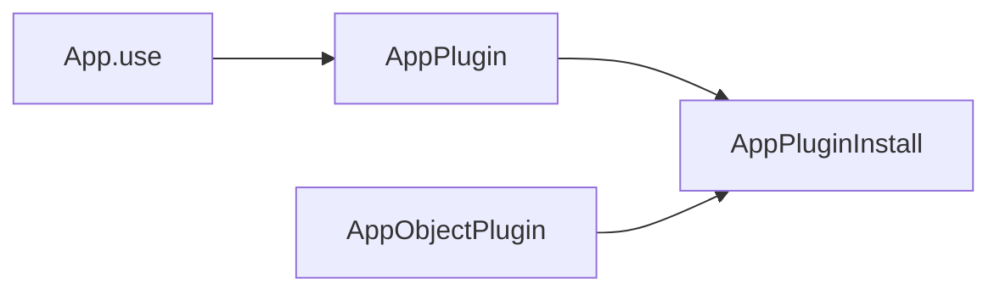

# 类型定义

<cite>
**本文引用的文件**
- [packages/runtime-core/src/app/App.ts](file://packages/runtime-core/src/app/App.ts)
- [packages/runtime-core/src/types/global.ts](file://packages/runtime-core/src/types/global.ts)
- [packages/runtime-core/src/constants/version.ts](file://packages/runtime-core/src/constants/version.ts)
- [packages/runtime-core/__tests__/app/App.test.ts](file://packages/runtime-core/__tests__/app/App.test.ts)
</cite>

## 目录
1. [简介](#简介)
2. [项目结构](#项目结构)
3. [核心组件](#核心组件)
4. [架构总览](#架构总览)
5. [详细组件分析](#详细组件分析)
6. [依赖分析](#依赖分析)
7. [性能考虑](#性能考虑)
8. [故障排查指南](#故障排查指南)
9. [结论](#结论)
10. [附录](#附录)

## 简介
本章节聚焦于插件系统的 TypeScript 类型定义，确保开发者在使用 AppPlugin<T> 联合类型时获得良好的类型推导与类型检查能力。文档将系统性地解释以下要点：
- AppPlugin<T> 的联合类型构成：函数式插件（AppPluginInstall<T>）与对象式插件（AppObjectPlugin<T>）的类型结构与差异。
- OptionallyConfigurablePlugIns、NonConfigurationPlugins、RequiredConfigurationPlugIn 三类函数类型的语义差异与适用场景。
- 泛型 T 在插件配置选项中的作用，以及如何为自定义插件定义精确的配置接口。
- 在 VSCode 中如何通过类型定义获得智能提示与类型检查，避免运行时错误。

## 项目结构
插件系统的核心类型与实现位于运行时核心包中，相关文件如下：
- 插件类型与 App.use 的实现：packages/runtime-core/src/app/App.ts
- 全局命名空间与 AppConfig 接口：packages/runtime-core/src/types/global.ts
- 版本常量（用于框架标识）：packages/runtime-core/src/constants/version.ts
- 插件系统行为的测试用例：packages/runtime-core/__tests__/app/App.test.ts



图表来源
- [packages/runtime-core/src/app/App.ts](file://packages/runtime-core/src/app/App.ts#L1-L60)
- [packages/runtime-core/src/types/global.ts](file://packages/runtime-core/src/types/global.ts#L155-L179)
- [packages/runtime-core/src/constants/version.ts](file://packages/runtime-core/src/constants/version.ts#L1-L2)
- [packages/runtime-core/__tests__/app/App.test.ts](file://packages/runtime-core/__tests__/app/App.test.ts#L195-L228)

章节来源
- [packages/runtime-core/src/app/App.ts](file://packages/runtime-core/src/app/App.ts#L1-L60)
- [packages/runtime-core/src/types/global.ts](file://packages/runtime-core/src/types/global.ts#L155-L179)
- [packages/runtime-core/src/constants/version.ts](file://packages/runtime-core/src/constants/version.ts#L1-L2)
- [packages/runtime-core/__tests__/app/App.test.ts](file://packages/runtime-core/__tests__/app/App.test.ts#L195-L228)

## 核心组件
本节从类型层面梳理插件系统的关键类型与职责边界，帮助理解如何为自定义插件设计精确的配置接口。

- AppConfig（应用配置）
  - 由全局命名空间 Vitarx 定义，包含 errorHandler 与 idPrefix 等字段，作为 App 实例的配置基础。
  - 参考路径：[packages/runtime-core/src/types/global.ts](file://packages/runtime-core/src/types/global.ts#L155-L179)

- AppPluginInstall<T>
  - 插件“安装函数”的类型别名，支持三种形态：
    - 可选配置：(app, options?) => void
    - 无配置：(app) => void
    - 必填配置：(app, options: T) => void
  - 通过联合类型组合上述三种形态，形成对不同插件风格的统一表达。
  - 参考路径：[packages/runtime-core/src/app/App.ts](file://packages/runtime-core/src/app/App.ts#L22-L36)

- AppObjectPlugin<T>
  - 插件对象的类型，必须提供 install 方法，其类型为 AppPluginInstall<T>。
  - 适用于“对象式插件”，即以对象形式提供 install 方法的插件。
  - 参考路径：[packages/runtime-core/src/app/App.ts](file://packages/runtime-core/src/app/App.ts#L45-L50)

- AppPlugin<T>
  - 插件的联合类型：AppObjectPlugin<T> | AppPluginInstall<T>。
  - 既支持函数式插件，也支持对象式插件；App.use 接收该联合类型并自动识别对象插件的 install 方法。
  - 参考路径：[packages/runtime-core/src/app/App.ts](file://packages/runtime-core/src/app/App.ts#L59-L60)

- 三种函数类型语义与适用场景
  - OptionallyConfigurablePlugIns<T>：可选配置的插件安装函数，options?: T。
    - 适用场景：插件可选地接收配置，但不强制要求提供配置。
  - NonConfigurationPlugins：无配置插件安装函数，无 options 参数。
    - 适用场景：插件无需配置即可工作，简化调用。
  - RequiredConfigurationPlugIn<T>：必填配置插件安装函数，options: T。
    - 适用场景：插件必须提供某些关键配置，否则无法正常工作。
  - 参考路径：[packages/runtime-core/src/app/App.ts](file://packages/runtime-core/src/app/App.ts#L22-L24)

- App.use 的类型签名与行为
  - 支持三种重载：
    - 无配置插件：use(plugin: NonConfigurationPlugins | { install: NonConfigurationPlugins })
    - 必填配置插件：use<T>(plugin: RequiredConfigurationPlugIn<T> | { install: RequiredConfigurationPlugIn<T> }, options: T)
    - 可选配置插件：use<T>(plugin: OptionallyConfigurablePlugIns<T> | { install: OptionallyConfigurablePlugIns<T> }, options?: T)
  - 最终统一到 AppPlugin<T>，并在运行时判断插件类型，提取 install 方法并调用。
  - 参考路径：[packages/runtime-core/src/app/App.ts](file://packages/runtime-core/src/app/App.ts#L337-L392)

章节来源
- [packages/runtime-core/src/types/global.ts](file://packages/runtime-core/src/types/global.ts#L155-L179)
- [packages/runtime-core/src/app/App.ts](file://packages/runtime-core/src/app/App.ts#L22-L60)
- [packages/runtime-core/src/app/App.ts](file://packages/runtime-core/src/app/App.ts#L337-L392)

## 架构总览
下图展示了插件类型与 App.use 的交互关系，以及类型推导如何在 VSCode 中生效。

```mermaid
classDiagram
class AppPluginInstall_T_ {
"+install(app, options?)"
}
class AppObjectPlugin_T_ {
"+install : AppPluginInstall_T_"
}
class AppPlugin_T_ {
"<<联合类型>>"
}
class App_use {
"+use(plugin : AppPlugin_T_, options? : T)"
}
AppPlugin_T_ --> AppPluginInstall_T_ : "联合成员"
AppObjectPlugin_T_ --> AppPluginInstall_T_ : "install 类型"
App_use --> AppPlugin_T_ : "接收"
```

图表来源
- [packages/runtime-core/src/app/App.ts](file://packages/runtime-core/src/app/App.ts#L22-L60)
- [packages/runtime-core/src/app/App.ts](file://packages/runtime-core/src/app/App.ts#L337-L392)

## 详细组件分析

### AppPlugin<T> 联合类型与 App.use 的类型分派
- 类型结构
  - AppPlugin<T> = AppObjectPlugin<T> | AppPluginInstall<T>
  - AppObjectPlugin<T> 必须提供 install: AppPluginInstall<T>
  - AppPluginInstall<T> 是三种安装函数形态的联合：可选配置、无配置、必填配置
- 运行时分派
  - App.use 在运行时检测 plugin 的类型：
    - 若为对象，则取其 install 方法
    - 若为函数，则直接作为安装函数
  - 然后调用 install(this, options!)，完成插件安装
- VSCode 类型推导
  - 当传入对象式插件时，VSCode 会将 install 的类型约束为 AppPluginInstall<T>，从而对 options 的可选/必填进行类型检查
  - 当传入函数式插件时，VSCode 会根据传入的 options 是否提供，自动推断为三种形态之一
- 参考路径
  - [packages/runtime-core/src/app/App.ts](file://packages/runtime-core/src/app/App.ts#L337-L392)



图表来源
- [packages/runtime-core/src/app/App.ts](file://packages/runtime-core/src/app/App.ts#L376-L392)

章节来源
- [packages/runtime-core/src/app/App.ts](file://packages/runtime-core/src/app/App.ts#L337-L392)

### 三种函数类型的差异与适用场景
- OptionallyConfigurablePlugIns<T>
  - 语义：可选配置插件
  - 适用场景：插件功能可选增强，不强制要求配置
  - VSCode 行为：当传入 options 时，类型为 T；不传时，类型为 undefined
  - 参考路径：[packages/runtime-core/src/app/App.ts](file://packages/runtime-core/src/app/App.ts#L22-L24)
- NonConfigurationPlugins
  - 语义：无配置插件
  - 适用场景：零配置即可工作的插件，如工具函数、快捷注册
  - VSCode 行为：不允许传入 options
  - 参考路径：[packages/runtime-core/src/app/App.ts](file://packages/runtime-core/src/app/App.ts#L22-L24)
- RequiredConfigurationPlugIn<T>
  - 语义：必填配置插件
  - 适用场景：插件必须提供关键配置才能工作
  - VSCode 行为：必须传入 T 类型的 options，否则类型检查失败
  - 参考路径：[packages/runtime-core/src/app/App.ts](file://packages/runtime-core/src/app/App.ts#L22-L24)

章节来源
- [packages/runtime-core/src/app/App.ts](file://packages/runtime-core/src/app/App.ts#L22-L24)

### 泛型 T 在插件配置选项中的作用
- 作用
  - 泛型 T 用于精确描述插件的配置选项类型，使得：
    - VSCode 能对 options 进行智能提示与类型检查
    - 编译期能捕获配置缺失或类型不匹配的问题
- 自定义插件配置接口的建议
  - 为每个插件定义独立的接口，仅包含必要的字段，避免过度宽泛的类型
  - 对可选字段使用可选属性（?），对必须字段使用必需属性
  - 将插件配置接口与 AppPlugin<T> 结合，确保类型一致性
- 参考路径
  - [packages/runtime-core/src/app/App.ts](file://packages/runtime-core/src/app/App.ts#L22-L60)

章节来源
- [packages/runtime-core/src/app/App.ts](file://packages/runtime-core/src/app/App.ts#L22-L60)

### 在 VSCode 中获得智能提示与类型检查
- 为函数式插件提供配置
  - 当插件为可选配置时，传入 options 即可触发类型推导；不传则为 undefined
  - 当插件为必填配置时，必须传入满足 T 的 options，否则类型检查报错
  - 参考路径：[packages/runtime-core/src/app/App.ts](file://packages/runtime-core/src/app/App.ts#L337-L392)
- 为对象式插件提供配置
  - 对象式插件通过 install 方法接收配置，VSCode 会基于 install 的类型签名进行推导
  - 参考路径：[packages/runtime-core/src/app/App.ts](file://packages/runtime-core/src/app/App.ts#L376-L392)
- 行为验证（测试）
  - 测试覆盖了函数式插件、对象式插件与传参场景，确保类型签名与行为一致
  - 参考路径：[packages/runtime-core/__tests__/app/App.test.ts](file://packages/runtime-core/__tests__/app/App.test.ts#L195-L228)

章节来源
- [packages/runtime-core/src/app/App.ts](file://packages/runtime-core/src/app/App.ts#L337-L392)
- [packages/runtime-core/__tests__/app/App.test.ts](file://packages/runtime-core/__tests__/app/App.test.ts#L195-L228)

## 依赖分析
- App.use 依赖的类型
  - AppPlugin<T>：统一函数式与对象式插件
  - AppPluginInstall<T>：三种安装函数形态的联合
  - AppObjectPlugin<T>：对象式插件的 install 类型
- 运行时依赖
  - App.use 在运行时通过 typeof 判断插件类型，提取 install 方法并调用
- 版本常量
  - __VITARX_VERSION__ 用于框架标识，与插件类型定义无直接耦合
- 参考路径
  - [packages/runtime-core/src/app/App.ts](file://packages/runtime-core/src/app/App.ts#L22-L60)
  - [packages/runtime-core/src/app/App.ts](file://packages/runtime-core/src/app/App.ts#L376-L392)
  - [packages/runtime-core/src/constants/version.ts](file://packages/runtime-core/src/constants/version.ts#L1-L2)



图表来源
- [packages/runtime-core/src/app/App.ts](file://packages/runtime-core/src/app/App.ts#L22-L60)
- [packages/runtime-core/src/app/App.ts](file://packages/runtime-core/src/app/App.ts#L337-L392)

章节来源
- [packages/runtime-core/src/app/App.ts](file://packages/runtime-core/src/app/App.ts#L22-L60)
- [packages/runtime-core/src/app/App.ts](file://packages/runtime-core/src/app/App.ts#L337-L392)
- [packages/runtime-core/src/constants/version.ts](file://packages/runtime-core/src/constants/version.ts#L1-L2)

## 性能考虑
- 类型层面的性能影响极小，主要在于编译期的类型检查与推导。
- 通过精确的泛型 T 与联合类型，可减少不必要的类型收敛，提升编译效率。
- 对象式插件与函数式插件在运行时成本相同，均通过 install 方法执行，无额外开销。

## 故障排查指南
- 插件类型错误
  - 症状：传入的对象式插件缺少 install 方法，或 install 类型不符合 AppPluginInstall<T>
  - 处理：确保对象式插件提供 install: AppPluginInstall<T>，且 install 的 options 符合 T 的可选/必填约定
  - 参考路径：[packages/runtime-core/src/app/App.ts](file://packages/runtime-core/src/app/App.ts#L376-L392)
- 必填配置缺失
  - 症状：使用 RequiredConfigurationPlugIn<T> 的插件时未传入 options
  - 处理：确保传入满足 T 的 options，或改为 OptionallyConfigurablePlugIns<T>
  - 参考路径：[packages/runtime-core/src/app/App.ts](file://packages/runtime-core/src/app/App.ts#L337-L392)
- 无配置插件误传 options
  - 症状：使用 NonConfigurationPlugins 的插件却传入了 options
  - 处理：不要传入 options，或改为 OptionallyConfigurablePlugIns<T>
  - 参考路径：[packages/runtime-core/src/app/App.ts](file://packages/runtime-core/src/app/App.ts#L337-L392)
- 行为验证（测试）
  - 可参考测试用例验证插件系统的行为是否符合预期
  - 参考路径：[packages/runtime-core/__tests__/app/App.test.ts](file://packages/runtime-core/__tests__/app/App.test.ts#L195-L228)

章节来源
- [packages/runtime-core/src/app/App.ts](file://packages/runtime-core/src/app/App.ts#L337-L392)
- [packages/runtime-core/__tests__/app/App.test.ts](file://packages/runtime-core/__tests__/app/App.test.ts#L195-L228)

## 结论
通过对 AppPlugin<T> 联合类型与三种安装函数形态的深入解析，开发者可以在以下方面获得显著收益：
- 明确区分可选、无配置与必填配置插件，提升插件设计的一致性与可维护性
- 利用泛型 T 精确描述插件配置接口，配合 VSCode 的类型推导与类型检查，降低运行时风险
- 在对象式与函数式插件之间自由选择，同时保持统一的类型约束与行为体验

## 附录
- 关键类型定义位置
  - AppPlugin<T>、AppObjectPlugin<T>、AppPluginInstall<T>：[packages/runtime-core/src/app/App.ts](file://packages/runtime-core/src/app/App.ts#L22-L60)
  - App.use 的类型签名与实现：[packages/runtime-core/src/app/App.ts](file://packages/runtime-core/src/app/App.ts#L337-L392)
  - AppConfig（全局命名空间）：[packages/runtime-core/src/types/global.ts](file://packages/runtime-core/src/types/global.ts#L155-L179)
- 行为验证（测试）
  - 插件系统行为测试：[packages/runtime-core/__tests__/app/App.test.ts](file://packages/runtime-core/__tests__/app/App.test.ts#L195-L228)