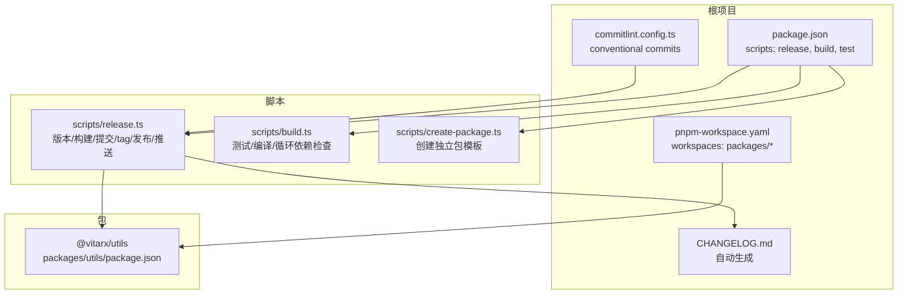
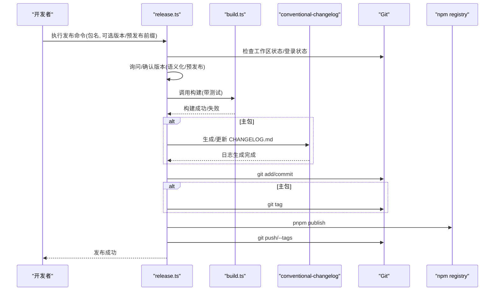
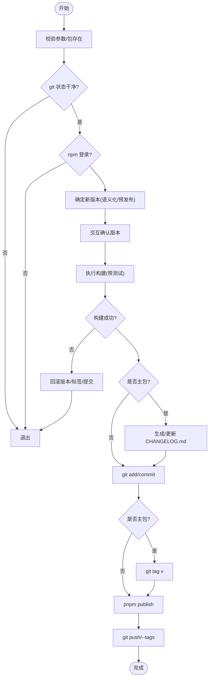
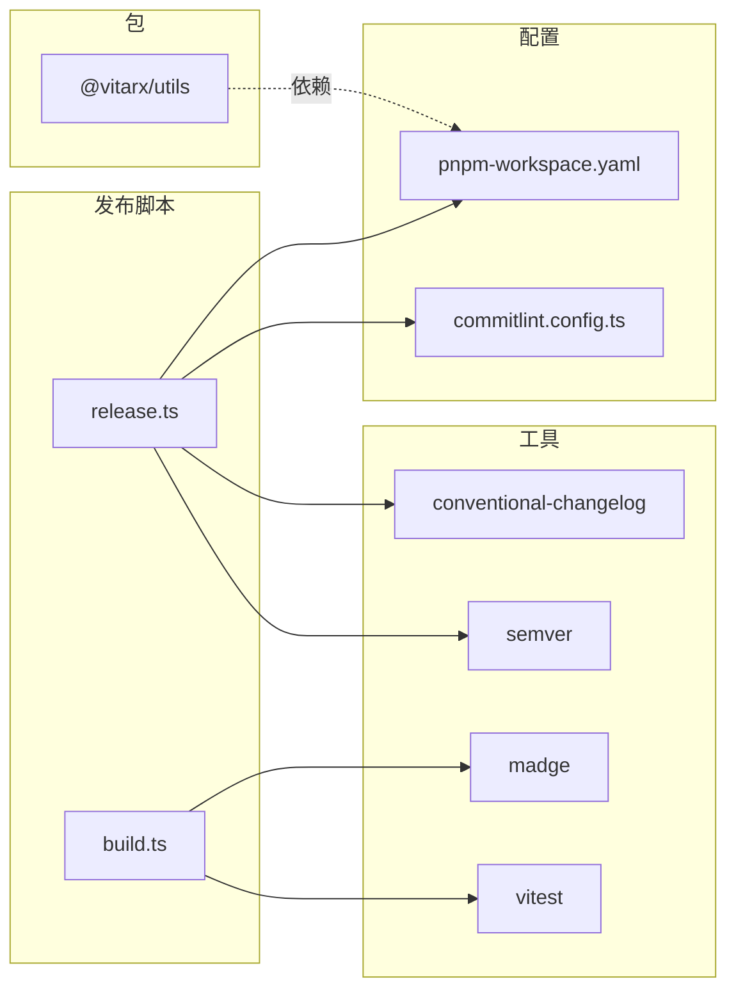

# 发布流程与版本管理

<cite>
**本文引用的文件**
- [scripts/release.ts](file://scripts/release.ts)
- [scripts/build.ts](file://scripts/build.ts)
- [scripts/create-package.ts](file://scripts/create-package.ts)
- [commitlint.config.ts](file://commitlint.config.ts)
- [package.json](file://package.json)
- [pnpm-workspace.yaml](file://pnpm-workspace.yaml)
- [CHANGELOG.md](file://CHANGELOG.md)
- [packages/utils/package.json](file://packages/utils/package.json)
</cite>

## 目录
1. [简介](#简介)
2. [项目结构](#项目结构)
3. [核心组件](#核心组件)
4. [架构总览](#架构总览)
5. [详细组件分析](#详细组件分析)
6. [依赖分析](#依赖分析)
7. [性能考虑](#性能考虑)
8. [故障排查指南](#故障排查指南)
9. [结论](#结论)
10. [附录](#附录)

## 简介
本指南面向在 pnpm workspace 环境下开发与发布的工程师，围绕 release.ts 与 create-package.ts 脚本，系统讲解从本地开发到 npm 发布的完整流程：包括版本递增策略、变更日志生成、Git 标签创建、npm 发布、CI/CD 集成、以及发布前预检清单与常见问题排查。同时结合 conventional commits 与 commitlint.config.ts，说明如何通过提交规范驱动语义化版本管理，避免依赖版本冲突，确保发布质量与一致性。

## 项目结构
- 根目录提供统一的 workspace 配置与发布脚本入口，各独立包位于 packages 下，彼此通过 workspace 管理依赖。
- 发布流程由 scripts/release.ts 驱动，构建流程由 scripts/build.ts 驱动，包创建由 scripts/create-package.ts 驱动。
- 提交规范由 commitlint.config.ts 定义，配合 conventional-changelog 生成 CHANGELOG.md。

图表来源
- [package.json](file://package.json#L1-L39)
- [pnpm-workspace.yaml](file://pnpm-workspace.yaml#L1-L5)
- [commitlint.config.ts](file://commitlint.config.ts#L1-L16)
- [scripts/release.ts](file://scripts/release.ts#L1-L231)
- [scripts/build.ts](file://scripts/build.ts#L1-L328)
- [scripts/create-package.ts](file://scripts/create-package.ts#L1-L71)
- [CHANGELOG.md](file://CHANGELOG.md#L1-L800)
- [packages/utils/package.json](file://packages/utils/package.json#L1-L22)

章节来源
- [package.json](file://package.json#L1-L39)
- [pnpm-workspace.yaml](file://pnpm-workspace.yaml#L1-L5)

## 核心组件
- 发布脚本 release.ts：负责版本确认、构建、变更日志生成、提交、打标签、发布与推送。
- 构建脚本 build.ts：负责测试、编译、循环依赖检查、版本号替换等。
- 包创建脚本 create-package.ts：在 packages 下创建独立包的最小模板，便于快速扩展。
- 提交规范 commitlint.config.ts：约束提交类型与格式，为语义化版本与变更日志生成提供基础。
- workspace 配置 pnpm-workspace.yaml：统一管理包集合，避免跨包版本冲突。
- 变更日志 CHANGELOG.md：由 conventional-changelog 自动生成，记录每次发布变更。

章节来源
- [scripts/release.ts](file://scripts/release.ts#L1-L231)
- [scripts/build.ts](file://scripts/build.ts#L1-L328)
- [scripts/create-package.ts](file://scripts/create-package.ts#L1-L71)
- [commitlint.config.ts](file://commitlint.config.ts#L1-L16)
- [pnpm-workspace.yaml](file://pnpm-workspace.yaml#L1-L5)
- [CHANGELOG.md](file://CHANGELOG.md#L1-L800)

## 架构总览
发布流程的端到端时序如下：

图表来源
- [scripts/release.ts](file://scripts/release.ts#L1-L231)
- [scripts/build.ts](file://scripts/build.ts#L1-L328)
- [commitlint.config.ts](file://commitlint.config.ts#L1-L16)
- [CHANGELOG.md](file://CHANGELOG.md#L1-L800)

## 详细组件分析

### 发布脚本 release.ts
- 输入参数与校验
  - 必须提供包名；若包不存在则终止。
  - 检查 git 状态，要求干净工作区。
  - 检查 npm 登录状态，未登录则报错。
- 版本决策
  - 若显式传入版本类型（major/minor/patch/prerelease 等），按 semver 递增；否则：
    - 若当前版本含预发布标识，则默认 prerelease；
    - 否则默认 patch。
  - 交互式确认最终版本号，支持自定义合法版本。
- 构建与测试
  - 调用 build.ts 对目标包执行测试与编译；失败则回滚版本并退出。
- 变更日志（仅主包）
  - 使用 conventional-changelog 生成/更新 CHANGELOG.md，基于 tag 前缀与起止范围。
- 提交与标签
  - add/commit 当前包与变更日志（主包）。
  - 主包打 v<version> 标签。
- 发布与推送
  - 在包目录执行 pnpm publish --access public。
  - 推送分支与标签。
- 回滚机制
  - 失败时回滚版本、软重置、删除标签，保证工作区干净。

图表来源
- [scripts/release.ts](file://scripts/release.ts#L1-L231)

章节来源
- [scripts/release.ts](file://scripts/release.ts#L1-L231)

### 构建脚本 build.ts
- 测试阶段
  - 若存在 __tests__/ 或 tests/ 目录，运行 vitest 测试；失败即退出。
- 清理与编译
  - 清理 dist 目录，生成临时 tsconfig.json（继承根 tsconfig），执行 tsc 编译。
- 特殊处理
  - runtime-core 包在编译后替换版本占位符为实际版本。
- 循环依赖检查
  - 使用 madge 检测 dist 中的循环依赖，失败则退出。
- 并行与健壮性
  - 命令失败时统一错误输出并退出非零状态，避免静默失败。

章节来源
- [scripts/build.ts](file://scripts/build.ts#L1-L328)

### 包创建脚本 create-package.ts
- 用途
  - 在 packages 下创建独立包的最小模板：目录、package.json、src/index.ts、README.md、LICENSE。
- 依赖约定
  - 默认导出 @vitarx/utils 依赖，采用 workspace 版本前缀，避免跨包版本漂移。
- 产出
  - 便于快速扩展新包，统一风格与发布入口。

章节来源
- [scripts/create-package.ts](file://scripts/create-package.ts#L1-L71)
- [packages/utils/package.json](file://packages/utils/package.json#L1-L22)

### 提交规范与语义化版本
- 提交类型
  - 通过 commitlint.config.ts 限定类型集合（feat/fix/docs/style/refactor/test/chore/build/ci），并要求 subject 非空。
- 语义化版本
  - feat → 向外兼容的新功能 → 可触发 minor；
  - fix → 向外兼容的缺陷修复 → 可触发 patch；
  - build/ci 等影响发布流程的提交 → 可触发 patch 或 prerelease；
  - 未显式传参时，release.ts 依据当前版本是否含预发布标识决定默认递增类型。
- 变更日志
  - conventional-changelog 基于提交历史生成 CHANGELOG.md，主包发布时同步更新。

章节来源
- [commitlint.config.ts](file://commitlint.config.ts#L1-L16)
- [scripts/release.ts](file://scripts/release.ts#L1-L231)
- [CHANGELOG.md](file://CHANGELOG.md#L1-L800)

## 依赖分析
- workspace 与依赖锁定
  - pnpm-workspace.yaml 声明 workspaces: packages/*，确保包间共享依赖与版本。
  - create-package.ts 默认依赖 @vitarx/utils，采用 workspace: '^'，避免跨包版本漂移。
- 发布脚本依赖
  - release.ts 依赖 conventional-changelog、semver、chalk、husky（通过 commitlint 配置）等工具。
  - build.ts 依赖 vitest、madge、tsc 等工具。
- 版本与标签
  - release.ts 仅主包生成 CHANGELOG.md 并打 v<version> 标签；非主包仅更新版本与提交。

图表来源
- [scripts/release.ts](file://scripts/release.ts#L1-L231)
- [scripts/build.ts](file://scripts/build.ts#L1-L328)
- [pnpm-workspace.yaml](file://pnpm-workspace.yaml#L1-L5)
- [commitlint.config.ts](file://commitlint.config.ts#L1-L16)
- [packages/utils/package.json](file://packages/utils/package.json#L1-L22)

章节来源
- [pnpm-workspace.yaml](file://pnpm-workspace.yaml#L1-L5)
- [scripts/create-package.ts](file://scripts/create-package.ts#L1-L71)

## 性能考虑
- 构建阶段
  - 使用 madge 检测循环依赖，避免复杂包结构带来的编译与运行时性能问题。
  - 临时 tsconfig.json 仅在构建期间生成，完成后清理，减少磁盘与 IO 压力。
- 测试阶段
  - 优先运行 vitest 测试，失败即刻中断，避免浪费资源。
- 发布阶段
  - 仅主包生成 CHANGELOG.md，减少不必要的文件写入与 git 操作。
  - 通过交互式确认版本，避免误触高版本递增导致的频繁回滚。

[本节为通用建议，无需特定文件引用]

## 故障排查指南
- 权限不足/未登录
  - 症状：发布失败，提示未登录。
  - 处理：先执行 npm 登录（或 pnpm 登录），确保 registry 指向 https://registry.npmjs.org/。
  - 参考：release.ts 中对 npm 登录状态的检查与报错。
- 版本重复/标签冲突
  - 症状：git tag 失败或推送失败。
  - 处理：release.ts 已提供回滚机制（删除标签、软重置、回写版本），可再次尝试；必要时手动清理标签与提交。
- 构建失败
  - 症状：tsc 编译或测试失败。
  - 处理：先在本地修复编译/测试问题；build.ts 失败会自动退出，避免继续发布。
- 循环依赖
  - 症状：madge 报告循环依赖。
  - 处理：重构模块拆分，打破循环引用；必要时调整导出/导入路径。
- 提交规范不合规
  - 症状：commitlint 报错。
  - 处理：遵循 feat/fix/docs/style/refactor/test/chore/build/ci 等类型，确保 subject 非空。

章节来源
- [scripts/release.ts](file://scripts/release.ts#L1-L231)
- [scripts/build.ts](file://scripts/build.ts#L1-L328)
- [commitlint.config.ts](file://commitlint.config.ts#L1-L16)

## 结论
通过 release.ts 与 build.ts 的协同，结合 conventional commits 与 workspace 管理，本项目实现了从本地开发到 npm 发布的自动化闭环。release.ts 负责版本决策、构建、变更日志、标签与发布；build.ts 负责测试与编译质量门禁；commitlint.config.ts 保障提交规范，驱动语义化版本与 CHANGELOG.md 的生成。遵循本文提供的发布前预检清单与 CI/CD 建议，可显著降低发布风险，提升团队协作效率。

[本节为总结，无需特定文件引用]

## 附录

### 发布前预检清单
- 本地开发
  - 代码通过本地测试（vitest）、类型检查与构建。
  - 无未提交的改动，工作区干净。
  - 提交符合 conventional commits 规范。
- 版本与日志
  - 明确版本递增策略（major/minor/patch/prerelease），必要时提前沟通。
  - 确认 CHANGELOG.md 生成符合预期（主包）。
- 依赖与发布
  - 确认 @vitarx/utils 等依赖采用 workspace 版本，避免跨包版本冲突。
  - 确认 npm 登录状态正常，registry 指向 npmjs.org。
- 文档与示例
  - 更新 README.md 与示例，确保与新版本一致。
- 兼容性测试
  - 在目标运行时（如浏览器/Node）进行兼容性验证。
- CI/CD 建议
  - 在 CI 中执行：git 状态检查、npm 登录检查、构建与测试、发布（仅主分支/标签触发）。
  - 使用 secrets 管理 npm token，避免明文泄露。

[本节为通用建议，无需特定文件引用]