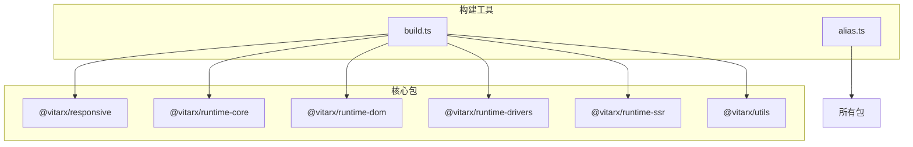
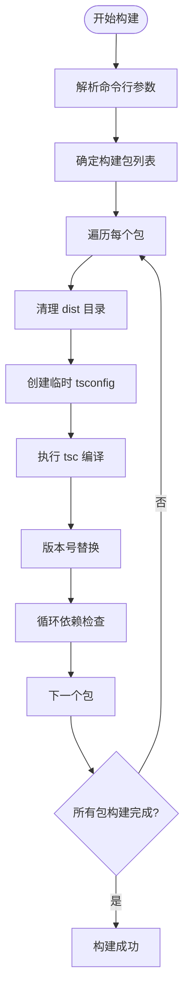
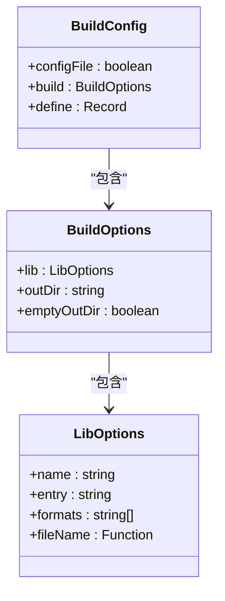
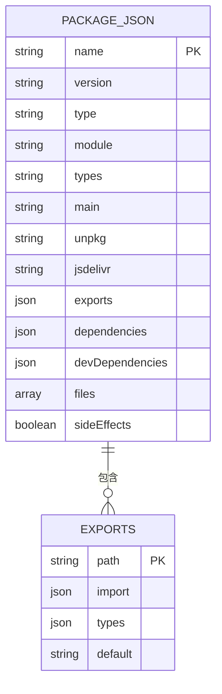
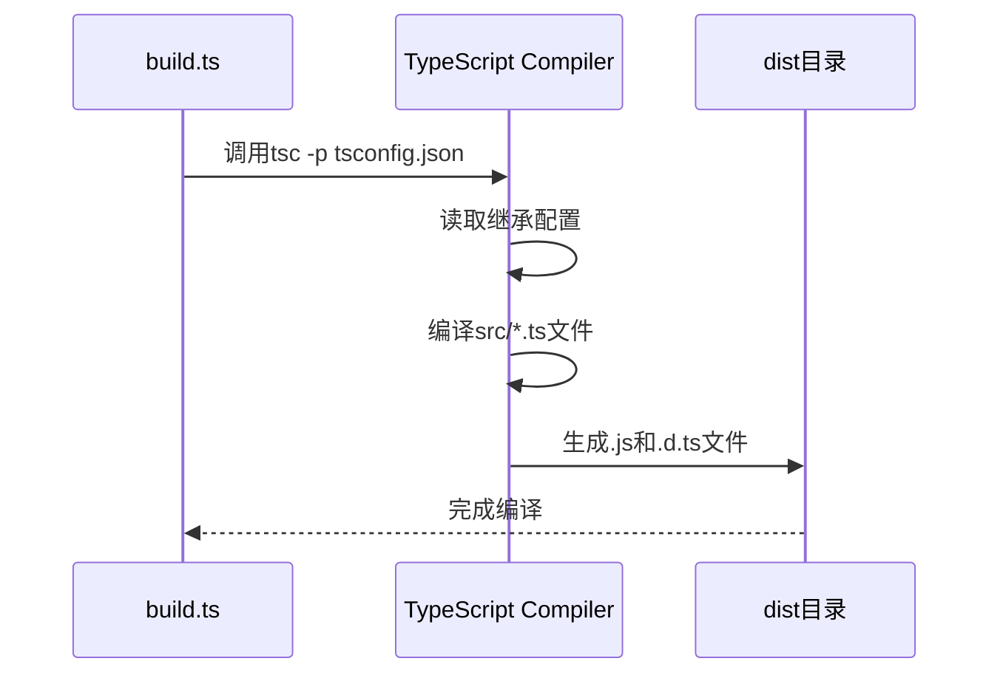
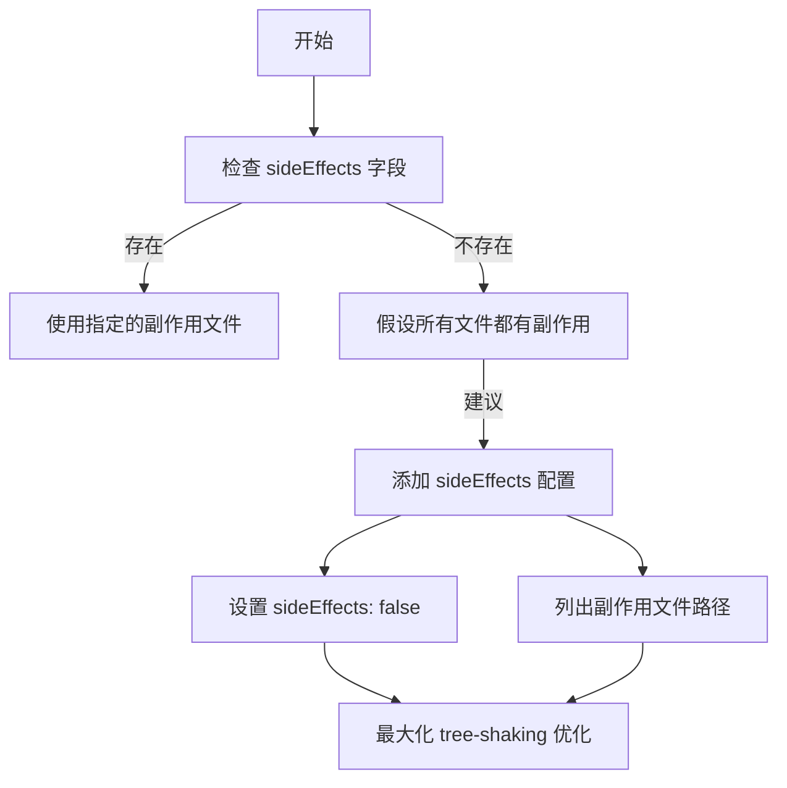
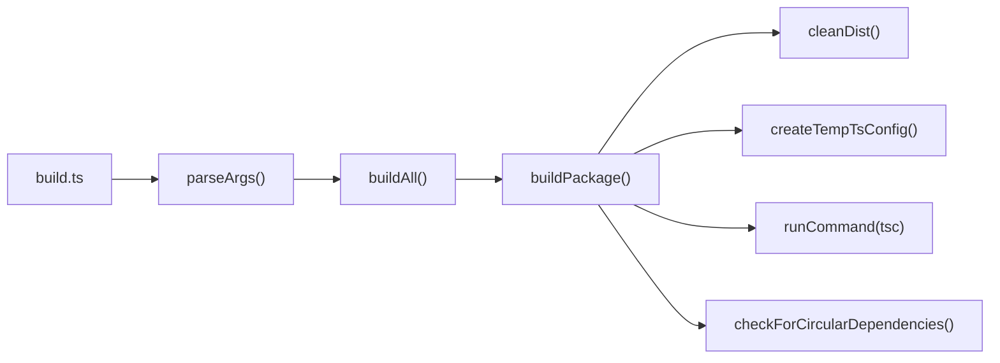

# 打包与模块输出配置

<cite>
**本文档引用的文件**   
- [build.ts](file://scripts/build.ts)
- [package.json](file://package.json)
- [responsive/package.json](file://packages/responsive/package.json)
- [runtime-core/package.json](file://packages/runtime-core/package.json)
- [utils/package.json](file://packages/utils/package.json)
- [runtime-dom/package.json](file://packages/runtime-dom/package.json)
- [tsconfig.json](file://tsconfig.json)
- [responsive/tsconfig.json](file://packages/responsive/tsconfig.json)
- [runtime-core/tsconfig.json](file://packages/runtime-core/tsconfig.json)
</cite>

## 目录
1. [项目结构](#项目结构)
2. [构建流程分析](#构建流程分析)
3. [模块输出格式配置](#模块输出格式配置)
4. [package.json 配置规范](#packagejson-配置规范)
5. [类型声明文件生成](#类型声明文件生成)
6. [sideEffects 字段配置](#sideeffects-字段配置)
7. [构建脚本执行流程](#构建脚本执行流程)

## 项目结构

项目采用 monorepo 架构，通过 pnpm workspaces 管理多个包。核心包包括 responsive、runtime-core、runtime-dom、runtime-drivers、runtime-ssr 和 utils 等，每个包都有独立的 package.json 和 tsconfig.json 配置文件。

**Diagram sources**
- [package.json](file://package.json#L6-L8)
- [build.ts](file://scripts/build.ts#L297-L308)

**Section sources**
- [package.json](file://package.json#L6-L8)
- [build.ts](file://scripts/build.ts#L297-L308)

## 构建流程分析

构建流程由 scripts/build.ts 脚本驱动，采用多阶段构建策略。首先使用 TypeScript 编译器进行类型检查和基础编译，然后通过 Vite 进行模块打包，最后进行循环依赖检查。

构建流程包含以下关键步骤：
1. 清理 dist 目录
2. 创建临时 TypeScript 配置文件
3. 执行 TypeScript 编译
4. 版本号替换处理
5. 循环依赖检查

**Diagram sources**
- [build.ts](file://scripts/build.ts#L161-L327)

**Section sources**
- [build.ts](file://scripts/build.ts#L161-L327)

## 模块输出格式配置

项目通过 TypeScript 和 Vite 协同工作来生成多格式模块。TypeScript 负责生成 ESM 格式的 .js 文件和对应的 .d.ts 类型声明文件，而 Vite 则用于生成 IIFE 格式的浏览器可用包。

在 build.ts 脚本中，虽然 Vite 相关代码被注释，但保留了生成 IIFE 格式的配置结构，表明项目支持多种输出格式：

**Diagram sources**
- [build.ts](file://scripts/build.ts#L247-L261)

**Section sources**
- [build.ts](file://scripts/build.ts#L247-L261)

## package.json 配置规范

各包的 package.json 文件遵循统一的配置规范，确保在不同环境中的兼容性。核心配置字段包括 type、module、types、exports 等。

**Diagram sources**
- [responsive/package.json](file://packages/responsive/package.json)
- [runtime-core/package.json](file://packages/runtime-core/package.json)
- [runtime-dom/package.json](file://packages/runtime-dom/package.json)

**Section sources**
- [responsive/package.json](file://packages/responsive/package.json)
- [runtime-core/package.json](file://packages/runtime-core/package.json)
- [runtime-dom/package.json](file://packages/runtime-dom/package.json)

## 类型声明文件生成

类型声明文件的生成由 TypeScript 编译器自动完成。项目根目录的 tsconfig.json 配置了 declaration: true，确保为每个包生成对应的 .d.ts 文件。

类型声明文件生成流程：
1. 继承根目录 tsconfig.json 配置
2. 设置输出目录为 dist
3. 包含 src 目录下的所有文件
4. 生成 .d.ts 声明文件

**Diagram sources**
- [tsconfig.json](file://tsconfig.json#L11)
- [responsive/tsconfig.json](file://packages/responsive/tsconfig.json)
- [runtime-core/tsconfig.json](file://packages/runtime-core/tsconfig.json)

**Section sources**
- [tsconfig.json](file://tsconfig.json#L11)
- [responsive/tsconfig.json](file://packages/responsive/tsconfig.json)
- [runtime-core/tsconfig.json](file://packages/runtime-core/tsconfig.json)

## sideEffects 字段配置

经过检查，项目中的各个 package.json 文件均未显式配置 sideEffects 字段。这意味着打包工具（如 Webpack、Vite）将默认认为这些包可能存在副作用，可能会影响 tree-shaking 的优化效果。

建议为无副作用的包显式设置 "sideEffects": false，以优化最终打包体积。对于包含 CSS 导入或有其他副作用的包，应列出具体的副作用文件路径。

**Diagram sources**
- [responsive/package.json](file://packages/responsive/package.json)
- [runtime-core/package.json](file://packages/runtime-core/package.json)
- [utils/package.json](file://packages/utils/package.json)

**Section sources**
- [responsive/package.json](file://packages/responsive/package.json)
- [runtime-core/package.json](file://packages/runtime-core/package.json)
- [utils/package.json](file://packages/utils/package.json)

## 构建脚本执行流程

构建脚本的完整执行流程包括参数解析、包列表确定、逐个构建和最终验证。脚本支持通过命令行参数指定要构建的包和是否运行测试。

**Diagram sources**
- [build.ts](file://scripts/build.ts)

**Section sources**
- [build.ts](file://scripts/build.ts)