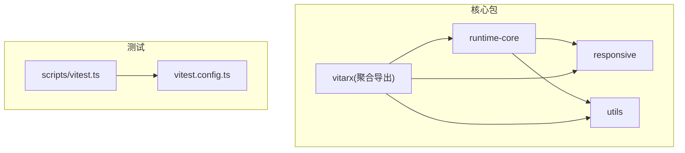
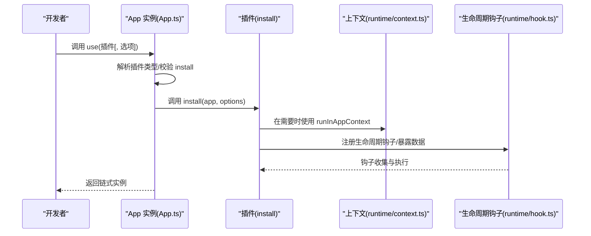
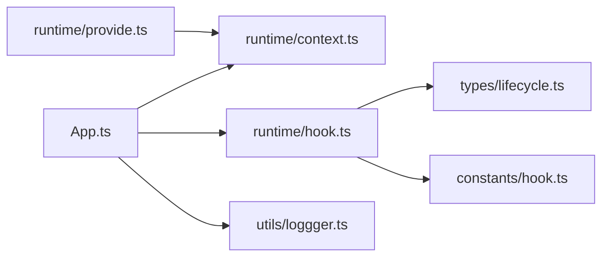

# 插件测试策略

<cite>
**本文引用的文件**
- [packages/runtime-core/src/app/App.ts](file://packages/runtime-core/src/app/App.ts)
- [packages/runtime-core/src/runtime/hook.ts](file://packages/runtime-core/src/runtime/hook.ts)
- [packages/runtime-core/src/types/lifecycle.ts](file://packages/runtime-core/src/types/lifecycle.ts)
- [packages/runtime-core/src/constants/hook.ts](file://packages/runtime-core/src/constants/hook.ts)
- [packages/runtime-core/src/runtime/context.ts](file://packages/runtime-core/src/runtime/context.ts)
- [packages/runtime-core/src/runtime/provide.ts](file://packages/runtime-core/src/runtime/provide.ts)
- [packages/utils/src/loggger.ts](file://packages/utils/src/loggger.ts)
- [vitest.config.ts](file://vitest.config.ts)
- [scripts/vitest.ts](file://scripts/vitest.ts)
- [packages/runtime-core/__tests__/app/App.test.ts](file://packages/runtime-core/__tests__/app/App.test.ts)
- [packages/runtime-core/__tests__/runtime/hook.test.ts](file://packages/runtime-core/__tests__/runtime/hook.test.ts)
- [packages/responsive/__tests__/signal/core.test.ts](file://packages/responsive/__tests__/signal/core.test.ts)
</cite>

## 目录
1. [引言](#引言)
2. [项目结构](#项目结构)
3. [核心组件](#核心组件)
4. [架构总览](#架构总览)
5. [详细组件分析](#详细组件分析)
6. [依赖分析](#依赖分析)
7. [性能考虑](#性能考虑)
8. [故障排查指南](#故障排查指南)
9. [结论](#结论)
10. [附录](#附录)

## 引言
本测试策略围绕 Vitarx 插件体系，聚焦以下目标：
- 验证插件的 install 函数是否正确扩展 App 实例能力
- 在不同上下文（App 上下文、组件节点上下文、全局上下文）下验证行为一致性
- 通过模拟 App 实例与组件运行时上下文进行隔离测试，避免外部依赖干扰
- 结合 runtime-core 的 App.ts 与 runtime 模块，验证生命周期钩子注入的正确性
- 设计异步插件加载与错误边界处理的测试方案
- 使用覆盖率工具确保核心路径的测试完整性

## 项目结构
仓库采用多包工作区结构，核心与插件相关的模块分布如下：
- runtime-core：应用内核、App 实例、生命周期钩子、上下文与依赖注入
- responsive：响应式信号与依赖管理（为 App.use 插件系统提供上下文能力）
- utils：日志与通用工具
- vitarx：对外导出聚合入口
- scripts：测试脚本与别名配置
- vitest.config.ts：全局测试配置（环境、覆盖率、超时、别名）

图表来源
- [packages/runtime-core/src/app/App.ts](file://packages/runtime-core/src/app/App.ts#L1-L394)
- [packages/runtime-core/src/runtime/hook.ts](file://packages/runtime-core/src/runtime/hook.ts#L1-L271)
- [packages/runtime-core/src/runtime/context.ts](file://packages/runtime-core/src/runtime/context.ts#L1-L52)
- [packages/runtime-core/src/runtime/provide.ts](file://packages/runtime-core/src/runtime/provide.ts#L1-L131)
- [packages/utils/src/loggger.ts](file://packages/utils/src/loggger.ts#L1-L230)
- [vitest.config.ts](file://vitest.config.ts#L1-L40)
- [scripts/vitest.ts](file://scripts/vitest.ts#L1-L155)

章节来源
- [vitest.config.ts](file://vitest.config.ts#L1-L40)
- [scripts/vitest.ts](file://scripts/vitest.ts#L1-L155)

## 核心组件
- App 实例与插件系统
  - App.use 支持函数式与对象式插件，可选/必选配置选项
  - install 调用时将 App 实例与可选 options 传入插件
  - App.runInContext 提供上下文执行能力
- 生命周期钩子与上下文
  - HookCollector 收集组件钩子与暴露数据
  - 生命周期钩子工厂 createLifecycleHook 注册钩子
  - 生命周期钩子枚举与类型约束
- 上下文与依赖注入
  - runInAppContext/runInNodeContext 提供上下文执行
  - provide/inject 实现组件间依赖注入
- 日志与错误处理
  - logger 提供统一日志输出
  - App.config.errorHandler 默认错误处理

章节来源
- [packages/runtime-core/src/app/App.ts](file://packages/runtime-core/src/app/App.ts#L1-L394)
- [packages/runtime-core/src/runtime/hook.ts](file://packages/runtime-core/src/runtime/hook.ts#L1-L271)
- [packages/runtime-core/src/types/lifecycle.ts](file://packages/runtime-core/src/types/lifecycle.ts#L1-L139)
- [packages/runtime-core/src/constants/hook.ts](file://packages/runtime-core/src/constants/hook.ts#L1-L16)
- [packages/runtime-core/src/runtime/context.ts](file://packages/runtime-core/src/runtime/context.ts#L1-L52)
- [packages/runtime-core/src/runtime/provide.ts](file://packages/runtime-core/src/runtime/provide.ts#L1-L131)
- [packages/utils/src/loggger.ts](file://packages/utils/src/loggger.ts#L1-L230)

## 架构总览
下图展示了插件安装与生命周期钩子注入的关键交互路径，映射到实际源码文件。

图表来源
- [packages/runtime-core/src/app/App.ts](file://packages/runtime-core/src/app/App.ts#L338-L394)
- [packages/runtime-core/src/runtime/context.ts](file://packages/runtime-core/src/runtime/context.ts#L1-L52)
- [packages/runtime-core/src/runtime/hook.ts](file://packages/runtime-core/src/runtime/hook.ts#L1-L271)

## 详细组件分析

### 插件安装流程与上下文隔离测试
目标
- 验证 App.use 的三种插件形态（无配置、可选配置、必填配置）
- 验证 install 被正确调用且传参正确
- 通过模拟 App 实例与上下文，隔离外部依赖

建议测试要点
- 函数式插件：use(fn) -> fn(app, undefined)
- 对象式插件：use({ install }) -> install(app, undefined)
- 带配置插件：use(fn, options) -> fn(app, options)
- 异常场景：空插件、install 非函数、无效选项
- 上下文隔离：使用 runInAppContext 包裹插件内部逻辑，避免全局污染

参考实现路径
- 插件安装与校验：[packages/runtime-core/src/app/App.ts](file://packages/runtime-core/src/app/App.ts#L338-L394)
- 上下文执行：[packages/runtime-core/src/runtime/context.ts](file://packages/runtime-core/src/runtime/context.ts#L1-L52)

章节来源
- [packages/runtime-core/src/app/App.ts](file://packages/runtime-core/src/app/App.ts#L338-L394)
- [packages/runtime-core/src/runtime/context.ts](file://packages/runtime-core/src/runtime/context.ts#L1-L52)

### 生命周期钩子注入与验证
目标
- 验证 HookCollector 能够正确收集钩子与暴露数据
- 验证 createLifecycleHook 的类型与行为约束
- 验证 onError、onRender 等钩子的特殊返回值与异步行为

建议测试要点
- onCreate 立即执行
- onBeforeMount/onMounted/onBeforeUpdate/onUpdated/onBeforeUnmount/onUnmounted/onActivated/onDeactivated/onDestroy 注册回调
- onError 接收 [error, info] 参数，可返回 VNode 或 false
- onRender 可返回 Promise（SSR 场景）
- defineExpose 过滤保留关键字并发出警告
- 边界：传入非函数抛 TypeError；回调内部抛错应按 errorHandler 处理

参考实现路径
- 钩子工厂与收集器：[packages/runtime-core/src/runtime/hook.ts](file://packages/runtime-core/src/runtime/hook.ts#L1-L271)
- 生命周期钩子枚举与类型：[packages/runtime-core/src/constants/hook.ts](file://packages/runtime-core/src/constants/hook.ts#L1-L16), [packages/runtime-core/src/types/lifecycle.ts](file://packages/runtime-core/src/types/lifecycle.ts#L1-L139)

章节来源
- [packages/runtime-core/src/runtime/hook.ts](file://packages/runtime-core/src/runtime/hook.ts#L1-L271)
- [packages/runtime-core/src/constants/hook.ts](file://packages/runtime-core/src/constants/hook.ts#L1-L16)
- [packages/runtime-core/src/types/lifecycle.ts](file://packages/runtime-core/src/types/lifecycle.ts#L1-L139)

### 依赖注入与上下文一致性
目标
- 验证 provide/inject 在组件上下文中的行为
- 验证 App.provide/inject 与组件上下文的协同
- 验证上下文符号与 runInNodeContext 的一致性

建议测试要点
- provide 必须在有状态组件上下文中调用
- inject 向上查找祖先节点，最终回退到 appContext
- runInNodeContext 与 getCurrentVNode 的配合
- App.provide/inject 的存在性与返回值

参考实现路径
- 依赖注入：[packages/runtime-core/src/runtime/provide.ts](file://packages/runtime-core/src/runtime/provide.ts#L1-L131)
- 上下文工具：[packages/runtime-core/src/runtime/context.ts](file://packages/runtime-core/src/runtime/context.ts#L1-L52)
- App 依赖注入：[packages/runtime-core/src/app/App.ts](file://packages/runtime-core/src/app/App.ts#L308-L336)

章节来源
- [packages/runtime-core/src/runtime/provide.ts](file://packages/runtime-core/src/runtime/provide.ts#L1-L131)
- [packages/runtime-core/src/runtime/context.ts](file://packages/runtime-core/src/runtime/context.ts#L1-L52)
- [packages/runtime-core/src/app/App.ts](file://packages/runtime-core/src/app/App.ts#L308-L336)

### 异步插件加载与错误边界处理
目标
- 验证异步插件加载（如动态 import）的兼容性
- 验证错误边界：install 抛错、生命周期钩子抛错、onError 处理

建议测试要点
- 异步 install：use(async () => ...) -> 安装后仍能正常扩展 App
- onError：在组件渲染/更新/挂载等阶段抛错，验证错误信息与回退 UI
- App.config.errorHandler：默认错误处理与自定义覆盖
- 日志：logger.error 的调用与格式化输出

参考实现路径
- App.use/install 与错误处理：[packages/runtime-core/src/app/App.ts](file://packages/runtime-core/src/app/App.ts#L338-L394)
- 生命周期错误处理与类型：[packages/runtime-core/src/types/lifecycle.ts](file://packages/runtime-core/src/types/lifecycle.ts#L1-L139)
- 日志工具：[packages/utils/src/loggger.ts](file://packages/utils/src/loggger.ts#L1-L230)

章节来源
- [packages/runtime-core/src/app/App.ts](file://packages/runtime-core/src/app/App.ts#L338-L394)
- [packages/runtime-core/src/types/lifecycle.ts](file://packages/runtime-core/src/types/lifecycle.ts#L1-L139)
- [packages/utils/src/loggger.ts](file://packages/utils/src/loggger.ts#L1-L230)

### 类型测试与覆盖率策略
目标
- 通过类型测试确保生命周期钩子参数/返回值的类型安全
- 使用覆盖率工具确保核心路径（install、钩子注册、上下文执行）被覆盖

建议测试要点
- 生命周期钩子参数类型：LifecycleHookParameter
- 生命周期钩子返回值类型：LifecycleHookReturnType
- HookCollector.addLifeCycle/addExposed 的类型约束
- 覆盖率：V8 provider，text/json/html 报告，排除 node_modules/dist/__tests__

参考实现路径
- 生命周期类型：[packages/runtime-core/src/types/lifecycle.ts](file://packages/runtime-core/src/types/lifecycle.ts#L1-L139)
- 覆盖率配置：[vitest.config.ts](file://vitest.config.ts#L1-L40)

章节来源
- [packages/runtime-core/src/types/lifecycle.ts](file://packages/runtime-core/src/types/lifecycle.ts#L1-L139)
- [vitest.config.ts](file://vitest.config.ts#L1-L40)

## 依赖分析
- App.use 依赖 runtime/context.ts 的上下文执行能力
- 生命周期钩子依赖 runtime/hook.ts 的 HookCollector 与 createLifecycleHook
- provide/inject 依赖 runtime/context.ts 与 runtime/provide.ts
- 日志与错误处理依赖 utils/logger

图表来源
- [packages/runtime-core/src/app/App.ts](file://packages/runtime-core/src/app/App.ts#L1-L394)
- [packages/runtime-core/src/runtime/context.ts](file://packages/runtime-core/src/runtime/context.ts#L1-L52)
- [packages/runtime-core/src/runtime/hook.ts](file://packages/runtime-core/src/runtime/hook.ts#L1-L271)
- [packages/runtime-core/src/types/lifecycle.ts](file://packages/runtime-core/src/types/lifecycle.ts#L1-L139)
- [packages/runtime-core/src/constants/hook.ts](file://packages/runtime-core/src/constants/hook.ts#L1-L16)
- [packages/runtime-core/src/runtime/provide.ts](file://packages/runtime-core/src/runtime/provide.ts#L1-L131)
- [packages/utils/src/loggger.ts](file://packages/utils/src/loggger.ts#L1-L230)

章节来源
- [packages/runtime-core/src/app/App.ts](file://packages/runtime-core/src/app/App.ts#L1-L394)
- [packages/runtime-core/src/runtime/context.ts](file://packages/runtime-core/src/runtime/context.ts#L1-L52)
- [packages/runtime-core/src/runtime/hook.ts](file://packages/runtime-core/src/runtime/hook.ts#L1-L271)
- [packages/runtime-core/src/types/lifecycle.ts](file://packages/runtime-core/src/types/lifecycle.ts#L1-L139)
- [packages/runtime-core/src/constants/hook.ts](file://packages/runtime-core/src/constants/hook.ts#L1-L16)
- [packages/runtime-core/src/runtime/provide.ts](file://packages/runtime-core/src/runtime/provide.ts#L1-L131)
- [packages/utils/src/loggger.ts](file://packages/utils/src/loggger.ts#L1-L230)

## 性能考虑
- 测试运行环境：jsdom，适合 DOM 操作与渲染场景
- 超时设置：单测默认 10 秒，可根据复杂度调整
- 覆盖率：V8 provider，建议开启 HTML 报告便于定位未覆盖路径
- 模拟与桩：优先使用 vi.fn/spyOn，减少真实 DOM 与网络请求
- 并行与隔离：每个测试独立，避免全局状态共享

章节来源
- [vitest.config.ts](file://vitest.config.ts#L1-L40)

## 故障排查指南
常见问题与定位
- 插件未生效
  - 检查 use 调用是否传入有效插件与选项
  - 确认 install 是否被调用且传参正确
  - 参考：[packages/runtime-core/src/app/App.ts](file://packages/runtime-core/src/app/App.ts#L338-L394)
- 生命周期钩子未触发
  - 确认钩子注册在正确的上下文中
  - 检查 HookCollector 是否在渲染过程中收集
  - 参考：[packages/runtime-core/src/runtime/hook.ts](file://packages/runtime-core/src/runtime/hook.ts#L1-L271)
- 上下文缺失
  - 确保在组件上下文中调用 provide/inject
  - 使用 runInNodeContext/runInAppContext 包裹
  - 参考：[packages/runtime-core/src/runtime/context.ts](file://packages/runtime-core/src/runtime/context.ts#L1-L52), [packages/runtime-core/src/runtime/provide.ts](file://packages/runtime-core/src/runtime/provide.ts#L1-L131)
- 错误未被捕获
  - 确认 App.config.errorHandler 是否设置
  - onError 钩子是否正确注册
  - 参考：[packages/runtime-core/src/app/App.ts](file://packages/runtime-core/src/app/App.ts#L216-L224), [packages/runtime-core/src/types/lifecycle.ts](file://packages/runtime-core/src/types/lifecycle.ts#L1-L139)

章节来源
- [packages/runtime-core/src/app/App.ts](file://packages/runtime-core/src/app/App.ts#L216-L224)
- [packages/runtime-core/src/runtime/hook.ts](file://packages/runtime-core/src/runtime/hook.ts#L1-L271)
- [packages/runtime-core/src/runtime/context.ts](file://packages/runtime-core/src/runtime/context.ts#L1-L52)
- [packages/runtime-core/src/runtime/provide.ts](file://packages/runtime-core/src/runtime/provide.ts#L1-L131)
- [packages/runtime-core/src/types/lifecycle.ts](file://packages/runtime-core/src/types/lifecycle.ts#L1-L139)

## 结论
本策略基于实际源码实现了面向插件安装、生命周期钩子与上下文的一体化测试方案。通过模拟 App 实例与组件运行时上下文，结合 Vitest 的 mock 与覆盖率工具，可有效验证插件在不同上下文环境下的行为一致性，并覆盖核心路径与边界条件。

## 附录
- 示例测试参考
  - App 插件系统测试：[packages/runtime-core/__tests__/app/App.test.ts](file://packages/runtime-core/__tests__/app/App.test.ts#L1-L252)
  - 生命周期钩子测试：[packages/runtime-core/__tests__/runtime/hook.test.ts](file://packages/runtime-core/__tests__/runtime/hook.test.ts#L1-L192)
  - 响应式信号核心测试（上下文与依赖管理参考）：[packages/responsive/__tests__/signal/core.test.ts](file://packages/responsive/__tests__/signal/core.test.ts#L1-L134)
- 测试执行
  - 全局配置：[vitest.config.ts](file://vitest.config.ts#L1-L40)
  - 脚本入口：[scripts/vitest.ts](file://scripts/vitest.ts#L1-L155)