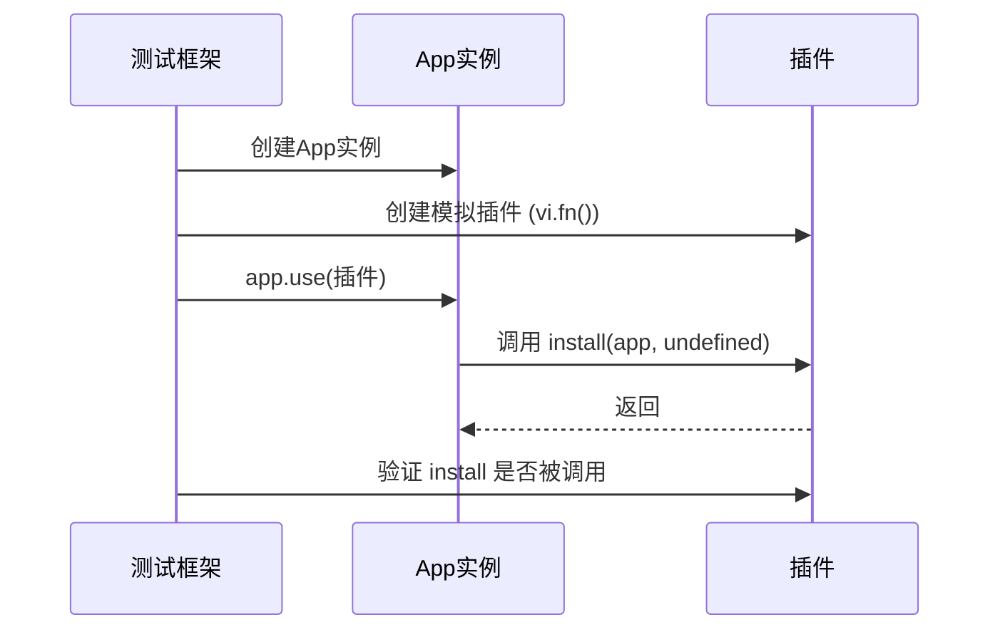
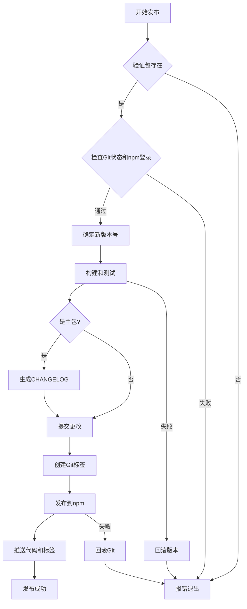
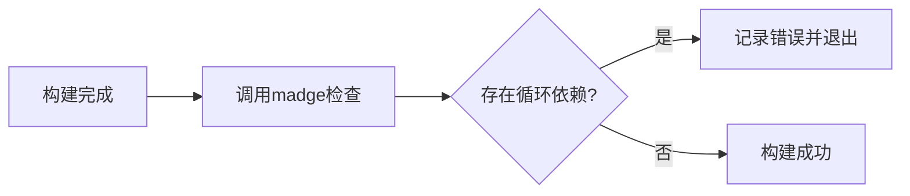

# 测试与部署

<cite>
**本文档中引用的文件**   
- [App.ts](file://packages/runtime-core/src/app/App.ts)
- [App.test.ts](file://packages/runtime-core/__tests__/app/App.test.ts)
- [effect.test.ts](file://packages/responsive/__tests__/effect/effect.test.ts)
- [vitest.config.ts](file://vitest.config.ts)
- [build.ts](file://scripts/build.ts)
- [release.ts](file://scripts/release.ts)
- [responsive/tsconfig.json](file://packages/responsive/tsconfig.json)
- [runtime-core/tsconfig.json](file://packages/runtime-core/tsconfig.json)
</cite>

## 目录
1. [测试策略](#测试策略)
2. [插件系统测试](#插件系统测试)
3. [打包与模块输出](#打包与模块输出)
4. [发布流程](#发布流程)
5. [性能基准测试](#性能基准测试)

## 测试策略

本项目采用 Vitest 作为测试框架，为 Vitarx 框架提供全面的测试覆盖。测试策略涵盖单元测试、集成测试和类型测试，确保代码质量和稳定性。

项目根目录的 `vitest.config.ts` 文件配置了全局测试环境，使用 `jsdom` 作为测试环境，包含覆盖率报告生成（使用 V8 提供程序），并设置了 10 秒的测试超时时间。测试文件遵循 `**/__tests__/**/*.{test,spec}.{js,ts}` 的匹配模式，排除了 `node_modules` 和 `dist` 目录。

`scripts/vitest.ts` 脚本提供了灵活的测试执行方式，支持通过命令行参数指定要测试的包、启用监听模式（`--watch`）和生成覆盖率报告（`--coverage`）。该脚本会遍历指定的包或所有包，并为每个包执行 Vitest 测试命令。

类型测试通过 `scripts/build.ts` 脚本中的 `runTest` 选项实现。当执行构建时，如果启用了测试，脚本会首先运行 Vitest 测试，确保在编译前所有测试用例都已通过。

**Section sources**
- [vitest.config.ts](file://vitest.config.ts#L1-L40)
- [scripts/vitest.ts](file://scripts/vitest.ts#L1-L155)
- [scripts/build.ts](file://scripts/build.ts#L1-L328)

## 插件系统测试

Vitarx 框架的插件系统通过 `App` 类的 `use` 方法实现，支持函数形式和对象形式（带有 `install` 方法）的插件。`App` 类的 `install` 方法签名定义了插件可以接受可选或必需的配置选项。

`packages/runtime-core/__tests__/app/App.test.ts` 文件中的测试用例详细验证了插件系统的功能。测试用例使用 Vitest 的 `vi.fn()` 来创建模拟函数，以验证 `install` 函数是否被正确调用。

**Diagram sources **
- [App.test.ts](file://packages/runtime-core/__tests__/app/App.test.ts#L196-L204)
- [App.ts](file://packages/runtime-core/src/app/App.ts#L376-L392)

**Section sources**
- [App.test.ts](file://packages/runtime-core/__tests__/app/App.test.ts#L195-L228)
- [App.ts](file://packages/runtime-core/src/app/App.ts#L22-L59)

## 打包与模块输出

项目的打包配置由 `scripts/build.ts` 脚本和各个包的 `tsconfig.json` 文件共同管理。`build.ts` 脚本负责清理 `dist` 目录、编译 TypeScript 代码、执行测试（如果启用）并检查循环依赖。

每个包（如 `responsive` 和 `runtime-core`）都包含一个 `tsconfig.json` 文件，该文件继承自项目根目录的 `tsconfig.json`。这些配置文件指定了编译输出目录为 `dist`，并包含了 `src` 目录，同时排除了 `dist`、`node_modules` 和 `__tests__` 目录。

`packages/vitarx/package.json` 文件通过 `exports` 字段定义了多种模块格式的输出：
- `.`: 主入口，提供 ESM 模块 (`dist/index.js`) 和类型定义 (`dist/index.d.ts`)
- `./jsx-runtime` 和 `./jsx-dev-runtime`: 提供 JSX 运行时模块
- `./unpkg` 和 `./jsdelivr`: 提供 IIFE 格式的捆绑包，适用于 CDN 直接引入

这种配置确保了库支持 tree-shaking，允许用户只导入和打包他们实际使用的代码，同时为不同环境（ESM、CJS、浏览器）提供了正确的模块格式。

**Section sources**
- [build.ts](file://scripts/build.ts#L1-L328)
- [responsive/tsconfig.json](file://packages/responsive/tsconfig.json#L1-L7)
- [runtime-core/tsconfig.json](file://packages/runtime-core/tsconfig.json#L1-L7)
- [vitarx/package.json](file://packages/vitarx/package.json#L1-L49)

## 发布流程

项目的发布流程由 `scripts/release.ts` 脚本自动化完成。该脚本遵循一个严谨的步骤，确保发布过程的可靠性和一致性。

发布流程如下：
1.  **验证**: 检查 Git 状态是否干净（无未提交的更改）并确认用户已登录 npm。
2.  **版本**: 确定新版本号。脚本支持通过命令行参数指定版本（如 `patch`, `minor`, `major`）或直接提供版本号。
3.  **构建**: 运行 `build.ts` 脚本，对指定的包进行构建和测试。
4.  **更新日志**: 如果是主包发布，使用 `conventional-changelog` 工具根据提交信息自动生成 `CHANGELOG.md` 文件。
5.  **提交**: 将更新的 `package.json` 和 `CHANGELOG.md` 文件提交到 Git 仓库。
6.  **打标签**: 为新版本创建 Git 标签（如 `v3.5.0`）。
7.  **发布**: 使用 `pnpm publish` 命令将包发布到 npm 仓库。
8.  **推送**: 将代码提交和标签推送到远程仓库。

整个流程包含错误处理和回滚机制。如果在任何步骤中发生错误，脚本会尝试回滚已做的更改（如恢复版本号、删除标签），以保持代码库的稳定状态。

**Diagram sources **
- [release.ts](file://scripts/release.ts#L92-L231)

**Section sources**
- [release.ts](file://scripts/release.ts#L1-L231)

## 性能基准测试

虽然当前代码库中没有显式的性能基准测试文件，但 `scripts/build.ts` 脚本中包含了一个重要的质量保证步骤：循环依赖检查。该脚本在构建完成后，会调用 `madge` 工具分析 `dist` 目录，检查是否存在循环依赖。

**Diagram sources **
- [build.ts](file://scripts/build.ts#L30-L64)

循环依赖是影响代码可维护性和 tree-shaking 效果的严重问题。通过在构建流程中强制检查并禁止循环依赖，项目确保了其模块化结构的清晰性，这本身就是一种性能优化，因为它保证了最终打包的代码可以被有效地 tree-shaking，从而生成更小的包体积。

此外，`App` 类中的 `useId` 工具函数也体现了对性能的考虑。该函数通过在应用上下文中维护一个独立的计数器来生成唯一 ID，避免了在非组件环境中使用全局计数器可能带来的性能问题和潜在的 ID 冲突。

**Section sources**
- [build.ts](file://scripts/build.ts#L30-L64)
- [utils.ts](file://packages/runtime-core/src/app/utils.ts#L1-L40)