# 平台适配案例

<cite>
**本文档引用的文件**
- [DomRenderer.ts](file://packages/runtime-dom/src/DomRenderer.ts)
- [factory.ts](file://packages/runtime-ssr/src/factory.ts)
- [SSRDriver.ts](file://packages/runtime-ssr/src/server/SSRDriver.ts)
- [HydrateDriver.ts](file://packages/runtime-ssr/src/client/HydrateDriver.ts)
- [schema.ts](file://packages/runtime-core/src/renderer/schema.ts)
- [attributes.ts](file://packages/runtime-dom/src/types/attributes.ts)
- [style.ts](file://packages/runtime-core/src/utils/style.ts)
- [element.ts](file://packages/runtime-core/src/types/element.ts)
- [element.ts](file://packages/runtime-core/src/vnode/creator/element.ts)
- [constrants.ts](file://packages/runtime-ssr/src/common/constrants.ts)
</cite>

## 目录
1. [项目结构](#项目结构)
2. [核心组件](#核心组件)
3. [浏览器环境下的DomRenderer实现](#浏览器环境下的domrenderer实现)
4. [服务端渲染的空渲染器模式](#服务端渲染的空渲染器模式)
5. [SVG专用渲染器构建](#svg专用渲染器构建)
6. [跨平台适配模式总结](#跨平台适配模式总结)

## 项目结构

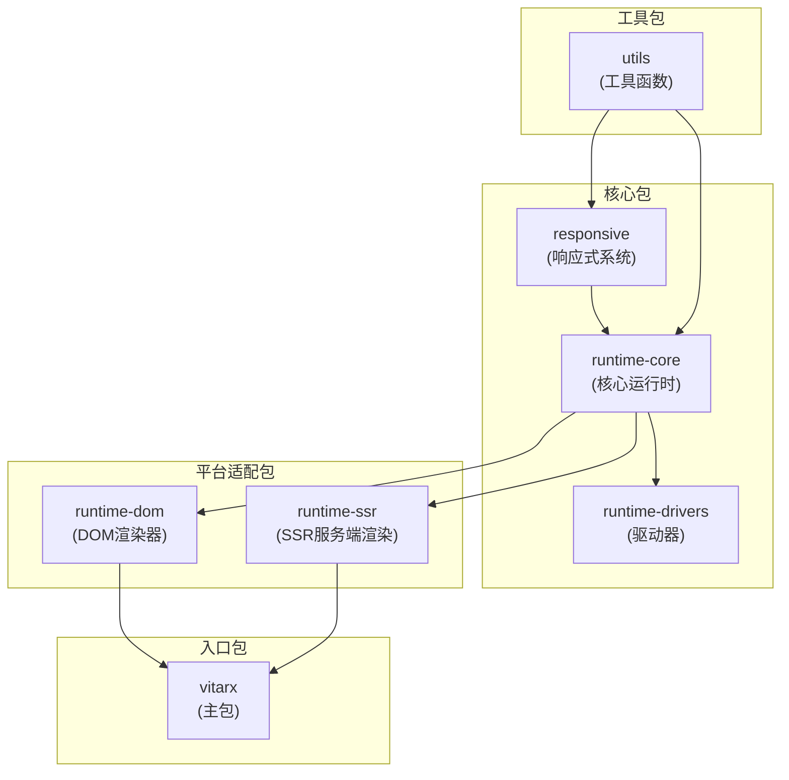

**图源**
- [DomRenderer.ts](file://packages/runtime-dom/src/DomRenderer.ts)
- [factory.ts](file://packages/runtime-ssr/src/factory.ts)
- [SSRDriver.ts](file://packages/runtime-ssr/src/server/SSRDriver.ts)

**节源**
- [DomRenderer.ts](file://packages/runtime-dom/src/DomRenderer.ts)
- [factory.ts](file://packages/runtime-ssr/src/factory.ts)

## 核心组件

本项目的核心组件包括DomRenderer、SSR渲染器、驱动器系统和响应式系统。DomRenderer是浏览器环境下的主要渲染器，负责DOM操作和渲染。SSR渲染器在服务端通过Proxy实现空渲染器模式，避免DOM操作。驱动器系统负责节点的挂载、更新和卸载。响应式系统提供数据绑定和状态管理功能。

**节源**
- [DomRenderer.ts](file://packages/runtime-dom/src/DomRenderer.ts)
- [SSRDriver.ts](file://packages/runtime-ssr/src/server/SSRDriver.ts)
- [responsive](file://packages/responsive)

## 浏览器环境下的DomRenderer实现

DomRenderer是浏览器环境下的核心渲染器，实现了HostRenderer接口，负责DOM元素的创建、更新和销毁。它支持SVG元素处理、属性批量设置和事件代理机制。

### SVG元素处理

DomRenderer通过命名空间处理SVG元素。当创建SVG元素时，使用`createElementNS`方法指定SVG命名空间。`isSVGElement`标志用于标识SVG元素及其子元素。

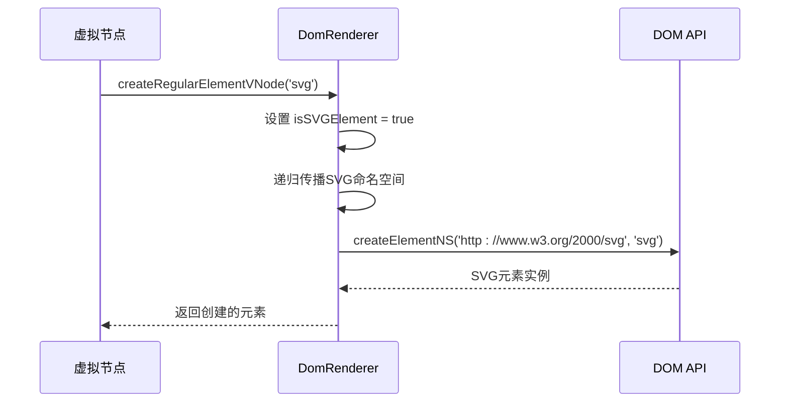

**图源**
- [DomRenderer.ts](file://packages/runtime-dom/src/DomRenderer.ts#L64-L74)
- [element.ts](file://packages/runtime-core/src/vnode/creator/element.ts#L55-L64)

### 属性批量设置

DomRenderer提供了`setAttributes`方法用于批量设置元素属性。该方法遍历属性对象，为每个属性调用`setAttribute`方法。

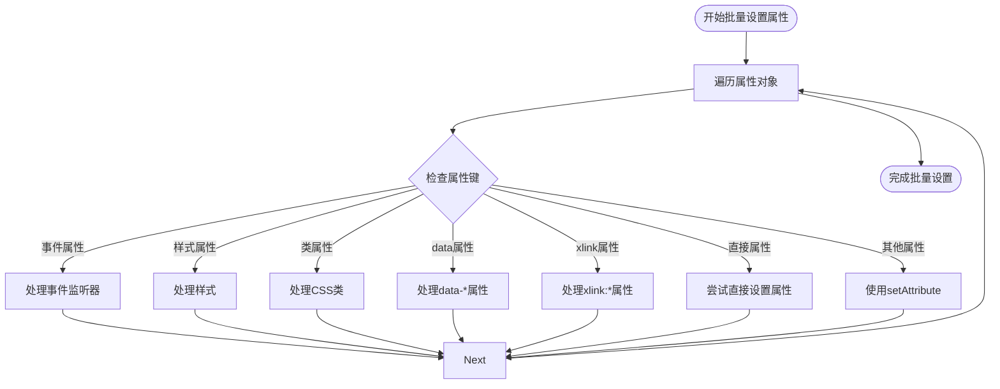

**图源**
- [DomRenderer.ts](file://packages/runtime-dom/src/DomRenderer.ts#L319-L324)
- [attributes.ts](file://packages/runtime-dom/src/types/attributes.ts)

### 事件代理机制

DomRenderer实现了完整的事件代理机制，支持事件选项如capture、once和passive。事件名称通过`extractEventOptions`方法解析，提取事件类型和选项。

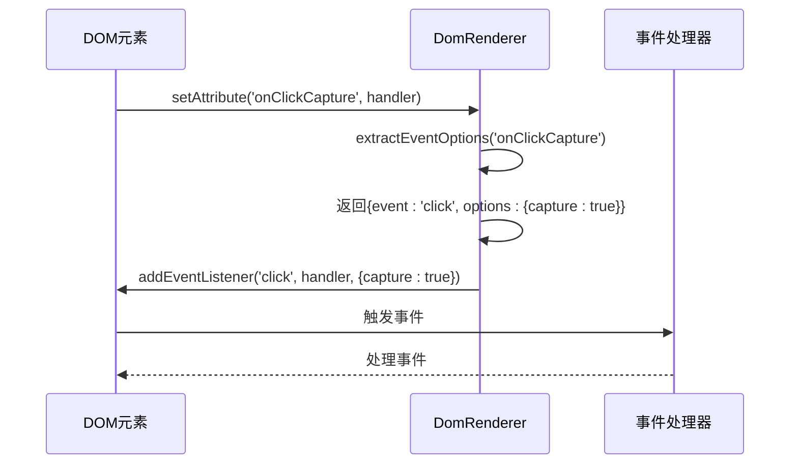

**图源**
- [DomRenderer.ts](file://packages/runtime-dom/src/DomRenderer.ts#L487-L496)
- [DomRenderer.ts](file://packages/runtime-dom/src/DomRenderer.ts#L521-L538)

**节源**
- [DomRenderer.ts](file://packages/runtime-dom/src/DomRenderer.ts)

## 服务端渲染的空渲染器模式

服务端渲染通过Proxy实现空渲染器模式，避免在服务端执行DOM操作。

### SSR环境检测

通过`__IS_SERVER__`常量检测是否在服务端运行：

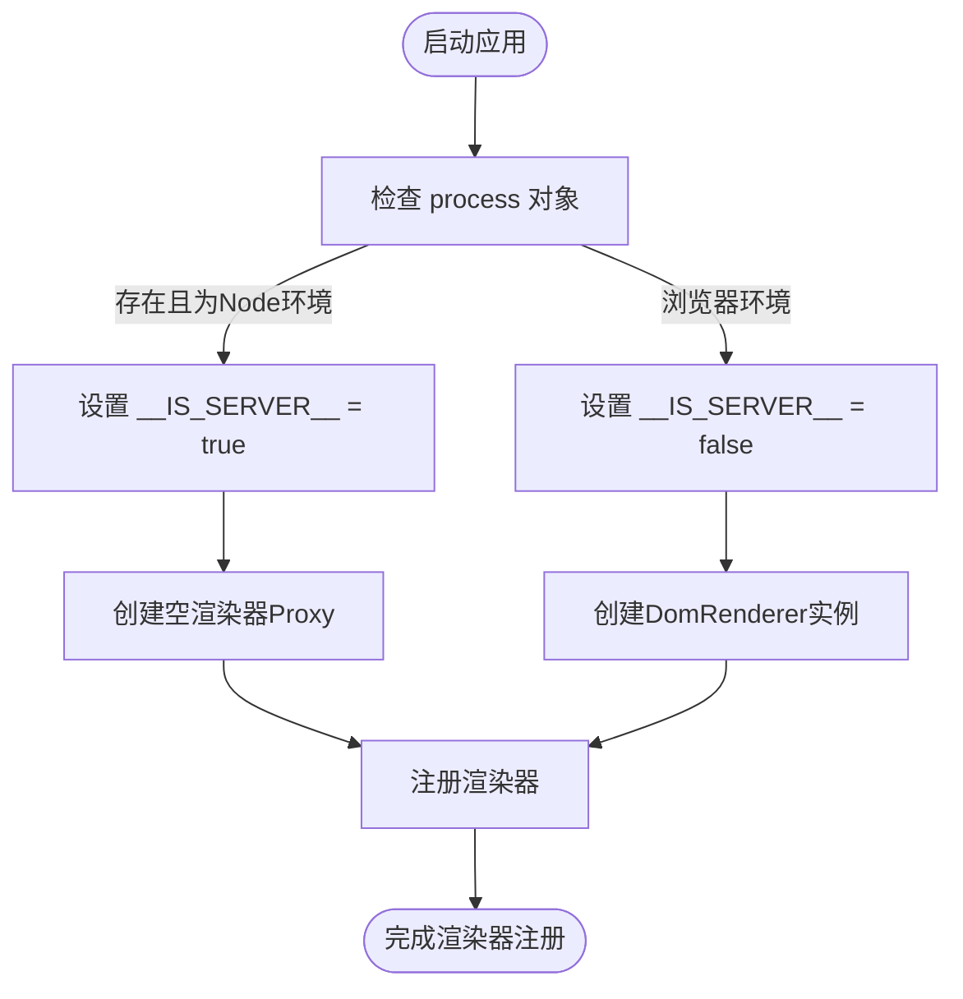

**图源**
- [constrants.ts](file://packages/runtime-ssr/src/common/constrants.ts)
- [factory.ts](file://packages/runtime-ssr/src/factory.ts)

### Proxy空渲染器

在服务端，渲染器被替换为Proxy对象，所有方法调用都会抛出错误：

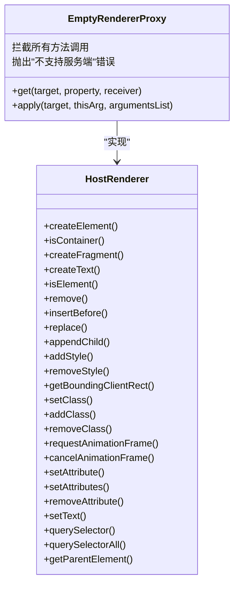

**图源**
- [factory.ts](file://packages/runtime-ssr/src/factory.ts#L8-L14)

### SSR驱动器

SSR驱动器负责服务端的节点渲染，不执行DOM操作，只处理虚拟节点的渲染逻辑：

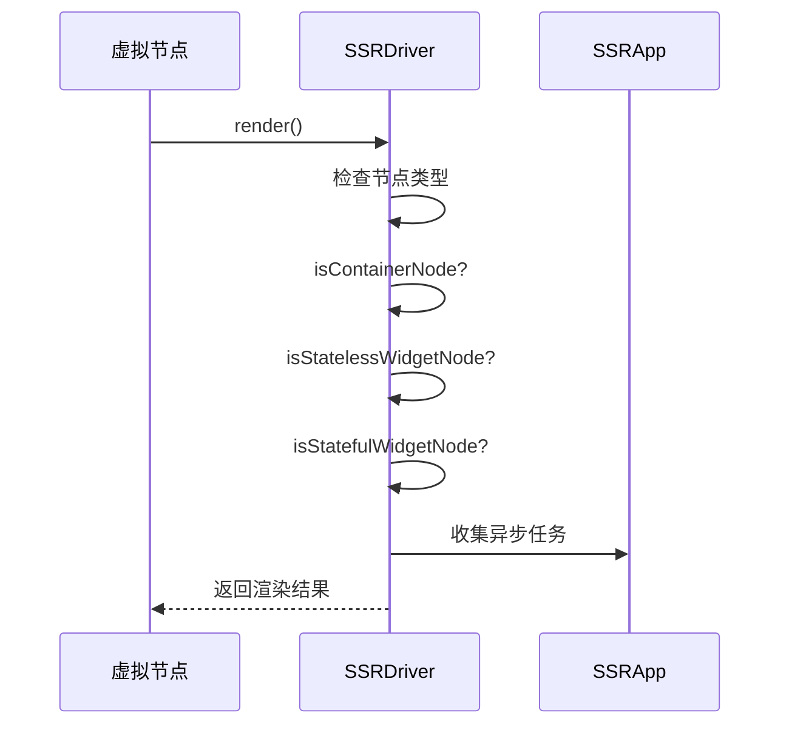

**图源**
- [SSRDriver.ts](file://packages/runtime-ssr/src/server/SSRDriver.ts)
- [HydrateDriver.ts](file://packages/runtime-ssr/src/client/HydrateDriver.ts)

**节源**
- [factory.ts](file://packages/runtime-ssr/src/factory.ts)
- [SSRDriver.ts](file://packages/runtime-ssr/src/server/SSRDriver.ts)

## SVG专用渲染器构建

构建SVG专用渲染器需要处理命名空间、属性映射和样式集成等关键问题。

### 命名空间处理

SVG渲染器必须正确处理XML命名空间，包括SVG主命名空间和XLink扩展命名空间：

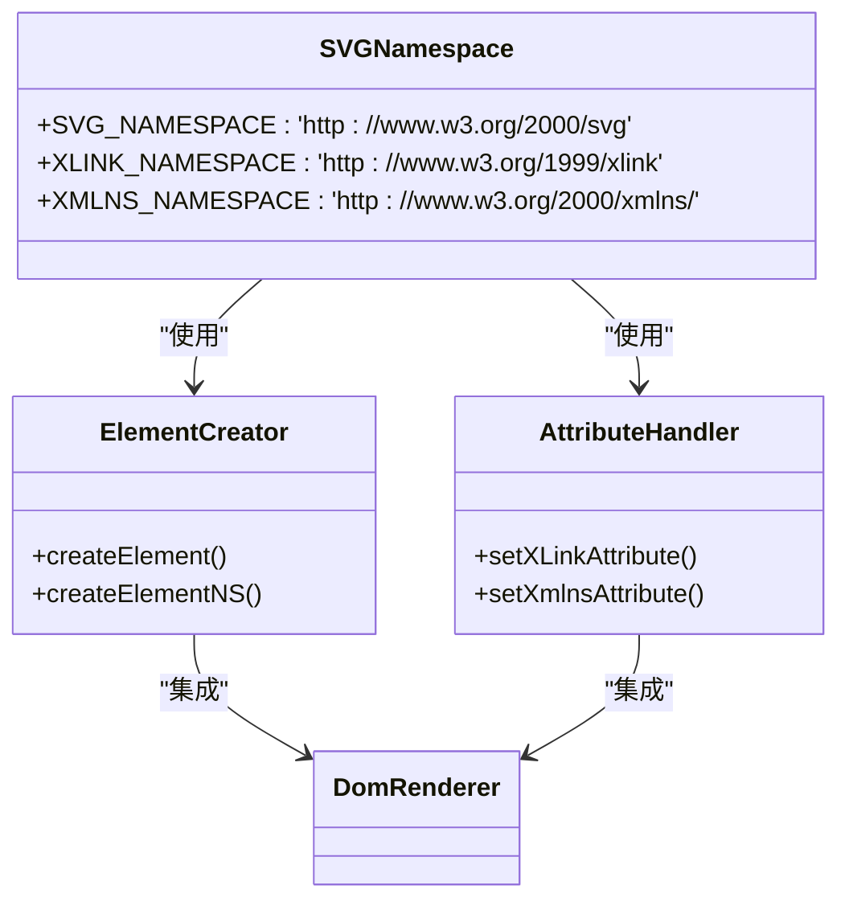

**图源**
- [DomRenderer.ts](file://packages/runtime-dom/src/DomRenderer.ts#L40-L41)

### 属性映射

SVG属性需要特殊映射处理，特别是XLink相关的属性：

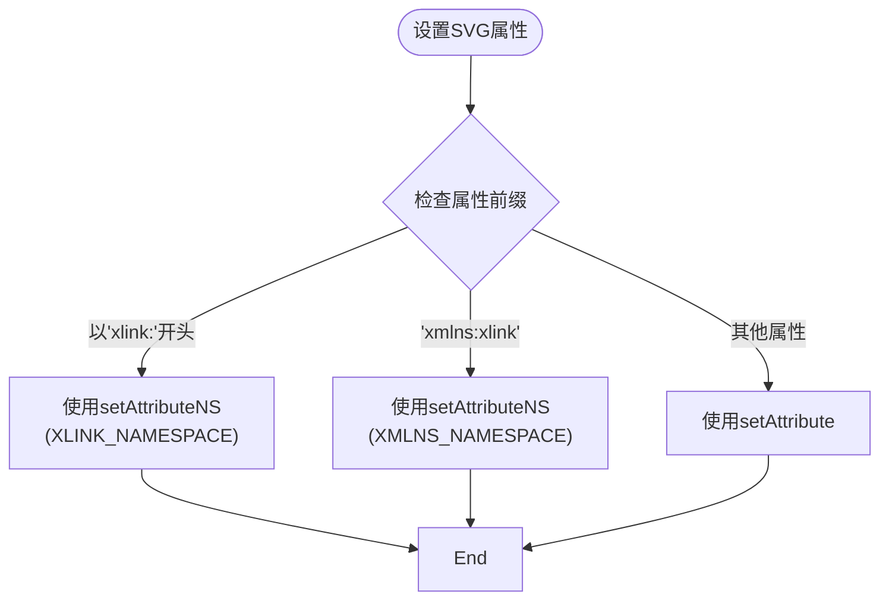

**图源**
- [DomRenderer.ts](file://packages/runtime-dom/src/DomRenderer.ts#L275-L278)
- [DomRenderer.ts](file://packages/runtime-dom/src/DomRenderer.ts#L295-L297)

### 样式集成

SVG样式处理需要集成CSS样式工具，支持对象和字符串格式的样式：

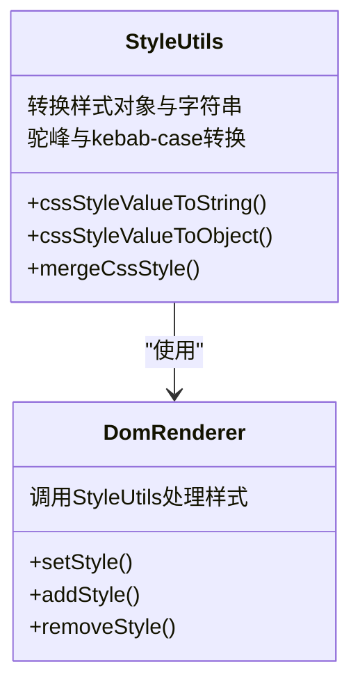

**图源**
- [style.ts](file://packages/runtime-core/src/utils/style.ts)
- [DomRenderer.ts](file://packages/runtime-dom/src/DomRenderer.ts#L239-L246)

**节源**
- [DomRenderer.ts](file://packages/runtime-dom/src/DomRenderer.ts)
- [style.ts](file://packages/runtime-core/src/utils/style.ts)

## 跨平台适配模式总结

### 通用模式

跨平台适配的通用模式包括接口抽象、条件编译和代理模式：

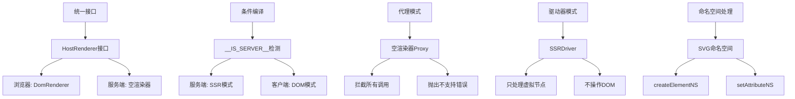

### 反模式

跨平台适配应避免的反模式包括：

1. **直接DOM操作**：在服务端直接使用document.createElement等DOM API
2. **环境检测遗漏**：未检测运行环境就执行平台特定代码
3. **接口不一致**：不同平台的渲染器接口不统一
4. **硬编码路径**：直接引用平台特定的文件路径
5. **同步阻塞**：在服务端使用同步阻塞的DOM操作

正确的做法是通过统一接口、条件编译和代理模式来实现跨平台兼容。

**节源**
- [factory.ts](file://packages/runtime-ssr/src/factory.ts)
- [DomRenderer.ts](file://packages/runtime-dom/src/DomRenderer.ts)
- [SSRDriver.ts](file://packages/runtime-ssr/src/server/SSRDriver.ts)