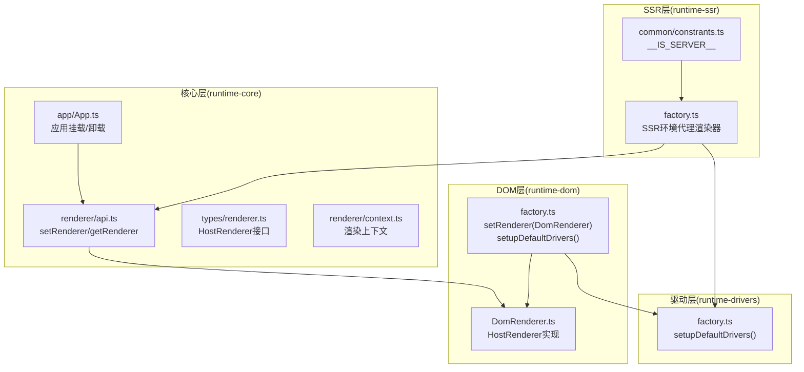
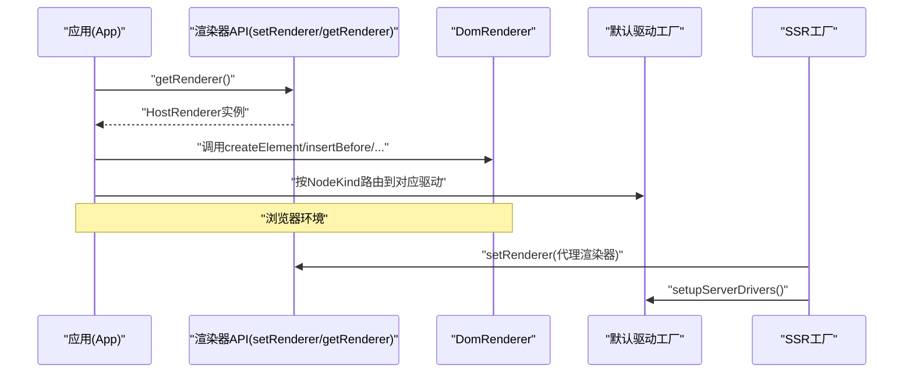
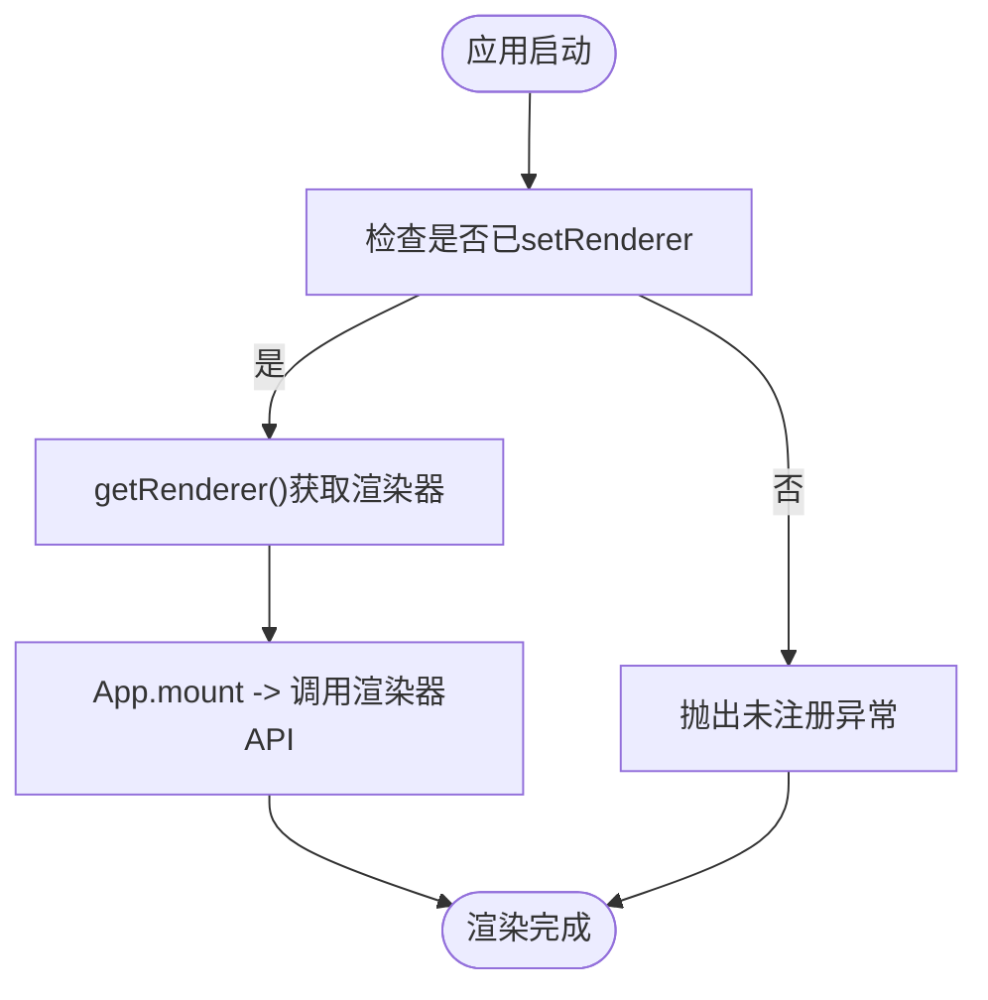
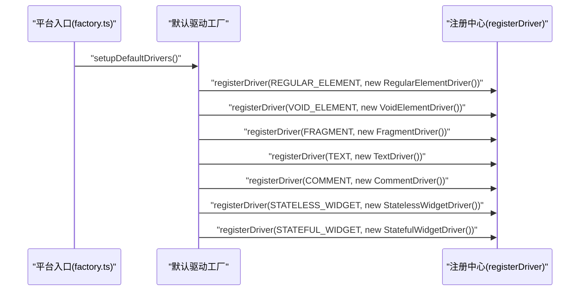
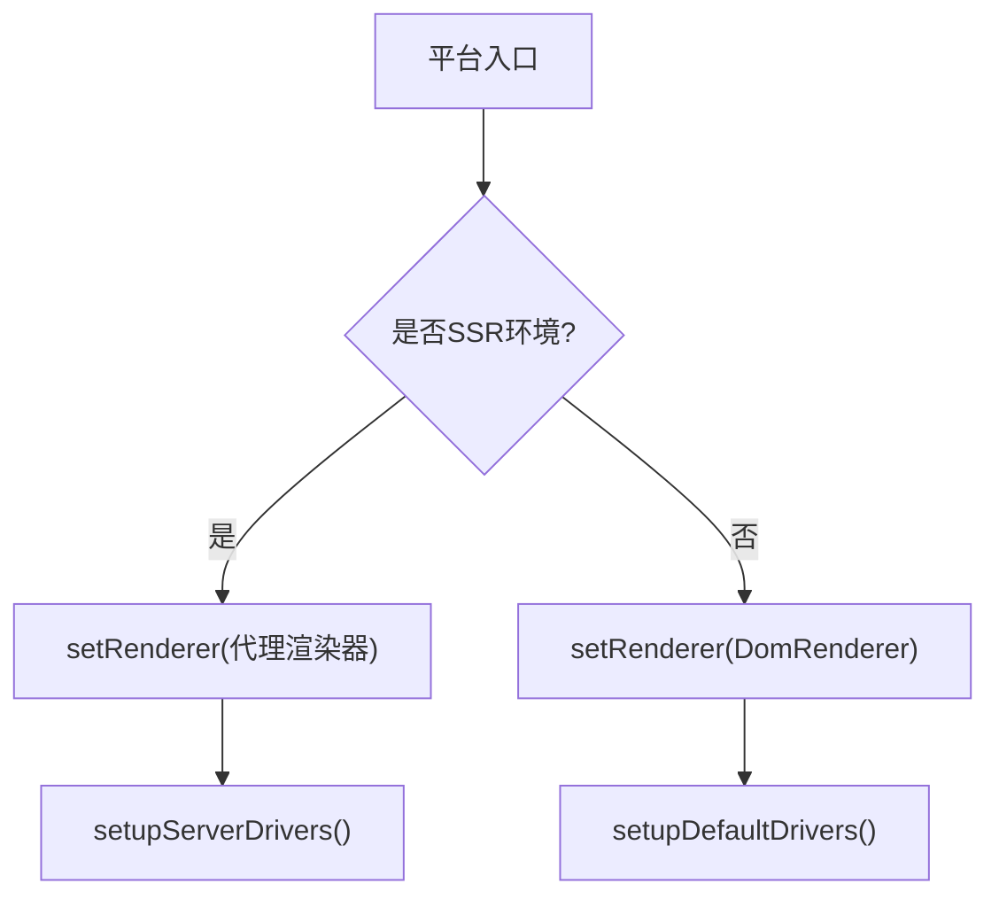
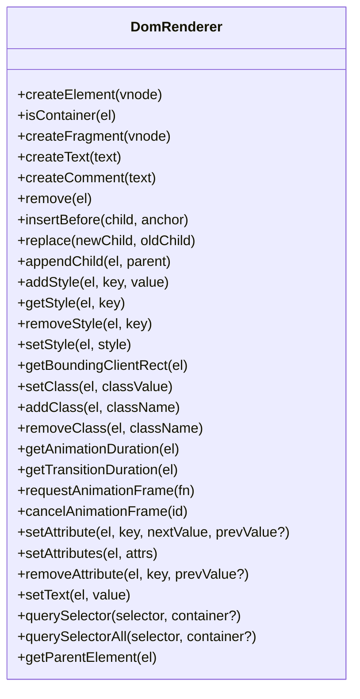
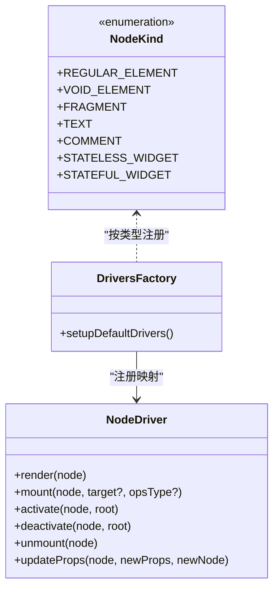
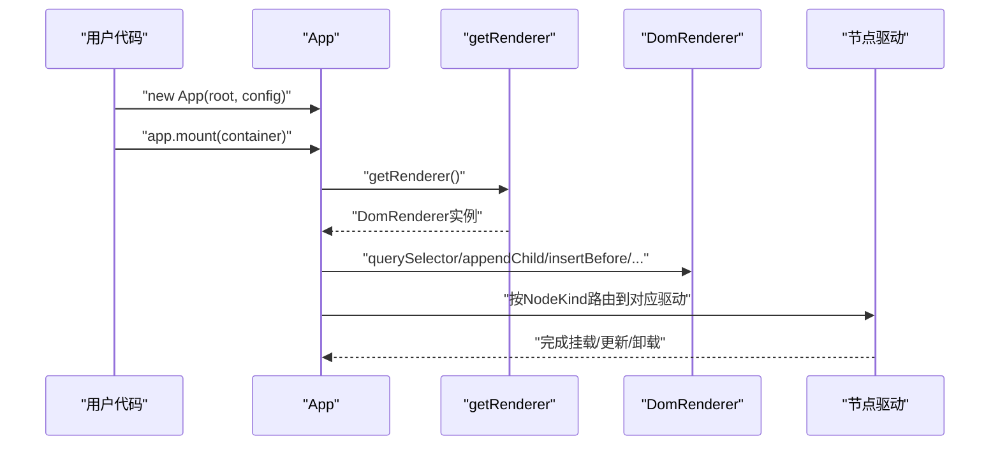
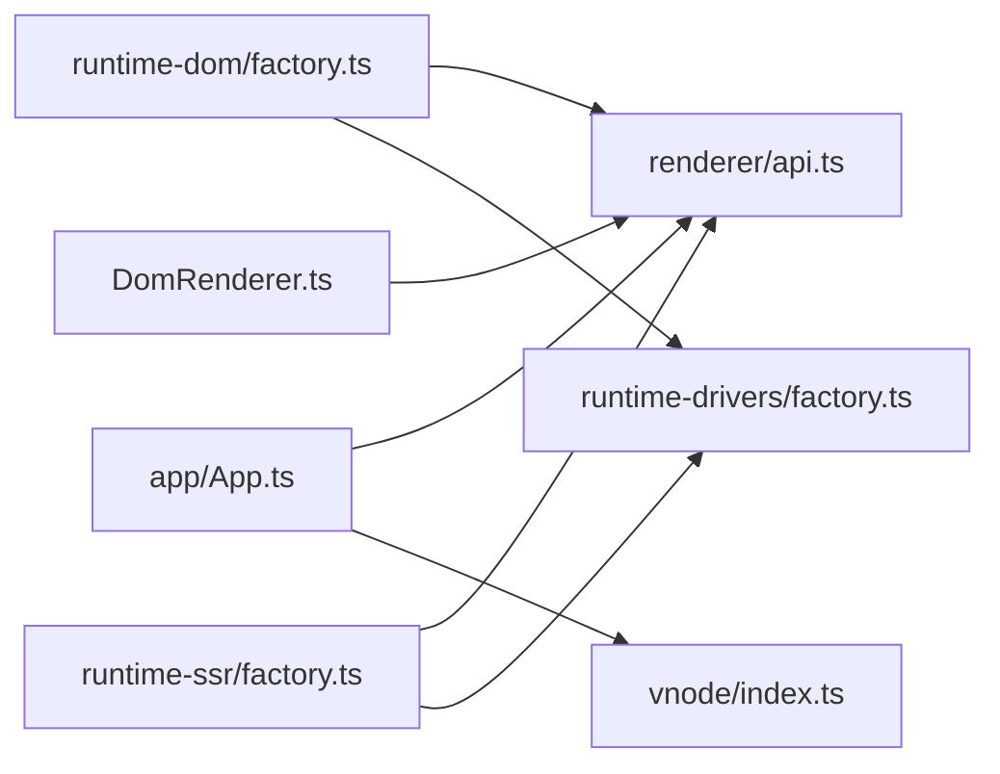

# 渲染器实现步骤

<cite>
**本文引用的文件**
- [packages/runtime-dom/src/factory.ts](file://packages/runtime-dom/src/factory.ts)
- [packages/runtime-dom/src/DomRenderer.ts](file://packages/runtime-dom/src/DomRenderer.ts)
- [packages/runtime-core/src/renderer/api.ts](file://packages/runtime-core/src/renderer/api.ts)
- [packages/runtime-core/src/renderer/context.ts](file://packages/runtime-core/src/renderer/context.ts)
- [packages/runtime-core/src/types/renderer.ts](file://packages/runtime-core/src/types/renderer.ts)
- [packages/runtime-core/src/types/driver.ts](file://packages/runtime-core/src/types/driver.ts)
- [packages/runtime-core/src/constants/nodeKind.ts](file://packages/runtime-core/src/constants/nodeKind.ts)
- [packages/runtime-core/src/vnode/index.ts](file://packages/runtime-core/src/vnode/index.ts)
- [packages/runtime-core/src/app/App.ts](file://packages/runtime-core/src/app/App.ts)
- [packages/runtime-drivers/src/factory.ts](file://packages/runtime-drivers/src/factory.ts)
- [packages/runtime-ssr/src/factory.ts](file://packages/runtime-ssr/src/factory.ts)
- [packages/runtime-ssr/src/common/constrants.ts](file://packages/runtime-ssr/src/common/constrants.ts)
</cite>

## 目录
1. [引言](#引言)
2. [项目结构](#项目结构)
3. [核心组件](#核心组件)
4. [架构总览](#架构总览)
5. [详细组件分析](#详细组件分析)
6. [依赖关系分析](#依赖关系分析)
7. [性能考量](#性能考量)
8. [故障排查指南](#故障排查指南)
9. [结论](#结论)
10. [附录：类型与导入指引](#附录类型与导入指引)

## 引言
本指南面向从零开始构建一个完整渲染器实例的开发者，系统讲解如何通过工厂模式注册驱动程序、如何正确绑定 HostRenderer 实例、如何在初始化阶段完成依赖注入，并提供错误处理最佳实践与类型安全建议。读者将掌握：
- 通过 setRenderer 与 getRenderer 实现依赖注入与运行时绑定
- setupDefaultDrivers 的调用时机与注册流程
- 如何在 DOM 环境与 SSR 环境分别注册合适的渲染器
- 驱动程序的节点类型映射与挂载/更新/卸载生命周期
- 未注册异常的捕获与重复注册的预防策略

## 项目结构
本仓库采用多包工作区组织，渲染器相关的关键模块分布如下：
- runtime-core：渲染器接口定义、全局渲染器注册/获取、应用生命周期与上下文
- runtime-dom：DOM 渲染器实现与工厂函数
- runtime-drivers：默认节点驱动注册工厂
- runtime-ssr：SSR 环境下的渲染器代理与驱动注册

图表来源
- [packages/runtime-dom/src/factory.ts](file://packages/runtime-dom/src/factory.ts#L1-L24)
- [packages/runtime-dom/src/DomRenderer.ts](file://packages/runtime-dom/src/DomRenderer.ts#L62-L120)
- [packages/runtime-core/src/renderer/api.ts](file://packages/runtime-core/src/renderer/api.ts#L1-L26)
- [packages/runtime-core/src/app/App.ts](file://packages/runtime-core/src/app/App.ts#L187-L202)
- [packages/runtime-drivers/src/factory.ts](file://packages/runtime-drivers/src/factory.ts#L1-L39)
- [packages/runtime-ssr/src/factory.ts](file://packages/runtime-ssr/src/factory.ts#L1-L21)
- [packages/runtime-ssr/src/common/constrants.ts](file://packages/runtime-ssr/src/common/constrants.ts#L1-L2)

章节来源
- [packages/runtime-dom/src/factory.ts](file://packages/runtime-dom/src/factory.ts#L1-L24)
- [packages/runtime-core/src/renderer/api.ts](file://packages/runtime-core/src/renderer/api.ts#L1-L26)
- [packages/runtime-core/src/types/renderer.ts](file://packages/runtime-core/src/types/renderer.ts#L79-L280)
- [packages/runtime-core/src/app/App.ts](file://packages/runtime-core/src/app/App.ts#L187-L202)
- [packages/runtime-drivers/src/factory.ts](file://packages/runtime-drivers/src/factory.ts#L1-L39)
- [packages/runtime-ssr/src/factory.ts](file://packages/runtime-ssr/src/factory.ts#L1-L21)

## 核心组件
- HostRenderer 接口：定义宿主平台渲染器必须实现的操作集合，包括元素创建、属性/样式设置、事件绑定、查询与生命周期等
- setRenderer/getRenderer：全局渲染器注册与获取，实现依赖注入
- DomRenderer：浏览器环境下的 HostRenderer 实现，封装 DOM 操作细节
- App：应用主类，负责挂载/卸载、上下文注入与错误处理，挂载时通过 getRenderer 获取已注册渲染器
- setupDefaultDrivers：注册默认节点驱动，将 NodeKind 映射到具体驱动实例
- SSR 工厂：在服务端环境下注册不可用的渲染器代理，避免在服务端调用 DOM API

章节来源
- [packages/runtime-core/src/types/renderer.ts](file://packages/runtime-core/src/types/renderer.ts#L79-L280)
- [packages/runtime-core/src/renderer/api.ts](file://packages/runtime-core/src/renderer/api.ts#L1-L26)
- [packages/runtime-dom/src/DomRenderer.ts](file://packages/runtime-dom/src/DomRenderer.ts#L62-L120)
- [packages/runtime-core/src/app/App.ts](file://packages/runtime-core/src/app/App.ts#L187-L202)
- [packages/runtime-drivers/src/factory.ts](file://packages/runtime-drivers/src/factory.ts#L1-L39)
- [packages/runtime-ssr/src/factory.ts](file://packages/runtime-ssr/src/factory.ts#L1-L21)

## 架构总览
渲染器体系通过“接口定义 + 实现 + 工厂注册 + 应用挂载”的方式解耦平台差异，保证在不同宿主环境（浏览器/SSR）下均能正确渲染。

图表来源
- [packages/runtime-core/src/app/App.ts](file://packages/runtime-core/src/app/App.ts#L187-L202)
- [packages/runtime-core/src/renderer/api.ts](file://packages/runtime-core/src/renderer/api.ts#L1-L26)
- [packages/runtime-dom/src/DomRenderer.ts](file://packages/runtime-dom/src/DomRenderer.ts#L62-L120)
- [packages/runtime-drivers/src/factory.ts](file://packages/runtime-drivers/src/factory.ts#L1-L39)
- [packages/runtime-ssr/src/factory.ts](file://packages/runtime-ssr/src/factory.ts#L1-L21)

## 详细组件分析

### 1) 依赖注入：setRenderer 与 getRenderer
- setRenderer：将 HostRenderer 实例设置为全局可用，供运行时各模块共享
- getRenderer：在需要执行 DOM 操作时获取已注册的渲染器；若未注册则抛出明确错误，避免静默失败
- App 在挂载阶段通过 getRenderer 获取渲染器实例，再调用 mountNode 完成挂载

图表来源
- [packages/runtime-core/src/renderer/api.ts](file://packages/runtime-core/src/renderer/api.ts#L1-L26)
- [packages/runtime-core/src/app/App.ts](file://packages/runtime-core/src/app/App.ts#L187-L202)

章节来源
- [packages/runtime-core/src/renderer/api.ts](file://packages/runtime-core/src/renderer/api.ts#L1-L26)
- [packages/runtime-core/src/app/App.ts](file://packages/runtime-core/src/app/App.ts#L187-L202)

### 2) 工厂模式注册驱动程序：setupDefaultDrivers
- NodeKind 定义了节点类型枚举，涵盖元素、文本、注释、片段、组件等
- setupDefaultDrivers 将每种 NodeKind 映射到对应驱动实例，确保渲染器能正确处理不同节点
- 调用时机：在平台入口处（如 runtime-dom 的 factory.ts）调用，确保渲染器与驱动在应用启动前就绪

图表来源
- [packages/runtime-drivers/src/factory.ts](file://packages/runtime-drivers/src/factory.ts#L1-L39)
- [packages/runtime-core/src/constants/nodeKind.ts](file://packages/runtime-core/src/constants/nodeKind.ts#L1-L26)

章节来源
- [packages/runtime-drivers/src/factory.ts](file://packages/runtime-drivers/src/factory.ts#L1-L39)
- [packages/runtime-core/src/constants/nodeKind.ts](file://packages/runtime-core/src/constants/nodeKind.ts#L1-L26)

### 3) 初始化阶段绑定 HostRenderer 实例
- 浏览器环境：runtime-dom 的 factory.ts 中先 setRenderer(new DomRenderer())，再 setupDefaultDrivers()
- SSR 环境：runtime-ssr 的 factory.ts 中检测 __IS_SERVER__，若为服务端则注册一个代理渲染器（调用任一方法都会抛错），同时 setupServerDrivers()

图表来源
- [packages/runtime-dom/src/factory.ts](file://packages/runtime-dom/src/factory.ts#L1-L24)
- [packages/runtime-ssr/src/factory.ts](file://packages/runtime-ssr/src/factory.ts#L1-L21)
- [packages/runtime-ssr/src/common/constrants.ts](file://packages/runtime-ssr/src/common/constrants.ts#L1-L2)

章节来源
- [packages/runtime-dom/src/factory.ts](file://packages/runtime-dom/src/factory.ts#L1-L24)
- [packages/runtime-ssr/src/factory.ts](file://packages/runtime-ssr/src/factory.ts#L1-L21)
- [packages/runtime-ssr/src/common/constrants.ts](file://packages/runtime-ssr/src/common/constrants.ts#L1-L2)

### 4) DomRenderer：HostRenderer 的浏览器实现
- 负责创建/删除/替换 DOM 元素、设置属性/样式、事件绑定、查询与定位、动画/过渡时长计算等
- 对 Fragment 节点有特殊处理，使用注释锚点标记起止位置，保证插入/替换/删除的正确性
- 对属性设置做了大量兼容处理（dataset、xlinkNS、style/class 等），并提供默认值缓存以提升性能
- 对事件属性进行解析与绑定，支持 capture/once/passive 等选项

图表来源
- [packages/runtime-dom/src/DomRenderer.ts](file://packages/runtime-dom/src/DomRenderer.ts#L62-L120)
- [packages/runtime-dom/src/DomRenderer.ts](file://packages/runtime-dom/src/DomRenderer.ts#L238-L313)
- [packages/runtime-dom/src/DomRenderer.ts](file://packages/runtime-dom/src/DomRenderer.ts#L319-L358)
- [packages/runtime-dom/src/DomRenderer.ts](file://packages/runtime-dom/src/DomRenderer.ts#L360-L424)
- [packages/runtime-dom/src/DomRenderer.ts](file://packages/runtime-dom/src/DomRenderer.ts#L426-L568)

章节来源
- [packages/runtime-dom/src/DomRenderer.ts](file://packages/runtime-dom/src/DomRenderer.ts#L62-L120)
- [packages/runtime-dom/src/DomRenderer.ts](file://packages/runtime-dom/src/DomRenderer.ts#L238-L313)
- [packages/runtime-dom/src/DomRenderer.ts](file://packages/runtime-dom/src/DomRenderer.ts#L319-L358)
- [packages/runtime-dom/src/DomRenderer.ts](file://packages/runtime-dom/src/DomRenderer.ts#L360-L424)
- [packages/runtime-dom/src/DomRenderer.ts](file://packages/runtime-dom/src/DomRenderer.ts#L426-L568)

### 5) 驱动程序与节点类型映射
- NodeKind 定义了节点类型枚举，驱动工厂将每种类型映射到对应驱动
- 驱动接口 NodeDriver 定义了渲染(render)、挂载(mount)、激活/停用(activate/deactivate)、卸载(unmount)、更新属性(updateProps)等生命周期方法
- vnode/index 导出驱动相关入口，配合渲染器在挂载/更新/卸载时调用

图表来源
- [packages/runtime-core/src/types/driver.ts](file://packages/runtime-core/src/types/driver.ts#L1-L51)
- [packages/runtime-core/src/constants/nodeKind.ts](file://packages/runtime-core/src/constants/nodeKind.ts#L1-L26)
- [packages/runtime-drivers/src/factory.ts](file://packages/runtime-drivers/src/factory.ts#L1-L39)

章节来源
- [packages/runtime-core/src/types/driver.ts](file://packages/runtime-core/src/types/driver.ts#L1-L51)
- [packages/runtime-core/src/constants/nodeKind.ts](file://packages/runtime-core/src/constants/nodeKind.ts#L1-L26)
- [packages/runtime-drivers/src/factory.ts](file://packages/runtime-drivers/src/factory.ts#L1-L39)

### 6) 应用挂载流程与渲染器交互
- App 构造时注入应用上下文，挂载阶段通过 getRenderer 获取渲染器
- 若传入选择器字符串，先通过渲染器的 querySelector 查找容器，找不到则抛错
- 调用 mountNode 完成根节点挂载，随后渲染器驱动按 NodeKind 分派到对应驱动

图表来源
- [packages/runtime-core/src/app/App.ts](file://packages/runtime-core/src/app/App.ts#L187-L202)
- [packages/runtime-core/src/renderer/api.ts](file://packages/runtime-core/src/renderer/api.ts#L1-L26)
- [packages/runtime-dom/src/DomRenderer.ts](file://packages/runtime-dom/src/DomRenderer.ts#L360-L424)

章节来源
- [packages/runtime-core/src/app/App.ts](file://packages/runtime-core/src/app/App.ts#L187-L202)
- [packages/runtime-core/src/renderer/api.ts](file://packages/runtime-core/src/renderer/api.ts#L1-L26)

## 依赖关系分析
- 平台入口依赖渲染器 API 与驱动工厂
- App 依赖渲染器 API 与 vnode 挂载入口
- DomRenderer 依赖 HostRenderer 接口与浏览器 DOM API
- SSR 工厂在服务端环境下替换渲染器，避免调用 DOM API

图表来源
- [packages/runtime-dom/src/factory.ts](file://packages/runtime-dom/src/factory.ts#L1-L24)
- [packages/runtime-core/src/renderer/api.ts](file://packages/runtime-core/src/renderer/api.ts#L1-L26)
- [packages/runtime-core/src/app/App.ts](file://packages/runtime-core/src/app/App.ts#L187-L202)
- [packages/runtime-dom/src/DomRenderer.ts](file://packages/runtime-dom/src/DomRenderer.ts#L62-L120)
- [packages/runtime-drivers/src/factory.ts](file://packages/runtime-drivers/src/factory.ts#L1-L39)
- [packages/runtime-ssr/src/factory.ts](file://packages/runtime-ssr/src/factory.ts#L1-L21)

章节来源
- [packages/runtime-dom/src/factory.ts](file://packages/runtime-dom/src/factory.ts#L1-L24)
- [packages/runtime-core/src/app/App.ts](file://packages/runtime-core/src/app/App.ts#L187-L202)
- [packages/runtime-core/src/renderer/api.ts](file://packages/runtime-core/src/renderer/api.ts#L1-L26)
- [packages/runtime-dom/src/DomRenderer.ts](file://packages/runtime-dom/src/DomRenderer.ts#L62-L120)
- [packages/runtime-drivers/src/factory.ts](file://packages/runtime-drivers/src/factory.ts#L1-L39)
- [packages/runtime-ssr/src/factory.ts](file://packages/runtime-ssr/src/factory.ts#L1-L21)

## 性能考量
- 属性默认值缓存：DomRenderer 使用 DEFAULT_PROPERTIES_CACHE 缓存元素属性默认值，减少重复创建元素的成本
- Fragment 子节点恢复：在插入/替换前恢复 Fragment 子节点，避免多次重建 DOM
- 事件选项解析：对事件属性进行一次性解析，减少运行时开销
- 批量属性设置：setAttributes 遍历属性对象，减少重复 DOM 操作
- 动画/过渡时长计算：通过 getComputedStyle 一次性解析并取最大值，避免多次样式查询

章节来源
- [packages/runtime-dom/src/DomRenderer.ts](file://packages/runtime-dom/src/DomRenderer.ts#L40-L60)
- [packages/runtime-dom/src/DomRenderer.ts](file://packages/runtime-dom/src/DomRenderer.ts#L426-L568)

## 故障排查指南
- 未注册渲染器异常
  - 现象：调用 getRenderer 抛出“渲染器未注册”错误
  - 原因：未在应用启动前调用 setRenderer 或 SSR 环境未正确设置代理渲染器
  - 解决：确保在平台入口处调用 setRenderer(new DomRenderer()) 或 SSR 环境的代理渲染器
  - 参考路径：[packages/runtime-core/src/renderer/api.ts](file://packages/runtime-core/src/renderer/api.ts#L1-L26)

- 挂载容器不存在
  - 现象：App.mount 传入选择器后找不到容器，抛出“未找到元素”错误
  - 原因：选择器无效或页面尚未加载完成
  - 解决：确认选择器正确、页面已加载，或传入已存在的 DOM 元素
  - 参考路径：[packages/runtime-core/src/app/App.ts](file://packages/runtime-core/src/app/App.ts#L187-L202)

- SSR 环境调用 DOM API
  - 现象：在服务端调用渲染器方法抛错
  - 原因：SSR 环境注册了代理渲染器，所有方法都会抛错
  - 解决：在服务端仅进行服务端渲染逻辑，避免客户端 DOM 操作
  - 参考路径：[packages/runtime-ssr/src/factory.ts](file://packages/runtime-ssr/src/factory.ts#L1-L21)

- 事件绑定/移除异常
  - 现象：事件属性设置/移除报错
  - 原因：属性设置异常被捕获并记录日志
  - 解决：检查事件属性命名与参数类型，确保事件处理函数一致
  - 参考路径：[packages/runtime-dom/src/DomRenderer.ts](file://packages/runtime-dom/src/DomRenderer.ts#L252-L313)

章节来源
- [packages/runtime-core/src/renderer/api.ts](file://packages/runtime-core/src/renderer/api.ts#L1-L26)
- [packages/runtime-core/src/app/App.ts](file://packages/runtime-core/src/app/App.ts#L187-L202)
- [packages/runtime-ssr/src/factory.ts](file://packages/runtime-ssr/src/factory.ts#L1-L21)
- [packages/runtime-dom/src/DomRenderer.ts](file://packages/runtime-dom/src/DomRenderer.ts#L252-L313)

## 结论
通过本指南，你可以：
- 明确 setRenderer 与 getRenderer 的职责与调用时机
- 正确在浏览器与 SSR 环境注册合适的渲染器实例
- 使用 setupDefaultDrivers 完成节点驱动的默认注册
- 在应用挂载阶段正确获取渲染器并完成渲染
- 面对常见问题（未注册、容器不存在、SSR 环境误用）采取针对性措施

## 附录：类型与导入指引
- HostRenderer 接口定义：用于约束渲染器能力
  - 路径参考：[packages/runtime-core/src/types/renderer.ts](file://packages/runtime-core/src/types/renderer.ts#L79-L280)

- 渲染器注册/获取 API：
  - setRenderer：注册全局渲染器
  - getRenderer：获取已注册渲染器，未注册时抛错
  - 路径参考：[packages/runtime-core/src/renderer/api.ts](file://packages/runtime-core/src/renderer/api.ts#L1-L26)

- 应用挂载与上下文：
  - App.mount 内部通过 getRenderer 获取渲染器
  - 路径参考：[packages/runtime-core/src/app/App.ts](file://packages/runtime-core/src/app/App.ts#L187-L202)

- 驱动程序与节点类型：
  - NodeKind：节点类型枚举
  - NodeDriver：驱动接口
  - setupDefaultDrivers：默认驱动注册
  - 路径参考：
    - [packages/runtime-core/src/constants/nodeKind.ts](file://packages/runtime-core/src/constants/nodeKind.ts#L1-L26)
    - [packages/runtime-core/src/types/driver.ts](file://packages/runtime-core/src/types/driver.ts#L1-L51)
    - [packages/runtime-drivers/src/factory.ts](file://packages/runtime-drivers/src/factory.ts#L1-L39)

- 平台入口与环境判定：
  - 浏览器入口：runtime-dom/factory.ts
  - SSR 入口：runtime-ssr/factory.ts + __IS_SERVER__ 常量
  - 路径参考：
    - [packages/runtime-dom/src/factory.ts](file://packages/runtime-dom/src/factory.ts#L1-L24)
    - [packages/runtime-ssr/src/factory.ts](file://packages/runtime-ssr/src/factory.ts#L1-L21)
    - [packages/runtime-ssr/src/common/constrants.ts](file://packages/runtime-ssr/src/common/constrants.ts#L1-L2)