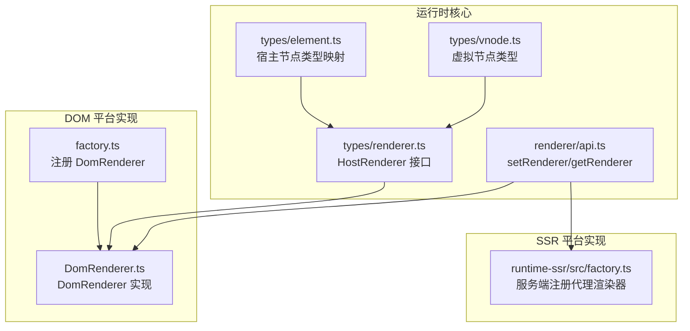
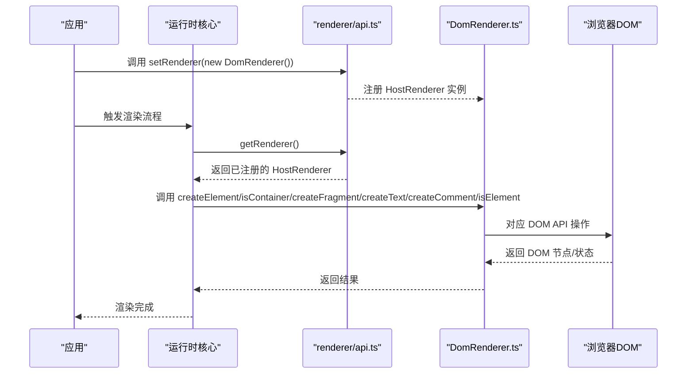
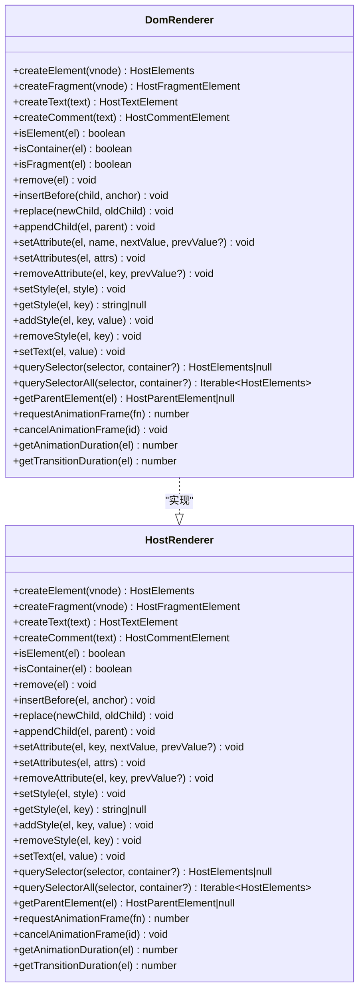
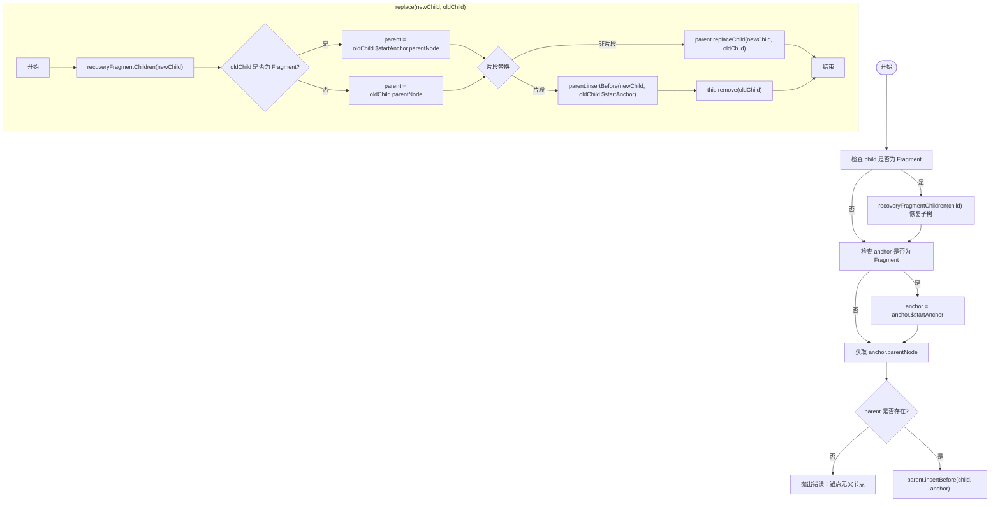
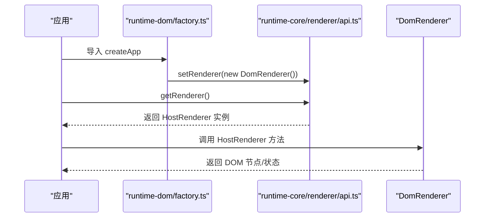
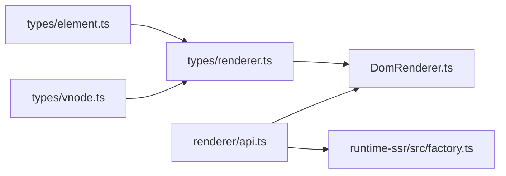

# 渲染器接口规范

<cite>
**本文引用的文件**
- [packages/runtime-core/src/types/renderer.ts](file://packages/runtime-core/src/types/renderer.ts)
- [packages/runtime-core/src/renderer/api.ts](file://packages/runtime-core/src/renderer/api.ts)
- [packages/runtime-dom/src/DomRenderer.ts](file://packages/runtime-dom/src/DomRenderer.ts)
- [packages/runtime-dom/src/factory.ts](file://packages/runtime-dom/src/factory.ts)
- [packages/runtime-ssr/src/factory.ts](file://packages/runtime-ssr/src/factory.ts)
- [packages/runtime-core/src/types/element.ts](file://packages/runtime-core/src/types/element.ts)
- [packages/runtime-core/src/types/nodes/index.ts](file://packages/runtime-core/src/types/nodes/index.ts)
- [packages/runtime-core/src/types/vnode.ts](file://packages/runtime-core/src/types/vnode.ts)
- [packages/runtime-core/__tests__/renderer/api.test.ts](file://packages/runtime-core/__tests__/renderer/api.test.ts)
- [packages/runtime-dom/__tests__/client/DomRenderer.test.ts](file://packages/runtime-dom/__tests__/client/DomRenderer.test.ts)
</cite>

## 目录
1. [引言](#引言)
2. [项目结构](#项目结构)
3. [核心组件](#核心组件)
4. [架构总览](#架构总览)
5. [详细组件分析](#详细组件分析)
6. [依赖关系分析](#依赖关系分析)
7. [性能考量](#性能考量)
8. [故障排查指南](#故障排查指南)
9. [结论](#结论)
10. [附录](#附录)

## 引言
本文件系统性阐述 HostRenderer 接口及其在平台抽象层中的核心作用，聚焦以下目标：
- 明确 createElement、createText、createComment、createFragment 等创建方法的设计契约与行为边界
- 解析 isElement、isContainer 等类型判断方法的语义规范与返回约定
- 规范参数约束、返回值要求与异常处理机制
- 结合 DomRenderer 的具体实现，展示接口方法如何与底层平台 API 对接
- 提供接口契约的验证清单，帮助开发者确保自定义渲染器的兼容性

## 项目结构
HostRenderer 接口位于运行时核心包中，DomRenderer 实现位于 runtime-dom 包，SSR 场景通过工厂在服务端侧注册一个“不可用”的代理渲染器以避免误用。

图表来源
- [packages/runtime-core/src/types/renderer.ts](file://packages/runtime-core/src/types/renderer.ts#L75-L280)
- [packages/runtime-core/src/renderer/api.ts](file://packages/runtime-core/src/renderer/api.ts#L1-L26)
- [packages/runtime-dom/src/DomRenderer.ts](file://packages/runtime-dom/src/DomRenderer.ts#L62-L115)
- [packages/runtime-dom/src/factory.ts](file://packages/runtime-dom/src/factory.ts#L1-L24)
- [packages/runtime-ssr/src/factory.ts](file://packages/runtime-ssr/src/factory.ts#L1-L21)
- [packages/runtime-core/src/types/element.ts](file://packages/runtime-core/src/types/element.ts#L66-L139)
- [packages/runtime-core/src/types/vnode.ts](file://packages/runtime-core/src/types/vnode.ts#L62-L101)

章节来源
- [packages/runtime-core/src/types/renderer.ts](file://packages/runtime-core/src/types/renderer.ts#L75-L280)
- [packages/runtime-core/src/renderer/api.ts](file://packages/runtime-core/src/renderer/api.ts#L1-L26)
- [packages/runtime-dom/src/DomRenderer.ts](file://packages/runtime-dom/src/DomRenderer.ts#L62-L115)
- [packages/runtime-dom/src/factory.ts](file://packages/runtime-dom/src/factory.ts#L1-L24)
- [packages/runtime-ssr/src/factory.ts](file://packages/runtime-ssr/src/factory.ts#L1-L21)
- [packages/runtime-core/src/types/element.ts](file://packages/runtime-core/src/types/element.ts#L66-L139)
- [packages/runtime-core/src/types/vnode.ts](file://packages/runtime-core/src/types/vnode.ts#L62-L101)

## 核心组件
- HostRenderer 接口：定义平台无关的 DOM 操作能力，包括节点创建、类型判断、插入/删除/替换、属性/样式/文本操作、查询与生命周期钩子等。
- DomRenderer：HostRenderer 的浏览器 DOM 实现，负责对接浏览器 DOM API，并提供 Fragment、事件、样式、动画/过渡等高级能力。
- 渲染器注册与获取：通过 setRenderer/getRenderer 在运行时注册全局 HostRenderer 实例；SSR 场景注册不可用代理以阻止误用。

章节来源
- [packages/runtime-core/src/types/renderer.ts](file://packages/runtime-core/src/types/renderer.ts#L75-L280)
- [packages/runtime-core/src/renderer/api.ts](file://packages/runtime-core/src/renderer/api.ts#L1-L26)
- [packages/runtime-dom/src/DomRenderer.ts](file://packages/runtime-dom/src/DomRenderer.ts#L62-L115)
- [packages/runtime-ssr/src/factory.ts](file://packages/runtime-ssr/src/factory.ts#L1-L21)

## 架构总览
HostRenderer 作为平台抽象层，向上承接虚拟 DOM 渲染流程，向下对接浏览器 DOM 或其他宿主平台 API。DomRenderer 通过 setRenderer 注册到运行时核心，SSR 场景通过代理渲染器在服务端侧阻止不支持的操作。

图表来源
- [packages/runtime-core/src/renderer/api.ts](file://packages/runtime-core/src/renderer/api.ts#L1-L26)
- [packages/runtime-dom/src/DomRenderer.ts](file://packages/runtime-dom/src/DomRenderer.ts#L62-L115)
- [packages/runtime-dom/src/factory.ts](file://packages/runtime-dom/src/factory.ts#L1-L24)

## 详细组件分析

### HostRenderer 接口设计契约
HostRenderer 定义了平台无关的 DOM 操作能力，涵盖节点创建、类型判断、插入/删除/替换、属性/样式/文本、查询与生命周期钩子等。以下为与本文主题密切相关的创建与类型判断方法的契约要点。

- createElement(vnode)
  - 参数：ElementVNode<T>，其中 T 为 HostElementNames
  - 语义：根据 vnode.type 创建对应宿主元素；必须依据 vnode.props 初始化属性
  - 返回：HostElements<T>
  - 异常：当无法创建或初始化属性时，应抛出错误或返回可诊断的失败状态（具体实现见 DomRenderer）
  - 关联：DomRenderer 依据 isSVGElement 选择 document.createElement 或 document.createElementNS，并调用 setAttributes 初始化属性

- createFragment(vnode)
  - 参数：FragmentVNode
  - 语义：创建文档片段，用于批量 DOM 操作
  - 返回：HostFragmentElement
  - 异常：无显式异常抛出约定，但 DomRenderer 会在 remove/replace 等操作中抛出错误以指示无效状态

- createText(text)
  - 参数：string
  - 语义：创建文本节点
  - 返回：HostTextElement
  - 异常：无显式异常抛出约定

- createComment(text)
  - 参数：string
  - 语义：创建注释/锚点节点
  - 返回：HostCommentElement
  - 异常：无显式异常抛出约定

- isElement(el)
  - 参数：HostNodeElements
  - 语义：判断给定的元素实例是否为元素（包括文档片段）
  - 返回：boolean
  - 异常：无显式异常抛出约定

- isContainer(el)
  - 参数：HostNodeElements
  - 语义：判断是否为容器元素（支持子元素）。DomRenderer 中，DocumentFragment 视为容器；元素节点且非 void 元素才视为容器
  - 返回：boolean
  - 异常：无显式异常抛出约定

章节来源
- [packages/runtime-core/src/types/renderer.ts](file://packages/runtime-core/src/types/renderer.ts#L75-L280)
- [packages/runtime-dom/src/DomRenderer.ts](file://packages/runtime-dom/src/DomRenderer.ts#L62-L115)

### DomRenderer 具体实现对接
DomRenderer 作为 HostRenderer 的浏览器 DOM 实现，展示了接口方法与底层平台 API 的对接方式。

- createElement
  - 依据 vnode.isSVGElement 选择 createElementNS 或 createElement
  - 调用 setAttributes 初始化属性
  - 返回 HostElements<T>

- isContainer
  - DocumentFragment 视为容器
  - 元素节点且非 void 元素视为容器；void 元素集合由 setHostSchema 注入

- createFragment
  - 创建 DocumentFragment，并设置 $startAnchor/$endAnchor 注释锚点与 $vnode 引用，便于 Fragment 子树恢复与管理

- createText/createComment
  - 直接调用 document.createTextNode/document.createComment

- isElement
  - 判断节点类型为 ELEMENT_NODE 或 DOCUMENT_FRAGMENT_NODE

- insertBefore/replace/appendChild/remove
  - 针对 Fragment 的特殊处理：recoveryFragmentChildren 用于在需要时恢复 Fragment 子树；对 Fragment 的插入/替换/删除采用锚点策略
  - insertBefore：若锚点为 Fragment，则插入到其 $startAnchor 之前；若锚点无父节点，抛出错误
  - replace：若旧元素为 Fragment，使用 $startAnchor 的父节点并在 Fragment 起始处插入新元素后删除旧 Fragment
  - appendChild：若父节点为 Fragment 且已挂载，插入到 $endAnchor 之前
  - remove：若为 Fragment，使用 Range 删除 $startAnchor 到 $endAnchor 之间的内容

- setAttribute/removeAttribute
  - 事件属性：on* 自动绑定/解绑，支持 capture/once/passive 选项
  - data-*：写入 dataset
  - xlink:*：使用命名空间 setAttributeNS
  - 特殊属性：style/class/className/innerHTML/autoFocus/xmlns:xlink 等特殊处理
  - 直接属性回退：尝试直接设置 JS property，失败则回退到 setAttribute/removeAttribute
  - 异常：setAttribute 内部 try/catch 记录错误日志

- setText
  - 设置 HostTextElement 或 HostCommentElement 的 textContent

- querySelector/querySelectorAll/getParentElement
  - 基于 document/container 查询与父节点获取

- getAnimationDuration/getTransitionDuration
  - 基于 getComputedStyle 解析 animation/transition 的延时与持续时间

章节来源
- [packages/runtime-dom/src/DomRenderer.ts](file://packages/runtime-dom/src/DomRenderer.ts#L62-L115)
- [packages/runtime-dom/src/DomRenderer.ts](file://packages/runtime-dom/src/DomRenderer.ts#L117-L177)
- [packages/runtime-dom/src/DomRenderer.ts](file://packages/runtime-dom/src/DomRenderer.ts#L179-L246)
- [packages/runtime-dom/src/DomRenderer.ts](file://packages/runtime-dom/src/DomRenderer.ts#L252-L358)
- [packages/runtime-dom/src/DomRenderer.ts](file://packages/runtime-dom/src/DomRenderer.ts#L360-L380)
- [packages/runtime-dom/src/DomRenderer.ts](file://packages/runtime-dom/src/DomRenderer.ts#L382-L424)
- [packages/runtime-dom/src/DomRenderer.ts](file://packages/runtime-dom/src/DomRenderer.ts#L426-L568)

### 接口契约验证清单（面向自定义渲染器）
为确保自定义渲染器与 HostRenderer 接口兼容，请对照以下清单逐项验证：

- 创建方法
  - createElement
    - 输入：ElementVNode<T>，T 为 HostElementNames
    - 行为：按 vnode.type 创建元素；必须依据 vnode.props 初始化属性
    - 输出：HostElements<T>
    - 异常：在无法创建或初始化属性时抛出错误
  - createFragment
    - 输入：FragmentVNode
    - 行为：创建容器片段
    - 输出：HostFragmentElement
  - createText
    - 输入：string
    - 行为：创建文本节点
    - 输出：HostTextElement
  - createComment
    - 输入：string
    - 行为：创建注释节点
    - 输出：HostCommentElement

- 类型判断方法
  - isElement
    - 输入：HostNodeElements
    - 行为：判断是否为元素（含文档片段）
    - 输出：boolean
  - isContainer
    - 输入：HostNodeElements
    - 行为：判断是否为容器（支持子元素）
    - 输出：boolean

- 插入/删除/替换
  - insertBefore
    - 输入：el, anchor
    - 行为：在锚点前插入；若 anchor 为 Fragment，插入到其 $startAnchor 之前；若 anchor 无父节点，抛出错误
  - replace
    - 输入：newChild, oldChild
    - 行为：替换旧节点；若 oldChild 为 Fragment，使用 $startAnchor 的父节点并在 Fragment 起始处插入新元素后删除旧 Fragment
  - appendChild
    - 输入：el, parent
    - 行为：追加到父节点；若 parent 为 Fragment 且已挂载，插入到 $endAnchor 之前
  - remove
    - 输入：el
    - 行为：删除元素；若为 Fragment，删除 $startAnchor 到 $endAnchor 之间内容

- 属性/样式/文本
  - setAttribute/removeAttribute
    - 行为：支持事件属性、data-*、xlink:*、style/class/className/innerHTML/autoFocus/xmlns:xlink 等；对直接属性尝试回退
    - 异常：setAttribute 内部 try/catch 记录错误日志
  - setStyle/getStyle/addStyle/removeStyle
    - 行为：基于 CSS 属性或 style.cssText 管理样式
  - setText
    - 行为：设置文本/注释内容

- 查询与父元素
  - querySelector/querySelectorAll/getParentElement
    - 行为：基于容器或 document 查询与父节点获取

- 生命周期钩子
  - requestAnimationFrame/cancelAnimationFrame
    - 行为：请求/取消动画帧
  - getAnimationDuration/getTransitionDuration
    - 行为：解析动画/过渡时长

章节来源
- [packages/runtime-core/src/types/renderer.ts](file://packages/runtime-core/src/types/renderer.ts#L75-L280)
- [packages/runtime-dom/src/DomRenderer.ts](file://packages/runtime-dom/src/DomRenderer.ts#L117-L177)
- [packages/runtime-dom/src/DomRenderer.ts](file://packages/runtime-dom/src/DomRenderer.ts#L252-L358)
- [packages/runtime-dom/src/DomRenderer.ts](file://packages/runtime-dom/src/DomRenderer.ts#L360-L380)
- [packages/runtime-dom/src/DomRenderer.ts](file://packages/runtime-dom/src/DomRenderer.ts#L382-L424)

### 类图：HostRenderer 与 DomRenderer

图表来源
- [packages/runtime-core/src/types/renderer.ts](file://packages/runtime-core/src/types/renderer.ts#L75-L280)
- [packages/runtime-dom/src/DomRenderer.ts](file://packages/runtime-dom/src/DomRenderer.ts#L62-L115)

### 流程图：insertBefore/replace/appendChild 对 Fragment 的处理

图表来源
- [packages/runtime-dom/src/DomRenderer.ts](file://packages/runtime-dom/src/DomRenderer.ts#L117-L177)
- [packages/runtime-dom/src/DomRenderer.ts](file://packages/runtime-dom/src/DomRenderer.ts#L400-L424)

### API 工作流：渲染器注册与获取

图表来源
- [packages/runtime-dom/src/factory.ts](file://packages/runtime-dom/src/factory.ts#L1-L24)
- [packages/runtime-core/src/renderer/api.ts](file://packages/runtime-core/src/renderer/api.ts#L1-L26)
- [packages/runtime-dom/src/DomRenderer.ts](file://packages/runtime-dom/src/DomRenderer.ts#L62-L115)

## 依赖关系分析
- HostRenderer 依赖宿主节点类型映射（element.ts）与虚拟节点类型（vnode.ts），确保 createElement 等方法的类型安全
- DomRenderer 依赖运行时核心的 HostRenderer 接口与 HostSchema（void 元素集合）以实现 isContainer 与属性处理
- SSR 场景通过 runtime-ssr/factory.ts 注册不可用代理渲染器，避免在服务端误用 HostRenderer 方法

图表来源
- [packages/runtime-core/src/types/renderer.ts](file://packages/runtime-core/src/types/renderer.ts#L75-L280)
- [packages/runtime-core/src/types/element.ts](file://packages/runtime-core/src/types/element.ts#L66-L139)
- [packages/runtime-core/src/types/vnode.ts](file://packages/runtime-core/src/types/vnode.ts#L62-L101)
- [packages/runtime-core/src/renderer/api.ts](file://packages/runtime-core/src/renderer/api.ts#L1-L26)
- [packages/runtime-dom/src/DomRenderer.ts](file://packages/runtime-dom/src/DomRenderer.ts#L62-L115)
- [packages/runtime-ssr/src/factory.ts](file://packages/runtime-ssr/src/factory.ts#L1-L21)

章节来源
- [packages/runtime-core/src/types/element.ts](file://packages/runtime-core/src/types/element.ts#L66-L139)
- [packages/runtime-core/src/types/vnode.ts](file://packages/runtime-core/src/types/vnode.ts#L62-L101)
- [packages/runtime-core/src/types/renderer.ts](file://packages/runtime-core/src/types/renderer.ts#L75-L280)
- [packages/runtime-dom/src/DomRenderer.ts](file://packages/runtime-dom/src/DomRenderer.ts#L62-L115)
- [packages/runtime-ssr/src/factory.ts](file://packages/runtime-ssr/src/factory.ts#L1-L21)

## 性能考量
- Fragment 批量操作：DomRenderer 通过 createDocumentFragment 与锚点注释实现 Fragment 的高效批量插入/删除，减少重排与重绘
- 属性设置优化：DomRenderer 对事件属性、data-*、xlink:* 等进行特殊处理，避免不必要的 DOM 操作；对直接属性尝试优先，失败回退到 setAttribute
- 样式管理：通过 style.cssText 与 setProperty 组合，减少重复设置；在无样式时移除 style 属性，降低 DOM 负担
- 动画/过渡时长解析：getAnimationDuration/getTransitionDuration 基于 getComputedStyle，避免重复计算

[本节为通用性能讨论，不涉及具体文件分析]

## 故障排查指南
- getRenderer 未注册
  - 现象：调用 getRenderer 抛出“渲染器未注册”错误
  - 排查：确认已通过 setRenderer 注册 HostRenderer 实例（DomRenderer）
  - 参考：[packages/runtime-core/src/renderer/api.ts](file://packages/runtime-core/src/renderer/api.ts#L1-L26)

- insertBefore 锚点无父节点
  - 现象：抛出“锚点元素没有父节点”的错误
  - 排查：确保 anchor 节点已挂载到父节点后再进行插入
  - 参考：[packages/runtime-dom/src/DomRenderer.ts](file://packages/runtime-dom/src/DomRenderer.ts#L127-L142)

- replace 旧元素无父节点
  - 现象：抛出“旧元素没有父元素”的错误
  - 排查：确认 oldChild 已挂载；若为 Fragment，使用其 $startAnchor 的父节点
  - 参考：[packages/runtime-dom/src/DomRenderer.ts](file://packages/runtime-dom/src/DomRenderer.ts#L144-L163)

- setAttribute 异常
  - 现象：setAttribute 内部 try/catch 记录错误日志
  - 排查：检查属性名/值合法性；事件属性需为函数；data-*、xlink:*、xmlns:* 等特殊属性按约定传递
  - 参考：[packages/runtime-dom/src/DomRenderer.ts](file://packages/runtime-dom/src/DomRenderer.ts#L252-L312)

- SSR 场景误用 HostRenderer
  - 现象：调用任意 HostRenderer 方法抛出“服务端不支持”的错误
  - 排查：SSR 场景已注册不可用代理渲染器，应在服务端使用 SSR 渲染流程
  - 参考：[packages/runtime-ssr/src/factory.ts](file://packages/runtime-ssr/src/factory.ts#L1-L21)

章节来源
- [packages/runtime-core/src/renderer/api.ts](file://packages/runtime-core/src/renderer/api.ts#L1-L26)
- [packages/runtime-dom/src/DomRenderer.ts](file://packages/runtime-dom/src/DomRenderer.ts#L127-L163)
- [packages/runtime-dom/src/DomRenderer.ts](file://packages/runtime-dom/src/DomRenderer.ts#L252-L312)
- [packages/runtime-ssr/src/factory.ts](file://packages/runtime-ssr/src/factory.ts#L1-L21)

## 结论
HostRenderer 作为平台抽象层，统一了虚拟 DOM 与底层平台 API 的交互契约。DomRenderer 通过严格的类型约束、完善的异常处理与 Fragment 专用优化，展示了接口方法与浏览器 DOM 的稳健对接。开发者在实现自定义渲染器时，应严格遵循接口契约与验证清单，确保创建、类型判断与 DOM 操作的一致性与可靠性。

[本节为总结性内容，不涉及具体文件分析]

## 附录

### 接口方法与类型映射关系
- HostElementNames/HostElements：普通宿主元素名称与实例映射
- HostNodeElements：所有宿主节点实例映射
- FragmentVNode/HostFragmentElement：片段虚拟节点与宿主片段元素
- TextVNode/HostTextElement：文本虚拟节点与宿主文本元素
- CommentVNode/HostCommentElement：注释虚拟节点与宿主注释元素

章节来源
- [packages/runtime-core/src/types/element.ts](file://packages/runtime-core/src/types/element.ts#L66-L139)
- [packages/runtime-core/src/types/nodes/index.ts](file://packages/runtime-core/src/types/nodes/index.ts#L1-L9)
- [packages/runtime-core/src/types/vnode.ts](file://packages/runtime-core/src/types/vnode.ts#L62-L101)

### 测试参考
- 渲染器注册与获取测试
  - 参考：[packages/runtime-core/__tests__/renderer/api.test.ts](file://packages/runtime-core/__tests__/renderer/api.test.ts#L1-L53)
- DomRenderer 创建与类型判断测试
  - 参考：[packages/runtime-dom/__tests__/client/DomRenderer.test.ts](file://packages/runtime-dom/__tests__/client/DomRenderer.test.ts#L1-L47)
  - 参考：[packages/runtime-dom/__tests__/client/DomRenderer.test.ts](file://packages/runtime-dom/__tests__/client/DomRenderer.test.ts#L93-L133)