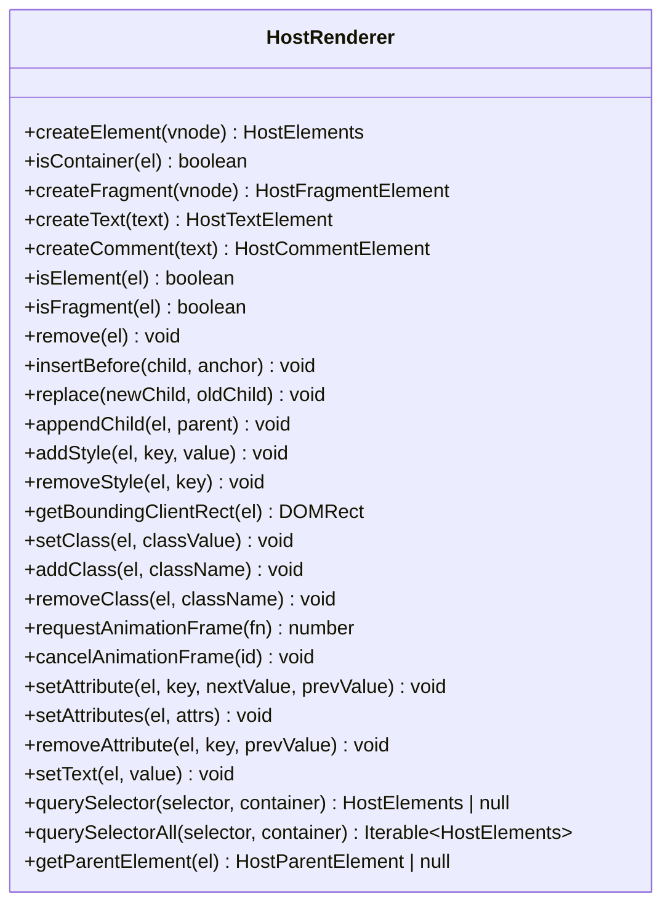
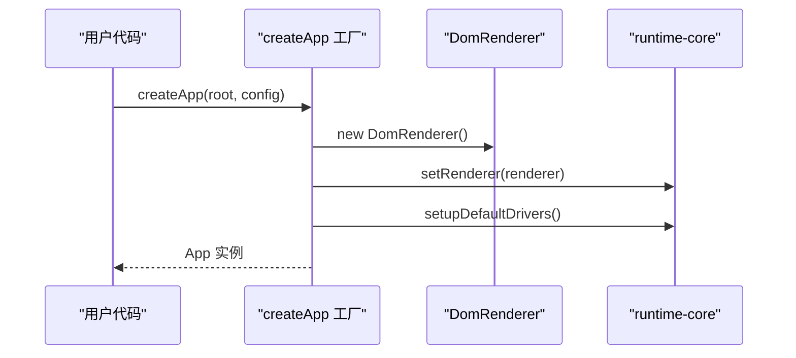
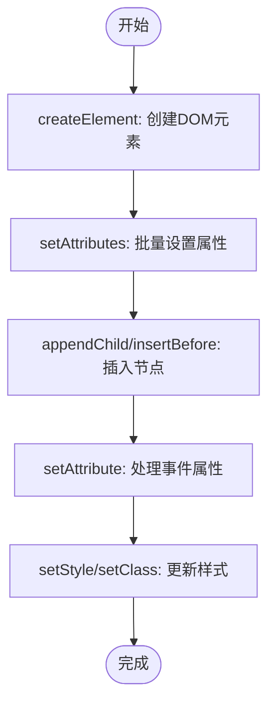
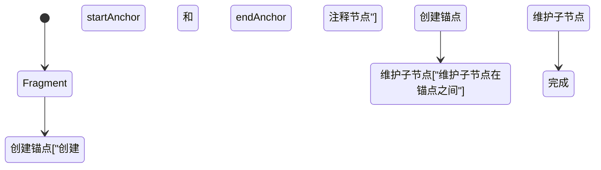
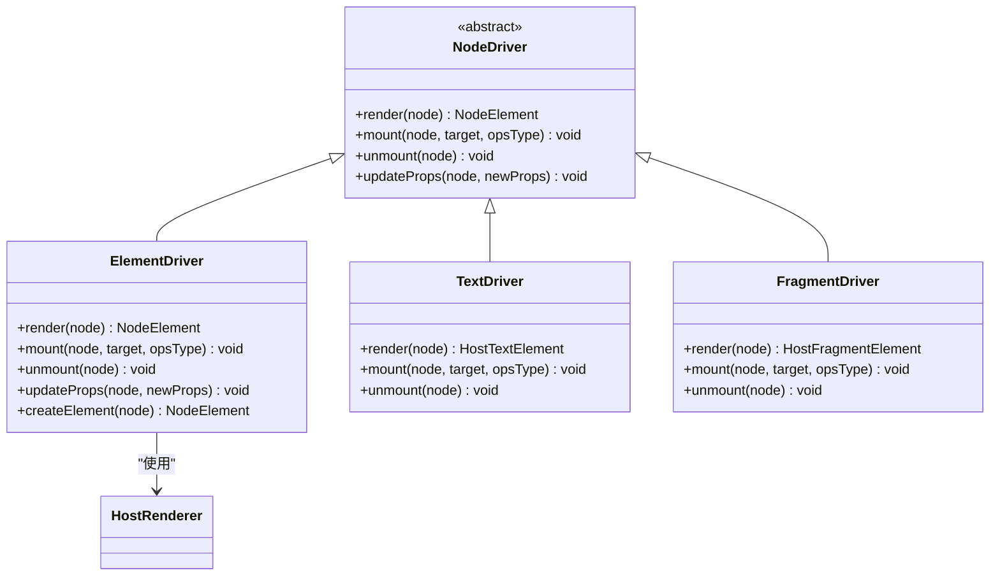
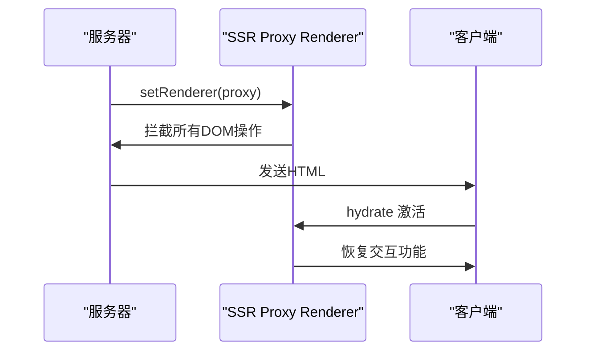
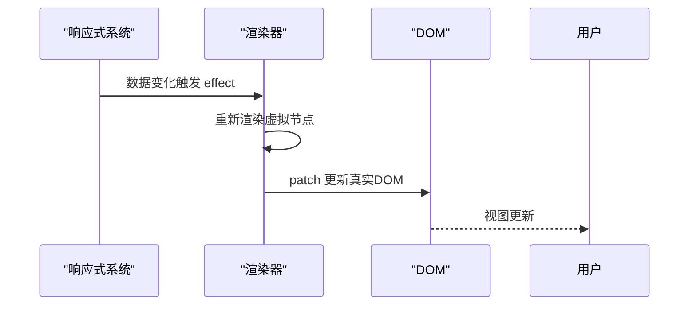

# 自定义渲染器

<cite>
**本文档引用的文件**
- [DomRenderer.ts](file://packages/runtime-dom/src/DomRenderer.ts)
- [factory.ts](file://packages/runtime-dom/src/factory.ts)
- [renderer.ts](file://packages/runtime-core/src/renderer/api.ts)
- [types/renderer.ts](file://packages/runtime-core/src/types/renderer.ts)
- [element.ts](file://packages/runtime-core/src/types/element.ts)
- [factory.ts](file://packages/runtime-ssr/src/factory.ts)
- [SSRApp.ts](file://packages/runtime-ssr/src/SSRApp.ts)
- [HydrateDriver.ts](file://packages/runtime-ssr/src/client/HydrateDriver.ts)
- [SSRDriver.ts](file://packages/runtime-ssr/src/server/SSRDriver.ts)
- [ElementDriver.ts](file://packages/runtime-drivers/src/drivers/ElementDriver.ts)
- [App.ts](file://packages/runtime-core/src/app/App.ts)
</cite>

## 目录
1. [介绍](#介绍)
2. [HostRenderer 接口设计原理](#hostrenderer-接口设计原理)
3. [渲染器工厂模式](#渲染器工厂模式)
4. [DomRenderer 实现详解](#domrenderer-实现详解)
5. [驱动器与渲染流程](#驱动器与渲染流程)
6. [SSR 与客户端激活](#ssr-与客户端激活)
7. [响应式系统集成](#响应式系统集成)
8. [构建 SVG 渲染器示例](#构建-svg-渲染器示例)
9. [总结](#总结)

## 介绍
Vitarx 框架提供了一套灵活的自定义渲染器机制，允许开发者为不同平台（如 Canvas、WebGL、终端界面等）创建适配的渲染器。该机制基于 HostRenderer 接口，通过工厂函数模式实现，支持 SSR（服务端渲染）和客户端激活，并与响应式系统 effect 紧密集成。本文档将深入讲解 HostRenderer 接口的设计原理、DomRenderer 的实现细节，以及如何从零构建一个 SVG 渲染器。

## HostRenderer 接口设计原理
HostRenderer 接口定义了操作宿主平台元素的基本方法，是所有渲染器实现的基础。该接口通过 TypeScript 类型系统提供了严格的类型约束，确保了跨平台渲染器的一致性。



**图示来源**
- [types/renderer.ts](file://packages/runtime-core/src/types/renderer.ts#L79-L280)

**本节来源**
- [types/renderer.ts](file://packages/runtime-core/src/types/renderer.ts#L79-L280)

## 渲染器工厂模式
Vitarx 使用工厂函数模式来创建和配置渲染器实例。通过 `createApp` 工厂函数，开发者可以轻松创建应用实例，同时框架内部会自动设置相应的渲染器。



**图示来源**
- [factory.ts](file://packages/runtime-dom/src/factory.ts#L1-L24)
- [api.ts](file://packages/runtime-core/src/renderer/api.ts#L10-L12)

**本节来源**
- [factory.ts](file://packages/runtime-dom/src/factory.ts#L1-L24)
- [api.ts](file://packages/runtime-core/src/renderer/api.ts#L10-L12)

## DomRenderer 实现详解
DomRenderer 是 Vitarx 框架中用于浏览器环境的 Web 渲染器实现，它实现了 HostRenderer 接口，专门处理 DOM 操作和渲染。

### 核心方法实现
DomRenderer 提供了完整的 DOM 操作能力，包括元素创建、属性更新、事件绑定等。



**图示来源**
- [DomRenderer.ts](file://packages/runtime-dom/src/DomRenderer.ts#L64-L325)

**本节来源**
- [DomRenderer.ts](file://packages/runtime-dom/src/DomRenderer.ts#L64-L325)

### 特殊元素处理
DomRenderer 对特殊元素（如 Fragment、SVG）进行了特殊处理，确保正确维护其子节点。



**图示来源**
- [DomRenderer.ts](file://packages/runtime-dom/src/DomRenderer.ts#L89-L95)
- [DomRenderer.ts](file://packages/runtime-dom/src/DomRenderer.ts#L407-L424)

## 驱动器与渲染流程
Vitarx 框架使用驱动器（Driver）模式来管理不同类型的虚拟节点渲染。每个驱动器负责特定类型节点的渲染、挂载和卸载。



**图示来源**
- [ElementDriver.ts](file://packages/runtime-drivers/src/drivers/ElementDriver.ts#L45-L106)
- [DomRenderer.ts](file://packages/runtime-dom/src/DomRenderer.ts#L62-L567)

**本节来源**
- [ElementDriver.ts](file://packages/runtime-drivers/src/drivers/ElementDriver.ts#L45-L106)

## SSR 与客户端激活
Vitarx 框架支持服务端渲染（SSR）和客户端激活，通过不同的渲染器实现来处理服务器端和客户端的渲染需求。

### SSR 渲染器实现
在服务端，使用一个代理渲染器，禁止所有 DOM 操作，仅用于生成 HTML 字符串。



**图示来源**
- [factory.ts](file://packages/runtime-ssr/src/factory.ts#L5-L17)
- [HydrateDriver.ts](file://packages/runtime-ssr/src/client/HydrateDriver.ts#L22-L78)

**本节来源**
- [factory.ts](file://packages/runtime-ssr/src/factory.ts#L5-L17)
- [HydrateDriver.ts](file://packages/runtime-ssr/src/client/HydrateDriver.ts#L22-L78)

## 响应式系统集成
Vitarx 的渲染器与响应式系统 effect 紧密集成，当响应式数据变化时，自动触发视图更新。



**本节来源**
- [effect.ts](file://packages/responsive/src/effect/effect.ts)
- [DomRenderer.ts](file://packages/runtime-dom/src/DomRenderer.ts)

## 构建 SVG 渲染器示例
以下是如何从零构建一个 SVG 渲染器的完整示例，涵盖节点创建、属性更新、事件绑定等关键环节。

### SVG 渲染器实现
```typescript
import { HostRenderer } from '@vitarx/runtime-core'

export class SVGRenderer implements HostRenderer {
  createElement<T extends string>(vnode: ElementVNode<T>): HostElements<T> {
    const el = document.createElementNS('http://www.w3.org/2000/svg', vnode.type) as HostElements<T>
    this.setAttributes(el, vnode.props)
    return el
  }

  // 实现其他 HostRenderer 接口方法...
}
```

**本节来源**
- [DomRenderer.ts](file://packages/runtime-dom/src/DomRenderer.ts)
- [types/renderer.ts](file://packages/runtime-core/src/types/renderer.ts)

## 总结
Vitarx 框架的自定义渲染器机制提供了一套强大而灵活的解决方案，通过 HostRenderer 接口和工厂模式，开发者可以轻松为不同平台创建适配的渲染器。该机制与响应式系统紧密集成，支持 SSR 和客户端激活，为构建跨平台应用提供了坚实的基础。