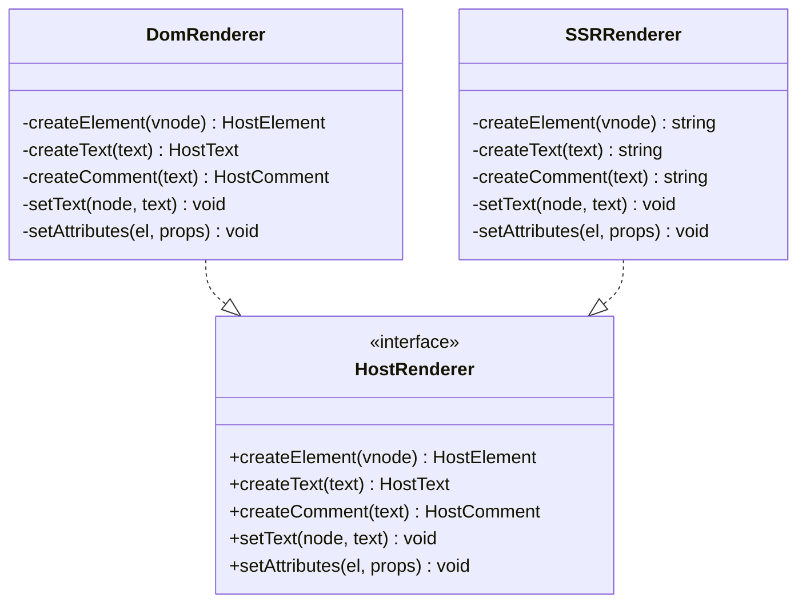
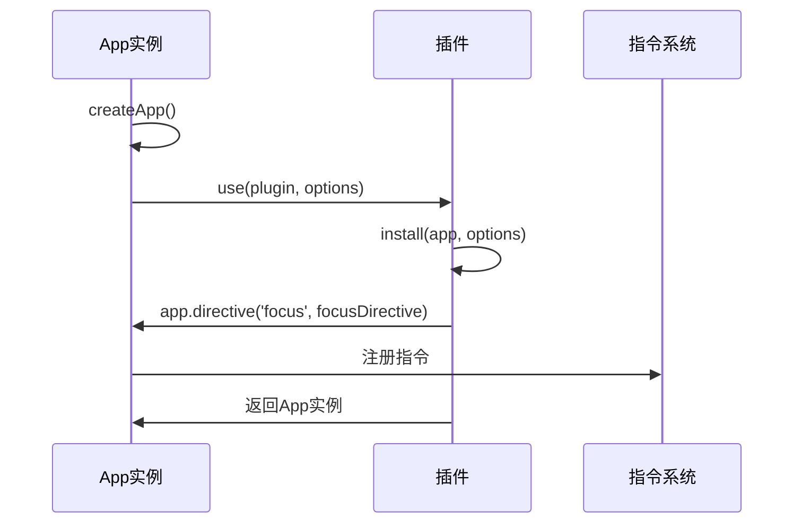
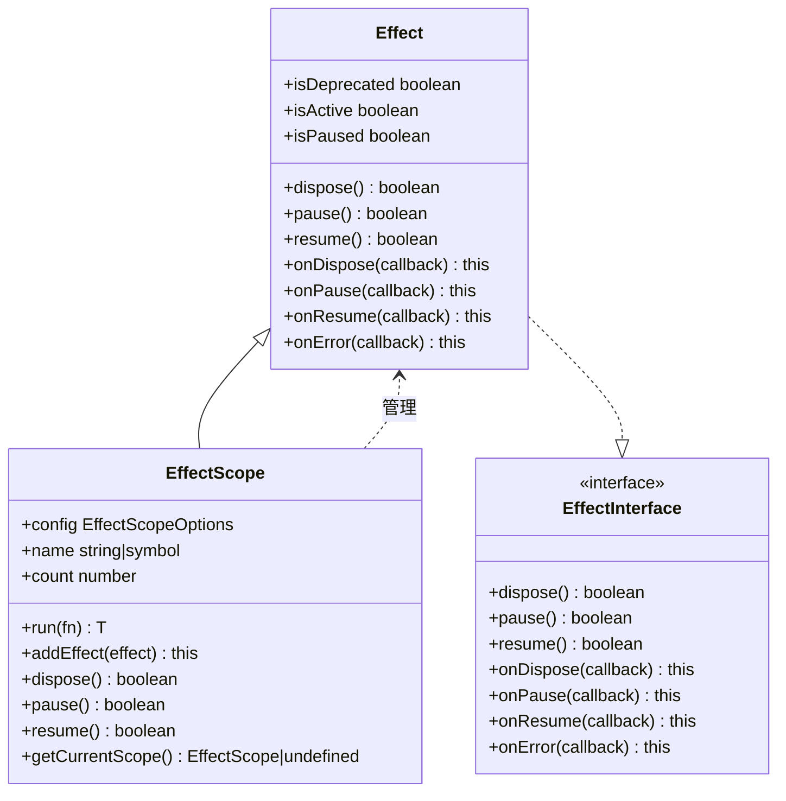
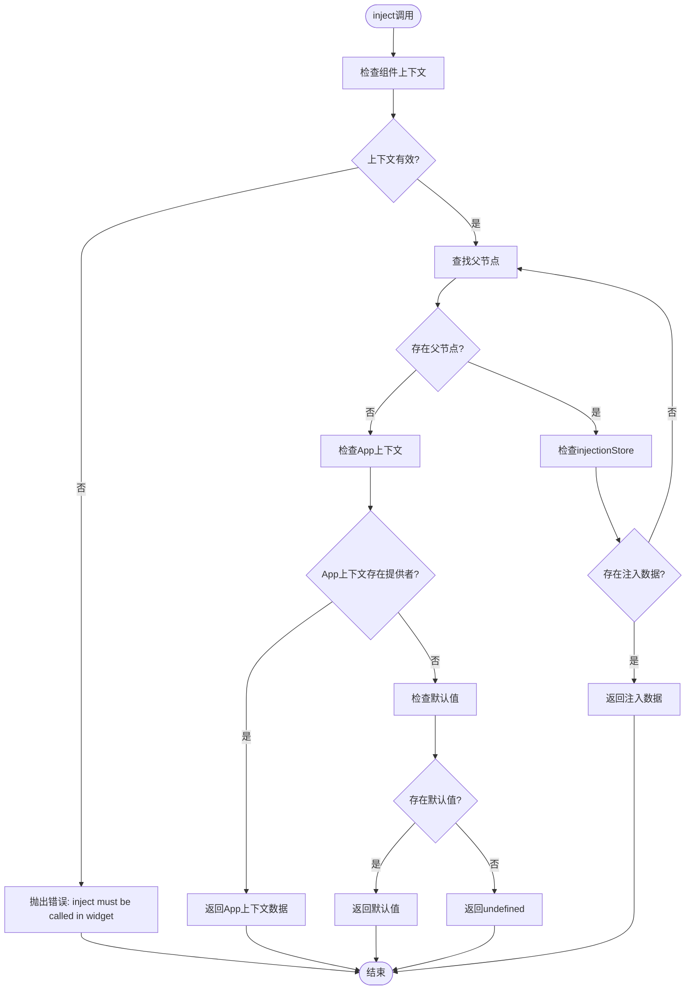
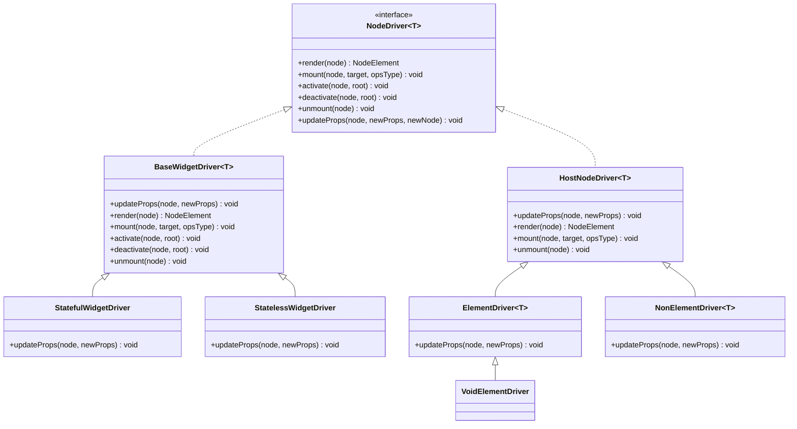

# 高级用法

<cite>
**本文档引用的文件**   
- [DomRenderer.ts](file://packages/runtime-dom/src/DomRenderer.ts)
- [factory.ts](file://packages/runtime-dom/src/factory.ts)
- [App.ts](file://packages/runtime-core/src/app/App.ts)
- [effect-scope.ts](file://packages/responsive/src/effect/effect-scope.ts)
- [helpers.ts](file://packages/responsive/src/effect/helpers.ts)
- [provide.ts](file://packages/runtime-core/src/runtime/provide.ts)
- [BaseWidgetDriver.ts](file://packages/runtime-drivers/src/drivers/BaseWidgetDriver.ts)
- [StatefulWidgetDriver.ts](file://packages/runtime-drivers/src/drivers/StatefulWidgetDriver.ts)
- [StatelessWidgetDriver.ts](file://packages/runtime-drivers/src/drivers/StatelessWidgetDriver.ts)
- [ElementDriver.ts](file://packages/runtime-drivers/src/drivers/ElementDriver.ts)
- [NonElementDriver.ts](file://packages/runtime-drivers/src/drivers/NonElementDriver.ts)
- [VoidElementDriver.ts](file://packages/runtime-drivers/src/drivers/VoidElementDriver.ts)
- [factory.ts](file://packages/runtime-drivers/src/factory.ts)
- [driver.ts](file://packages/runtime-core/src/types/driver.ts)
- [driver.ts](file://packages/runtime-core/src/vnode/core/driver.ts)
</cite>

## 目录
1. [自定义渲染器与工厂模式](#自定义渲染器与工厂模式)
2. [插件开发最佳实践](#插件开发最佳实践)
3. [EffectScope 副作用作用域管理](#effectscope-副作用作用域管理)
4. [provide/inject 深层组件树优化](#provideinject-深层组件树优化)
5. [Driver 抽象层扩展节点类型](#driver-抽象层扩展节点类型)
6. [性能调优与内存泄漏防范](#性能调优与内存泄漏防范)

## 自定义渲染器与工厂模式

Vitarx 通过工厂模式实现多平台渲染器的创建与适配，支持 Web、SSR 等不同环境。`DomRenderer` 类实现了 `HostRenderer` 接口，负责浏览器环境下的 DOM 操作。通过 `setRenderer` 和 `getRenderer` 全局 API，框架实现了渲染器的注册与获取。

在 `runtime-dom` 包中，`factory.ts` 文件通过 `createApp` 工厂函数创建应用实例，并自动注册 `DomRenderer` 渲染器。这种设计模式允许开发者通过不同的工厂函数（如 `runtime-ssr` 中的工厂）创建适配不同平台的渲染器，实现渲染逻辑的解耦。

**图示来源**
- [DomRenderer.ts](file://packages/runtime-dom/src/DomRenderer.ts#L62-L74)
- [factory.ts](file://packages/runtime-dom/src/factory.ts#L9-L13)

**本节来源**
- [DomRenderer.ts](file://packages/runtime-dom/src/DomRenderer.ts)
- [factory.ts](file://packages/runtime-dom/src/factory.ts)

## 插件开发最佳实践

Vitarx 的插件系统通过 `App` 类的 `use` 方法实现，支持函数式和对象式两种插件形式。插件必须提供 `install` 方法，该方法接收 `App` 实例和可选的配置参数。通过 `directive` 方法，插件可以注册自定义指令，扩展框架功能。

插件开发时，建议遵循以下最佳实践：1) 插件应通过 `install` 方法接收配置选项，实现灵活配置；2) 插件可通过 `provide` 方法向应用上下文注入全局服务；3) 插件应使用链式调用模式，返回 `this` 实例以支持连续调用。

**图示来源**
- [App.ts](file://packages/runtime-core/src/app/App.ts#L338-L392)
- [App.test.ts](file://packages/runtime-core/__tests__/app/App.test.ts#L196-L228)

**本节来源**
- [App.ts](file://packages/runtime-core/src/app/App.ts)

## EffectScope 副作用作用域管理

`EffectScope` 类是 Vitarx 中管理副作用生命周期的核心工具，继承自 `Effect` 类。它通过 `run` 方法在作用域上下文中执行函数，并自动捕获产生的副作用。作用域内的副作用会随作用域一起暂停、恢复或销毁，实现资源的统一管理。

`EffectScope` 提供了 `addEffect` 方法将副作用对象添加到作用域中，当作用域销毁时，所有副作用都会被自动清理。通过 `attachToCurrentScope` 配置项，可以将子作用域自动附加到父作用域，形成作用域树结构，便于复杂应用的资源管理。

**图示来源**
- [effect-scope.ts](file://packages/responsive/src/effect/effect-scope.ts#L40-L212)
- [effect.ts](file://packages/responsive/src/effect/effect.ts)
- [helpers.ts](file://packages/responsive/src/effect/helpers.ts)

**本节来源**
- [effect-scope.ts](file://packages/responsive/src/effect/effect-scope.ts)
- [helpers.ts](file://packages/responsive/src/effect/helpers.ts)

## provide/inject 深层组件树优化

`provide` 和 `inject` 是 Vitarx 中实现依赖注入的核心 API，用于在深层组件树中传递数据。`provide` 只能在有状态组件中调用，将数据存储在组件的 `injectionStore` 中。`inject` 从当前组件向上查找祖先组件的 `injectionStore`，直到找到匹配的数据。

为优化性能，框架在查找依赖时采用短路策略：一旦找到匹配的注入值即返回，避免遍历整个组件树。此外，`inject` 还支持默认值和工厂函数，当依赖不存在时可提供默认行为。这种设计既保证了依赖查找的高效性，又提供了灵活的配置选项。

**图示来源**
- [provide.ts](file://packages/runtime-core/src/runtime/provide.ts#L102-L130)
- [provide.test.ts](file://packages/runtime-core/__tests__/runtime/provide.test.ts)

**本节来源**
- [provide.ts](file://packages/runtime-core/src/runtime/provide.ts)

## Driver 抽象层扩展节点类型

Vitarx 通过 `Driver` 抽象层实现对不同节点类型的扩展。`NodeDriver` 接口定义了所有节点驱动器的通用方法，包括 `render`、`mount`、`unmount` 等。各种具体驱动器（如 `StatefulWidgetDriver`、`ElementDriver`）继承自 `BaseWidgetDriver` 或 `HostNodeDriver`，实现特定节点类型的渲染逻辑。

通过 `registerDriver` 和 `getNodeDriver` API，框架实现了驱动器的注册与获取。开发者可以创建自定义驱动器，处理特殊类型的节点。`setupDefaultDrivers` 函数在启动时注册所有默认驱动器，确保框架能够正确渲染各种节点类型。

**图示来源**
- [driver.ts](file://packages/runtime-core/src/types/driver.ts#L7-L51)
- [BaseWidgetDriver.ts](file://packages/runtime-drivers/src/drivers/BaseWidgetDriver.ts#L52-L54)
- [StatefulWidgetDriver.ts](file://packages/runtime-drivers/src/drivers/StatefulWidgetDriver.ts#L43-L50)
- [StatelessWidgetDriver.ts](file://packages/runtime-drivers/src/drivers/StatelessWidgetDriver.ts#L31-L48)
- [ElementDriver.ts](file://packages/runtime-drivers/src/drivers/ElementDriver.ts#L45-L52)
- [NonElementDriver.ts](file://packages/runtime-drivers/src/drivers/NonElementDriver.ts#L28-L36)
- [VoidElementDriver.ts](file://packages/runtime-drivers/src/drivers/VoidElementDriver.ts#L30-L30)
- [driver.ts](file://packages/runtime-core/src/vnode/core/driver.ts)

**本节来源**
- [driver.ts](file://packages/runtime-core/src/types/driver.ts)
- [BaseWidgetDriver.ts](file://packages/runtime-drivers/src/drivers/BaseWidgetDriver.ts)
- [StatefulWidgetDriver.ts](file://packages/runtime-drivers/src/drivers/StatefulWidgetDriver.ts)
- [StatelessWidgetDriver.ts](file://packages/runtime-drivers/src/drivers/StatelessWidgetDriver.ts)
- [ElementDriver.ts](file://packages/runtime-drivers/src/drivers/ElementDriver.ts)
- [NonElementDriver.ts](file://packages/runtime-drivers/src/drivers/NonElementDriver.ts)
- [VoidElementDriver.ts](file://packages/runtime-drivers/src/drivers/VoidElementDriver.ts)
- [factory.ts](file://packages/runtime-drivers/src/factory.ts)
- [driver.ts](file://packages/runtime-core/src/vnode/core/driver.ts)

## 性能调优与内存泄漏防范

为确保应用性能和避免内存泄漏，建议遵循以下最佳实践：1) 使用 `EffectScope` 统一管理副作用生命周期，在组件销毁时及时清理；2) 避免在 `provide` 中传递大型对象，减少内存占用；3) 合理使用 `inject` 的默认值机制，避免不必要的计算；4) 在自定义驱动器中正确实现 `unmount` 方法，确保资源完全释放。

框架通过作用域树结构和依赖注入机制，实现了高效的资源管理和依赖查找。开发者应充分利用这些机制，构建高性能、低内存占用的应用。同时，建议在开发环境中启用调试工具，监控副作用和组件树状态，及时发现潜在的性能问题。

**本节来源**
- [effect-scope.ts](file://packages/responsive/src/effect/effect-scope.ts)
- [provide.ts](file://packages/runtime-core/src/runtime/provide.ts)
- [driver.ts](file://packages/runtime-core/src/vnode/core/driver.ts)