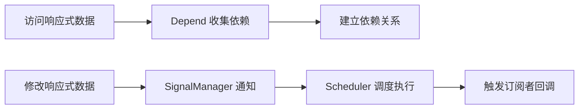
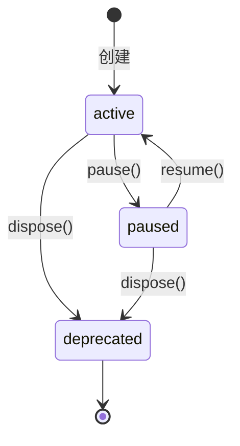

# @vitarx/responsive

Vitarx 响应式系统的核心包，提供高性能、类型安全的响应式数据管理和依赖追踪功能。

## 📖 目录

- [概述](#概述)
- [安装](#安装)
- [快速开始](#快速开始)
- [核心概念](#核心概念)
- [API 参考](#api-参考)
  - [Ref API](#ref-api)
  - [Reactive API](#reactive-api)
  - [Computed API](#computed-api)
  - [Watch API](#watch-api)
  - [Effect API](#effect-api)
  - [Observer API](#observer-api)
  - [工具函数](#工具函数)
- [进阶指南](#进阶指南)
- [API 索引](#api-索引)

## 概述

`@vitarx/responsive` 是 Vitarx 框架的响应式系统核心，借鉴 Vue 3 的响应式设计理念，提供了一套完整的响应式数据管理解决方案。

### 核心特性

| 特性                | 说明                                        |
|-------------------|-------------------------------------------|
| 🎯 **多种信号类型**     | 支持 `ref`、`reactive`、`computed` 等多种响应式数据类型 |
| ⚡ **细粒度响应**       | 精确追踪依赖,避免不必要的更新                           |
| 💤 **懒计算**        | 计算属性采用 Vue 风格的懒计算策略，按需执行                  |
| 🔄 **作用域管理**      | 自动清理资源，防止内存泄漏                             |
| 📅 **灵活调度**       | 支持 `sync`、`pre`、`post`、`default` 多种调度模式   |
| 🔌 **Vue 兼容**     | 提供与 Vue 3 兼容的 API 别名                      |
| 📘 **TypeScript** | 完整的类型定义和类型推导                              |

## 安装

```bash
npm install @vitarx/responsive
```

或使用其他包管理器：

```bash
# pnpm
pnpm add @vitarx/responsive

# yarn
yarn add @vitarx/responsive
```

## 快速开始

### 基础示例

```typescript
import { ref, reactive, computed, watch } from '@vitarx/responsive'

// 1. 创建响应式引用
const count = ref(0)
console.log(count.value) // 0

// 2. 创建响应式对象
const state = reactive({
  user: 'John',
  age: 25
})

// 3. 创建计算属性
const doubleCount = computed(() => count.value * 2)
console.log(doubleCount.value) // 0

// 4. 监听变化
watch(count, (newVal, oldVal) => {
  console.log(`count 从 ${oldVal} 变为 ${newVal}`)
})

// 5. 修改数据触发更新
count.value = 10 // 输出: count 从 0 变为 10
console.log(doubleCount.value) // 20
```

## 核心概念

### 响应式原理

Vitarx 响应式系统基于依赖收集和发布订阅模式工作：



**工作流程：**

1. **依赖收集阶段**：当访问响应式数据时（如 `count.value`），`Depend` 模块自动追踪依赖关系
2. **数据变更阶段**：修改响应式数据时，`SignalManager` 协调通知所有订阅者
3. **订阅响应阶段**：`Scheduler` 根据调度策略执行订阅者的回调函数

### 信号类型

| 信号类型            | 适用场景                   | 特点             |
|-----------------|------------------------|----------------|
| **RefSignal**   | 基本类型值、需要明确 `.value` 访问 | 适合简单值，API 清晰明确 |
| **ProxySignal** | 对象、数组、Map/Set          | 自动递归代理，使用方便    |
| **Computed**    | 依赖其他信号的派生值             | 自动缓存，按需计算      |

### 深度 vs 浅层响应式

| 对比项      | 深度响应式            | 浅层响应式                          |
|----------|------------------|--------------------------------|
| **嵌套对象** | 递归代理所有嵌套属性       | 仅代理顶层属性                        |
| **性能开销** | 稍高（需要递归处理）       | 较低（仅处理一层）                      |
| **适用场景** | 复杂嵌套数据结构         | 大对象或已知不需深度监听                   |
| **API**  | `ref`、`reactive` | `shallowRef`、`shallowReactive` |

**使用建议：**
- 默认使用深度响应式，覆盖大多数场景
- 大型对象或已知结构简单时，使用浅层响应提升性能
- 静态数据使用 `markNonSignal` 标记，完全跳过响应式处理

## API 参考

### Ref API

#### `ref()`

创建一个响应式引用信号，用于包装基本类型或对象，通过 `.value` 访问和修改值。

**函数签名：**

```typescript
function ref<T>(): Ref<T | undefined>
function ref<T>(value: T): Ref<T>
function ref<T, Deep extends boolean = true>(
  value: T,
  options?: SignalOptions<Deep> | Deep
): Ref<T, Deep>
```

**参数：**

| 参数                | 类型                         | 必填 | 默认值         | 说明              |
|-------------------|----------------------------|----|-------------|-----------------|
| `value`           | `T`                        | 否  | `undefined` | 初始值             |
| `options`         | `SignalOptions \| boolean` | 否  | -           | 配置选项或 `deep` 标志 |
| `options.deep`    | `boolean`                  | 否  | `true`      | 是否深度代理嵌套对象      |
| `options.compare` | `(a, b) => boolean`        | 否  | `Object.is` | 值比较函数           |

**返回值：** `Ref<T, Deep>` - 响应式引用对象

**基础用法：**

```typescript
// 创建基本类型 ref
const count = ref(0)
console.log(count.value) // 0
count.value = 1

// 创建对象 ref（深度响应式）
const user = ref({ name: 'John', profile: { age: 25 } })
user.value.profile.age = 26 // 深层属性也是响应式的

// 创建未定义类型的 ref
const data = ref<number>() // data.value 类型为 number | undefined
```

**高级用法：**

```typescript
// 自定义比较函数（仅当比较结果为 false 时才触发更新）
const user = ref(
  { name: 'John', age: 25 },
  { compare: (prev, next) => prev.name === next.name }
)

// 禁用深度响应（使用 boolean 快捷方式）
const shallow = ref({ a: { b: 1 } }, false)
shallow.value.a.b = 2 // 不会触发更新
shallow.value = { a: { b: 2 } } // 会触发更新

// 嵌套 ref 自动解包
const nested = ref(ref(1))
nested.value++ // 直接操作，无需 nested.value.value
```

> **注意：** 不能将 ref 的值设置为另一个 ref，会自动解包或抛出错误。

---

#### `shallowRef()`

创建一个浅层响应式引用信号，仅顶层的 `.value` 是响应式的。

**函数签名：**

```typescript
function shallowRef<T>(): Ref<T | undefined, false>
function shallowRef<T>(
  value: T,
  options?: Omit<SignalOptions, 'deep'>
): Ref<T, false>
```

**使用场景：**
- 大型对象或数组，已知不需要深层监听
- 性能敏感场景
- 手动控制更新时机

**示例：**

```typescript
const state = shallowRef({ count: 0, nested: { value: 1 } })

// 修改嵌套属性不会触发更新
state.value.nested.value = 2 // 不触发

// 替换整个对象才会触发
state.value = { count: 1, nested: { value: 2 } } // 触发

// 或使用 forceUpdate 强制触发
state.value.nested.value = 3
state.forceUpdate() // 手动触发更新
```

---

#### `toRef()`

创建一个基于源的响应式引用，支持多种重载形式。

**函数签名：**

```typescript
// 将普通值转为 ref
function toRef<T>(value: T): Ref<T>

// 将 getter 函数转为只读 ref
function toRef<T>(source: () => T): ReadonlyRef<T>

// 返回已有的 ref
function toRef<T extends RefSignal>(source: T): T

// 创建与对象属性双向绑定的 ref
function toRef<T extends object, K extends keyof T>(
  object: T,
  key: K,
  defaultValue?: T[K]
): PropertyRef<T, K>
```

**使用场景：**

1. **解构 reactive 对象保持响应性**

    ```typescript
    const state = reactive({ count: 0, name: 'John' })
    const countRef = toRef(state, 'count')
    
    // 双向绑定
    countRef.value++ // state.count 也会变为 1
    state.count = 10 // countRef.value 也会变为 10
    ```

2. **将 getter 函数转为只读 ref**

    ```typescript
    let count = 0
    const countRef = toRef(() => count)
    console.log(countRef.value) // 0
    
    count = 10
    console.log(countRef.value) // 10（自动同步）
    ```

3. **使用默认值**
    
    ```typescript
    const state: any = reactive({ count: 1 })
    const nameRef = toRef(state, 'name', 'Anonymous')
    
    console.log(nameRef.value) // 'Anonymous'
    state.name = 'John'
    console.log(nameRef.value) // 'John'
    ```

---

#### `toRefs()`

将 reactive 对象的每个属性转换为独立的 ref，保持双向绑定。

**函数签名：**

```typescript
function toRefs<T extends object>(object: T): {
  [K in keyof T]: ToRef<T[K]>
}
```

**使用场景：**

```typescript
const state = reactive({
  count: 0,
  user: { name: 'John' }
})

// 解构后保持响应性
const { count, user } = toRefs(state)

count.value++ // state.count === 1
state.user.name = 'Jane' // user.value.name === 'Jane'
```

> **提示：** `toRefs` 主要用于组合式函数返回值，使解构后的属性保持响应性。

---

#### `unref()`

解包 ref，如果参数是 ref 则返回其值，否则返回参数本身。

**函数签名：**

```typescript
function unref<T>(ref: T | Ref<T>): T
```

**使用场景：**

```typescript
function useValue(value: number | Ref<number>) {
  // 统一处理 ref 和普通值
  const unwrapped = unref(value)
  return unwrapped * 2
}

useValue(10) // 20
useValue(ref(10)) // 20
```

---

#### `isRef()` / `isRefSignal()`

判断值是否为 ref 类型。

**区别：**
- `isRef(val)`：检查是否为 `Ref` 类实例
- `isRefSignal(val)`：检查是否实现 `RefSignal` 接口（更宽泛）

**示例：**

```typescript
const count = ref(0)

isRef(count) // true（Ref 实例）
isRefSignal(count) // true（实现了 RefSignal 接口）

// 自定义 ref 实现
class CustomRef {
  [SIGNAL_SYMBOL] = true
  [REF_SIGNAL_SYMBOL] = true
  get value() { return 1 }
  set value(v) {}
}

const custom = new CustomRef()
isRef(custom) // false（不是 Ref 实例）
isRefSignal(custom) // true（实现了接口）
```

---

### Reactive API

#### `reactive()`

创建对象的响应式代理，支持对象、数组、Map、Set 等类型。

**函数签名：**

```typescript
function reactive<T extends object, Deep extends boolean = true>(
  target: T,
  options?: SignalOptions<Deep> | Deep
): Reactive<T, Deep>
```

**参数：**

| 参数                | 类型                         | 必填 | 默认值         | 说明              |
|-------------------|----------------------------|----|-------------|-----------------|
| `target`          | `object`                   | 是  | -           | 要代理的目标对象        |
| `options`         | `SignalOptions \| boolean` | 否  | -           | 配置选项或 `deep` 标志 |
| `options.deep`    | `boolean`                  | 否  | `true`      | 是否深度代理          |
| `options.compare` | `(a, b) => boolean`        | 否  | `Object.is` | 值比较函数           |

**与 ref 的对比：**

| 对比项       | `reactive`     | `ref`       |
|-----------|----------------|-------------|
| **访问方式**  | 直接访问属性         | 通过 `.value` |
| **适用类型**  | 对象、数组、Map/Set  | 任意类型        |
| **根值替换**  | 不支持（需替换属性）     | 支持          |
| **解构响应性** | 丢失（需 `toRefs`） | 保持          |

**基础用法：**

```typescript
// 对象
const state = reactive({ count: 0, user: 'John' })
state.count++ // 直接访问，无需 .value

// 数组
const list = reactive([1, 2, 3])
list.push(4) // 响应式

// Map
const map = reactive(new Map())
map.set('key', 'value') // 响应式

// Set
const set = reactive(new Set())
set.add(1) // 响应式
```

**深度响应示例：**

```typescript
const state = reactive({
  user: {
    profile: {
      name: 'John',
      age: 25
    }
  }
})

// 深层嵌套属性也是响应式的
watch(() => state.user.profile.age, (newAge) => {
  console.log('Age changed to', newAge)
})

state.user.profile.age = 26 // 触发 watch
```

---

#### `shallowReactive()`

创建浅层响应式对象，仅顶层属性是响应式的。

**函数签名：**

```typescript
function shallowReactive<T extends object>(
  target: T,
  options?: Omit<SignalOptions, 'deep'>
): Reactive<T, false>
```

**示例：**

```typescript
const state = shallowReactive({
  count: 0,
  nested: { value: 1 }
})

// 顶层属性响应式
state.count = 1 // 触发更新

// 嵌套属性不响应式
state.nested.value = 2 // 不触发更新
state.nested = { value: 2 } // 触发更新（替换了顶层属性）
```

---

#### `isReactive()`

检查值是否为 reactive 创建的响应式对象。

**函数签名：**

```typescript
function isReactive(val: any): boolean
```

**示例：**

```typescript
const state = reactive({ count: 0 })
const plain = { count: 0 }

isReactive(state) // true
isReactive(plain) // false
isReactive(ref(0)) // false（ref 不是 reactive）
```

---

#### `unreactive()` / `toRaw()`

获取响应式对象的原始值。

> **Vue 兼容性：** `toRaw` 是通用的获取原始值函数，`unreactive` 专用于 reactive 对象。

**函数签名：**

```typescript
function unreactive<T extends object>(proxy: T | Reactive<T>): Unreactive<T>
function toRaw<T>(signal: T): SignalToRaw<T>
```

**使用场景：**

1. **传递给第三方库**
    
    ```typescript
    const state = reactive({ data: [1, 2, 3] })
    
    // 第三方库可能不兼容 Proxy
    thirdPartyLib.process(unreactive(state))
    ```

2. **性能优化（跳过响应式）**

    ```typescript
    const state = reactive({ large: { /* 大量数据 */ } })
    
    // 直接操作原始对象，不触发更新
    const raw = unreactive(state)
    raw.large.someField = 'value' // 不触发响应
    ```

3. **对象比较**

```typescript
const original = { count: 0 }
const proxy = reactive(original)

unreactive(proxy) === original // true
```

---

### Computed API

#### `computed()`

创建一个计算属性，值由 getter 函数计算得出，自动追踪依赖并缓存结果。

**函数签名：**

```typescript
function computed<T>(
  getter: (oldValue: T | undefined) => T,
  options?: ComputedOptions<T>
): Computed<T>
```

**参数：**

| 参数                  | 类型                       | 必填 | 默认值         | 说明            |
|---------------------|--------------------------|----|-------------|---------------|
| `getter`            | `(oldValue) => T`        | 是  | -           | 计算函数，接收上次计算结果 |
| `options`           | `ComputedOptions<T>`     | 否  | -           | 配置选项          |
| `options.setter`    | `(newValue: T) => void`  | 否  | `undefined` | 处理赋值操作        |
| `options.immediate` | `boolean`                | 否  | `false`     | 是否立即计算        |
| `options.scope`     | `boolean \| EffectScope` | 否  | `true`      | 作用域管理         |

**计算属性特点：**

- **懒计算**：首次访问 `.value` 时才执行 getter
- **自动缓存**：依赖未变化时返回缓存值，不重复计算
- **依赖追踪**：自动收集 getter 中访问的响应式数据

**基础用法：**

```typescript
const count = ref(0)
const double = computed(() => count.value * 2)

console.log(double.value) // 0（首次访问，执行 getter）
console.log(double.value) // 0（返回缓存）

count.value = 5
console.log(double.value) // 10（依赖变化，重新计算）
```

**带 setter 的计算属性：**

```typescript
const firstName = ref('John')
const lastName = ref('Doe')

const fullName = computed(
  () => `${firstName.value} ${lastName.value}`,
  {
    setter: (newValue) => {
      const [first, last] = newValue.split(' ')
      firstName.value = first
      lastName.value = last
    }
  }
)

fullName.value = 'Jane Smith'
console.log(firstName.value) // 'Jane'
console.log(lastName.value) // 'Smith'
```

**immediate 选项：**

```typescript
// 默认懒计算
const lazy = computed(() => {
  console.log('computing...')
  return count.value * 2
})
// 此时还未输出 'computing...'

lazy.value // 现在才输出 'computing...'

// 立即计算
const eager = computed(
  () => {
    console.log('computing immediately...')
    return count.value * 2
  },
  { immediate: true }
)
// 立即输出 'computing immediately...'
```

---

#### `computedWithSetter()`

便捷函数，用于创建带 setter 的计算属性。

**函数签名：**

```typescript
function computedWithSetter<T>(
  getter: (oldValue: T | undefined) => T,
  setter: (newValue: T) => void,
  options?: Omit<ComputedOptions<T>, 'setter'>
): Computed<T>
```

**示例：**

```typescript
const count = ref(0)
const double = computedWithSetter(
  () => count.value * 2,
  (newValue) => { count.value = newValue / 2 }
)

double.value = 20
console.log(count.value) // 10
```

---

#### `isComputed()`

检查值是否为计算属性实例。

**示例：**

```typescript
const comp = computed(() => 1)
const r = ref(1)

isComputed(comp) // true
isComputed(r) // false
```

---

#### `stopCompute()`

停止计算属性的依赖监听，返回最后一次的计算结果。

**函数签名：**

```typescript
function stopCompute<T>(computed: Computed<T> | T): T
```

**示例：**

```typescript
const count = ref(0)
const double = computed(() => count.value * 2)

console.log(double.value) // 0
count.value = 5
console.log(double.value) // 10

// 停止监听
const finalValue = stopCompute(double) // 10

// 依赖变化不再触发更新
count.value = 100
console.log(double.value) // 仍然是 10
```

---

### Watch API

#### `watch()`

监听响应式数据的变化，当数据改变时执行回调函数。

**函数签名：**

```typescript
function watch<T>(
  source: WatchSource<T>,
  callback: WatchCallback<T>,
  options?: WatchOptions
): Subscriber

type WatchSource<T> = 
  | Ref<T>
  | ProxySignal<T>
  | (() => T)
  | Array<WatchSource<any>>
```

**参数：**

| 参数         | 类型                                    | 必填 | 说明   |
|------------|---------------------------------------|----|------|
| `source`   | `WatchSource<T>`                      | 是  | 监听源  |
| `callback` | `(newVal, oldVal, onCleanup) => void` | 是  | 变化回调 |
| `options`  | `WatchOptions`                        | 否  | 配置选项 |

**选项：**

| 选项          | 类型                                       | 默认值         | 说明              |
|-------------|------------------------------------------|-------------|-----------------|
| `flush`     | `'sync' \| 'pre' \| 'post' \| 'default'` | `'default'` | 调度模式            |
| `immediate` | `boolean`                                | `false`     | 立即执行一次          |
| `clone`     | `boolean`                                | `false`     | 深度克隆新旧值         |
| `limit`     | `number`                                 | `0`         | 触发次数限制（0 表示无限制） |
| `scope`     | `boolean`                                | `true`      | 添加到当前作用域        |

**flush 模式说明：**

| 模式          | 执行时机   | 适用场景          |
|-------------|--------|---------------|
| `'sync'`    | 同步立即执行 | 需要实时响应的场景     |
| `'pre'`     | 组件更新前  | 需要在 DOM 更新前执行 |
| `'post'`    | 组件更新后  | 需要访问更新后的 DOM  |
| `'default'` | 合并批处理  | 大部分场景的默认选择    |

**基础用法：**

```typescript
// 1. 监听 ref
const count = ref(0)
watch(count, (newVal, oldVal) => {
  console.log(`count: ${oldVal} -> ${newVal}`)
})

count.value = 10 // 输出: count: 0 -> 10

// 2. 监听 reactive
const state = reactive({ count: 0 })
watch(state, (newVal, oldVal) => {
  console.log('state changed')
})

state.count = 1 // 触发回调

// 3. 监听 getter 函数
const x = ref(0)
const y = ref(0)
watch(() => x.value + y.value, (sum) => {
  console.log('Sum:', sum)
})

x.value = 1 // Sum: 1
y.value = 2 // Sum: 3

// 4. 监听多个源
watch([count, state], ([newCount, newState], [oldCount, oldState]) => {
  console.log('Multiple sources changed')
})
```

**使用 onCleanup 清理副作用：**

```typescript
watch(searchText, (newVal, oldVal, onCleanup) => {
  // 发起异步请求
  const controller = new AbortController()
  
  fetch(`/api/search?q=${newVal}`, { signal: controller.signal })
    .then(res => res.json())
    .then(data => console.log(data))
  
  // 注册清理函数，在下次触发前或取消监听时调用
  onCleanup(() => {
    controller.abort() // 取消上一次的请求
  })
})
```

**clone 选项解决对象引用问题：**

```typescript
const state = reactive({ count: 0 })

// 不使用 clone
watch(state, (newVal, oldVal) => {
  console.log(newVal === oldVal) // true（同一引用）
})

// 使用 clone
watch(state, (newVal, oldVal) => {
  console.log(newVal === oldVal) // false（深度克隆）
}, { clone: true })
```

**immediate 立即执行：**

```typescript
watch(
  count,
  (val) => console.log('Current count:', val),
  { immediate: true }
)
// 立即输出: Current count: 0
```

**返回值用于取消监听：**

```typescript
const unwatch = watch(count, () => console.log('changed'))

// 稍后取消监听
unwatch.dispose()
```

---

#### `watchProperty()`

监听对象的特定属性变化，不记录新旧值，只关注哪些属性发生了变化。

**函数签名：**

```typescript
function watchProperty<T extends object, P extends keyof T>(
  signal: T,
  properties: P | P[] | Set<P>,
  callback: (props: P[], signal: T) => void,
  options?: SubscriberOptions & { immediate?: boolean }
): Subscriber
```

**与 watch 的区别：**

| 对比项      | `watch` | `watchProperty` |
|----------|---------|-----------------|
| **回调参数** | 新值、旧值   | 变化的属性列表         |
| **关注点**  | 值的变化    | 属性的变化           |
| **适用场景** | 需要对比新旧值 | 只需知道哪些属性变了      |

**示例：**

```typescript
const state = reactive({ name: 'John', age: 30, city: 'NYC' })

// 监听单个属性
watchProperty(state, 'name', (props, target) => {
  console.log(`属性 ${props[0]} 变化了`) // props 始终是 ['name']
  console.log('新值:', target.name)
})

// 监听多个属性
watchProperty(state, ['name', 'age'], (props, target) => {
  console.log(`属性 ${props[0]} 变化了`) // props 可能是 ['name'] 或 ['age']
})

// 使用 paramsHandler 收集同一事件循环内的所有变化
watchProperty(
  state,
  ['name', 'age'],
  (props) => console.log('变化的属性:', props.join(', ')),
  {
    paramsHandler: (newParams, oldParams) => {
      return Array.from(new Set([...oldParams, ...newParams]))
    }
  }
)

state.name = 'Jane'
state.age = 31
// 输出: 变化的属性: name, age
```

---

#### `watchChanges()`

同时监听多个对象的变化。

**函数签名：**

```typescript
function watchChanges<T extends object>(
  targets: T[] | Set<T>,
  callback: (props: (keyof T)[], target: T) => void,
  options?: SubscriberOptions
): Subscriber
```

**示例：**

```typescript
const user1 = reactive({ name: 'John' })
const user2 = reactive({ name: 'Jane' })

watchChanges([user1, user2], (props, target) => {
  console.log(`对象的 ${props.join(', ')} 属性变化了`)
  console.log('是哪个对象?', target === user1 ? 'user1' : 'user2')
})

user1.name = 'John Doe' // 触发
user2.name = 'Jane Doe' // 触发
```

---

### Effect API

#### `Effect` 类

副作用管理类，提供生命周期管理和事件监听能力。

**生命周期状态：**



**状态说明：**
- `active`：活跃状态，正常工作
- `paused`：暂停状态，临时停止响应
- `deprecated`：已销毁，不可再使用

**生命周期钩子：**

| 钩子          | 触发时机            | 用途    |
|-------------|-----------------|-------|
| `onDispose` | `dispose()` 调用时 | 清理资源  |
| `onPause`   | `pause()` 调用时   | 暂停副作用 |
| `onResume`  | `resume()` 调用时  | 恢复副作用 |
| `onError`   | 执行出错时           | 错误处理  |

**示例：**

```typescript
import { Effect } from '@vitarx/responsive'

const effect = new Effect()

// 注册生命周期钩子
effect.onDispose(() => {
  console.log('清理资源')
})

effect.onPause(() => {
  console.log('暂停')
})

effect.onResume(() => {
  console.log('恢复')
})

effect.onError((error, source) => {
  console.error(`错误来源: ${source}`, error)
})

// 状态检查
console.log(effect.isActive) // true
console.log(effect.isPaused) // false
console.log(effect.isDeprecated) // false

// 暂停
effect.pause() // 输出: 暂停
console.log(effect.state) // 'paused'

// 恢复
effect.resume() // 输出: 恢复

// 销毁
effect.dispose() // 输出: 清理资源
console.log(effect.isDeprecated) // true
```

---

#### `EffectScope` 类

作用域管理器，统一管理多个副作用的生命周期。

**配置选项：**

| 选项                     | 类型                        | 默认值           | 说明          |
|------------------------|---------------------------|---------------|-------------|
| `attachToCurrentScope` | `boolean`                 | `false`       | 附加到当前作用域    |
| `name`                 | `string \| symbol`        | `'anonymous'` | 作用域名称（用于调试） |
| `errorHandler`         | `(error, source) => void` | `null`        | 统一错误处理器     |

**主要方法：**

| 方法                  | 说明           |
|---------------------|--------------|
| `run(fn)`           | 在作用域上下文中执行函数 |
| `addEffect(effect)` | 添加副作用到作用域    |
| `dispose()`         | 销毁作用域及所有副作用  |
| `pause()`           | 暂停所有副作用      |
| `resume()`          | 恢复所有副作用      |

**使用场景：**

1. **组件卸载时自动清理**

    ```typescript
    import { EffectScope, watch, ref } from '@vitarx/responsive'
    
    function useFeature() {
      const scope = new EffectScope({ name: 'feature-scope' })
      
      scope.run(() => {
        const count = ref(0)
        
        // 在作用域内创建的 watch 会自动添加到作用域
        watch(count, () => console.log('count changed'))
      })
      
      // 组件卸载时调用
      function cleanup() {
        scope.dispose() // 自动清理所有副作用
      }
      
      return { cleanup }
    }
    ```

2. **批量管理相关副作用**

    ```typescript
    const scope = new EffectScope({
      name: 'app-scope',
      errorHandler: (error) => console.error('App error:', error)
    })
    
    const effect1 = new Effect()
    const effect2 = new Effect()
    
    scope.addEffect(effect1)
    scope.addEffect(effect2)
    
    // 统一销毁
    scope.dispose() // effect1 和 effect2 都会被销毁
    ```

3. **获取当前作用域**

    ```typescript
    const scope = new EffectScope()
    
    scope.run(() => {
      const currentScope = EffectScope.getCurrentScope()
      console.log(currentScope === scope) // true
    })
    ```

---

### Observer API

观察者系统提供底层的订阅管理 API，一般开发者使用 `watch` 等高级 API 即可。

#### 订阅管理函数

| 函数                    | 功能         | 适用场景      |
|-----------------------|------------|-----------|
| `subscribe`           | 订阅对象所有属性变化 | 监听整个对象    |
| `subscribes`          | 订阅多个对象     | 批量监听      |
| `subscribeProperty`   | 订阅单个属性     | 精确监听特定属性  |
| `subscribeProperties` | 订阅多个属性     | 监听对象的部分属性 |

**示例：**

```typescript
import { subscribe, subscribeProperty, notify } from '@vitarx/responsive'

const user = { name: 'John', age: 30 }

// 订阅所有属性
const sub1 = subscribe(user, (props, target) => {
  console.log(`属性 ${props.join(', ')} 变化了`)
})

// 订阅特定属性
const sub2 = subscribeProperty(user, 'name', (props, target) => {
  console.log(`name 变为: ${target.name}`)
})

// 手动触发通知
notify(user, 'name') // 触发订阅者
notify(user, ['name', 'age']) // 通知多个属性

// 取消订阅
sub1.dispose()
sub2.dispose()
```

---

#### `notify()` / `trigger()`

手动触发对象属性的变更通知。

> **Vue 兼容性：** `trigger` 是 `notify` 的别名。

**函数签名：**

```typescript
function notify<T extends object, P extends keyof T>(
  target: T,
  property: P | P[]
): void
```

**使用场景：**

1. **浅层响应式对象的深层变化**

    ```typescript
    const state = shallowRef({ nested: { value: 1 } })
    
    state.value.nested.value = 2 // 不会自动触发
    notify(state, 'value') // 手动触发
    ```

2. **外部数据同步**

    ```typescript
    const state = reactive({ items: [] })
    
    // 外部库修改了数据
    externalLib.updateItems(state.items)
    
    // 手动通知更新
    notify(state, 'items')
    ```

---

#### `hasSubscribers()`

检查对象是否存在订阅者，用于性能优化判断。

**示例：**

```typescript
const state = reactive({ count: 0 })

hasSubscribers(state) // false

watch(state, () => {})
hasSubscribers(state) // true
hasSubscribers(state, 'count') // true（检查特定属性）
```

---

#### `nextTick()`

将回调推迟到下一个微任务执行，确保 DOM 更新后执行。

**函数签名：**

```typescript
function nextTick(fn?: () => void): Promise<void>
```

**示例：**

```typescript
const count = ref(0)

count.value = 1

// 等待更新完成
await nextTick()
console.log('DOM 已更新')

// 或使用回调
nextTick(() => {
  console.log('DOM 已更新')
})
```

---

### 工具函数

#### 类型判断函数

| 函数                              | 判断内容            | 返回类型      |
|---------------------------------|-----------------|-----------|
| `isSignal`                      | 是否为信号对象         | `boolean` |
| `isRefSignal`                   | 是否为 ref 类型信号    | `boolean` |
| `isRef`                         | 是否为 `Ref` 实例    | `boolean` |
| `isProxySignal` / `isProxy`     | 是否为 proxy 信号    | `boolean` |
| `isReactive`                    | 是否为 reactive 对象 | `boolean` |
| `isComputed`                    | 是否为计算属性         | `boolean` |
| `isDeepSignal`                  | 是否为深度信号         | `boolean` |
| `isEffect`                      | 是否为副作用对象        | `boolean` |
| `isMarkNonSignal` / `isMarkRaw` | 是否标记为非响应式       | `boolean` |

> **Vue 兼容性：** `isProxy` 和 `isMarkRaw` 是 Vue 3 兼容别名。

**示例：**

```typescript
const r = ref(0)
const p = reactive({})
const c = computed(() => 1)

isSignal(r) // true
isSignal(p) // true
isSignal(c) // true

isRef(r) // true
isRef(p) // false

isReactive(p) // true
isReactive(r) // false

isComputed(c) // true
```

---

#### 转换函数

| 函数           | 功能          | 说明          |
|--------------|-------------|-------------|
| `toRaw`      | 获取信号原始值     | 适用所有信号类型    |
| `unref`      | 解包 ref      | 兼容 ref 和普通值 |
| `toRef`      | 转为 ref      | 多种重载形式      |
| `toRefs`     | 对象属性批量转 ref | 保持解构响应性     |
| `unreactive` | 获取响应式对象原始值  | reactive 专用 |

**示例：**

```typescript
// toRaw - 获取任意信号的原始值
const r = ref({ count: 0 })
const p = reactive({ count: 0 })
const c = computed(() => 1)

toRaw(r) // { count: 0 }
toRaw(p) // { count: 0 }（原始对象）
toRaw(c) // 1

// unref - 解包 ref
unref(ref(10)) // 10
unref(10) // 10（非 ref 直接返回）

// unreactive - 专门用于 reactive
const original = { count: 0 }
const proxy = reactive(original)
unreactive(proxy) === original // true
```

---

#### `markNonSignal()` / `markRaw()`

标记对象永远不会被转换为响应式。

> **Vue 兼容性：** `markRaw` 是 `markNonSignal` 的 Vue 兼容别名。

**函数签名：**

```typescript
function markNonSignal<T extends object>(obj: T): NonSignal<T>
```

**使用场景：**

1. **第三方类实例**

    ```typescript
    class ThirdPartyClass {
      // 复杂的内部结构
    }
    
    const instance = markNonSignal(new ThirdPartyClass())
    const state = reactive({ external: instance })
    
    // instance 不会被代理
    ```

2. **大型不可变数据**

    ```typescript
    const largeData = markNonSignal({
      // 大量静态数据
    })
    
    const state = reactive({
      data: largeData // 跳过响应式，提升性能
    })
    ```

3. **检查是否标记**

    ```typescript
    const obj = markNonSignal({})
    isMarkNonSignal(obj) // true
    ```

---

## 进阶指南

### 作用域管理最佳实践

#### 组件中使用作用域

```typescript
import { EffectScope, watch, ref } from '@vitarx/responsive'

function createComponent() {
  // 创建组件级作用域
  const scope = new EffectScope({
    name: 'component-scope',
    errorHandler: (error) => {
      console.error('Component error:', error)
      // 上报错误监控
    }
  })
  
  scope.run(() => {
    const count = ref(0)
    const double = computed(() => count.value * 2)
    
    // 在作用域内创建的副作用会自动管理
    watch(count, () => {
      console.log('count changed')
    })
  })
  
  return {
    // 组件卸载时调用
    unmount() {
      scope.dispose() // 自动清理所有副作用
    }
  }
}
```

#### 异步上下文维护

```typescript
import { EffectScope } from '@vitarx/responsive'

const scope = new EffectScope()

scope.run(async () => {
  // 异步操作前
  const data = await fetchData()
  
  // ⚠️ await 后作用域上下文丢失
  // 解决方案：使用 run 重新进入上下文
  scope.run(() => {
    watch(data, () => {})
  })
})
```

### 性能优化建议

| 优化策略           | 说明             | 适用场景       |
|----------------|----------------|------------|
| **使用浅层响应**     | 避免深度递归代理       | 大对象、已知结构简单 |
| **标记非响应式**     | 跳过不必要的代理       | 静态数据、第三方对象 |
| **计算属性缓存**     | 避免重复计算         | 复杂计算逻辑     |
| **合理选择 flush** | 批处理合并更新        | 频繁变化的数据    |
| **限制触发次数**     | 使用 `limit` 选项  | 一次性监听器     |
| **手动停止监听**     | 及时清理不需要的 watch | 动态创建的监听器   |

**示例：**

```typescript
// ❌ 不推荐：深度响应大对象
const largeData = ref({
  // 成千上万个嵌套属性
})

// ✅ 推荐：使用浅层响应
const largeData = shallowRef({
  // 成千上万个嵌套属性
})

// ✅ 或标记为非响应式
const largeData = reactive({
  staticData: markNonSignal({
    // 静态大数据
  })
})

// ✅ 限制监听次数
watch(
  source,
  callback,
  { limit: 1 } // 仅触发一次后自动销毁
)

// ✅ 手动清理
const unwatch = watch(source, callback)
// 适当时机清理
unwatch.dispose()
```

### 最佳实践

#### 1. 合理选择 ref vs reactive

```typescript
// ✅ 基本类型和需要替换根值时使用 ref
const count = ref(0)
const user = ref({ name: 'John' })
user.value = newUser // 可以替换整个对象

// ✅ 对象类型且不需要替换根值时使用 reactive
const state = reactive({
  count: 0,
  user: { name: 'John' }
})
// state = newState // ❌ 不能直接替换
state.count = 1 // ✅ 修改属性
```

#### 2. 解构保持响应性

```typescript
// ❌ 错误：直接解构会丢失响应性
const { count } = reactive({ count: 0 })
count++ // 不是响应式的

// ✅ 正确：使用 toRefs
const state = reactive({ count: 0, name: 'John' })
const { count, name } = toRefs(state)
count.value++ // 响应式的
```

#### 3. 避免在 computed 中执行副作用

```typescript
// ❌ 错误：computed 中修改外部状态
const count = ref(0)
const double = computed(() => {
  count.value++ // ❌ 不要在 computed 中修改其他状态
  return count.value * 2
})

// ✅ 正确：computed 仅用于计算
const double = computed(() => count.value * 2)

// 副作用使用 watch
watch(double, (val) => {
  // 根据 double 的值执行副作用
})
```

#### 4. 清理副作用

```typescript
// ✅ 使用 onCleanup 清理副作用
watch(id, (newId, oldId, onCleanup) => {
  const timer = setTimeout(() => {
    fetchData(newId)
  }, 500)
  
  onCleanup(() => {
    clearTimeout(timer) // 清理定时器
  })
})

// ✅ 使用作用域自动管理
const scope = new EffectScope()
scope.run(() => {
  // 所有副作用
})
// 组件销毁时
scope.dispose() // 自动清理所有副作用
```

### 常见问题

| 问题               | 原因                | 解决方案                  |
|------------------|-------------------|-----------------------|
| **解构丧失响应性**      | reactive 对象解构为普通值 | 使用 `toRefs`           |
| **新旧值相同**        | 对象引用未变            | 使用 `clone` 选项         |
| **深层属性不响应**      | 使用了 shallow API   | 改用深度响应 API            |
| **内存泄漏**         | 未清理副作用            | 使用作用域管理或手动 dispose    |
| **异步上下文丢失**      | await 后作用域断开      | 使用 `scope.run()` 重新进入 |
| **computed 不更新** | 依赖未正确收集           | 检查是否访问了 `.value`      |

**调试技巧：**

```typescript
// 1. 检查依赖收集
const deps = Depend.collect(() => {
  // 执行会访问响应式数据的代码
  console.log(count.value)
})
console.log('收集到的依赖:', deps)

// 2. 检查是否有订阅者
console.log('是否有订阅:', hasSubscribers(state))

// 3. 手动触发更新（调试用）
notify(state, 'count')
```

---

## API 索引

### 完整 API 列表

| API                   | 类型 | 所属模块     | Vue 别名      |
|-----------------------|----|----------|-------------|
| `ref`                 | 函数 | Ref      | -           |
| `shallowRef`          | 函数 | Ref      | -           |
| `toRef`               | 函数 | Ref      | -           |
| `toRefs`              | 函数 | Ref      | -           |
| `unref`               | 函数 | Ref      | -           |
| `isRef`               | 函数 | Ref      | -           |
| `isRefSignal`         | 函数 | Ref      | -           |
| `reactive`            | 函数 | Reactive | -           |
| `shallowReactive`     | 函数 | Reactive | -           |
| `isReactive`          | 函数 | Reactive | -           |
| `unreactive`          | 函数 | Reactive | -           |
| `toRaw`               | 函数 | Utils    | -           |
| `computed`            | 函数 | Computed | -           |
| `computedWithSetter`  | 函数 | Computed | -           |
| `isComputed`          | 函数 | Computed | -           |
| `stopCompute`         | 函数 | Computed | -           |
| `watch`               | 函数 | Watch    | -           |
| `watchProperty`       | 函数 | Watch    | -           |
| `watchChanges`        | 函数 | Watch    | -           |
| `Effect`              | 类  | Effect   | -           |
| `EffectScope`         | 类  | Effect   | -           |
| `isEffect`            | 函数 | Effect   | -           |
| `subscribe`           | 函数 | Observer | -           |
| `subscribes`          | 函数 | Observer | -           |
| `subscribeProperty`   | 函数 | Observer | -           |
| `subscribeProperties` | 函数 | Observer | -           |
| `notify`              | 函数 | Observer | `trigger`   |
| `hasSubscribers`      | 函数 | Observer | -           |
| `nextTick`            | 函数 | Observer | -           |
| `isSignal`            | 函数 | Utils    | -           |
| `isProxySignal`       | 函数 | Utils    | `isProxy`   |
| `isDeepSignal`        | 函数 | Utils    | -           |
| `markNonSignal`       | 函数 | Utils    | `markRaw`   |
| `isMarkNonSignal`     | 函数 | Utils    | `isMarkRaw` |
| `Depend`              | 类  | Depend   | -           |
| `createContext`       | 函数 | Context  | -           |
| `getContext`          | 函数 | Context  | -           |
| `runInContext`        | 函数 | Context  | -           |

---

## 许可证

[MIT](LICENSE)
