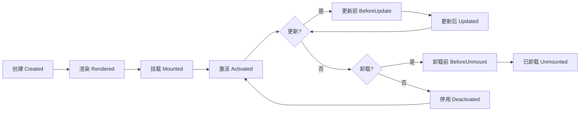

# @vitarx/runtime-core

Vitarx 框架的核心运行时模块，提供虚拟 DOM 管理、组件系统、渲染机制等核心功能。这是整个 Vitarx 框架的基石，为构建高性能 Web 应用提供强大的底层支持。

## 📖 目录

- [功能特性](#功能特性)
- [安装](#安装)
- [快速开始](#快速开始)
- [核心概念](#核心概念)
  - [虚拟 DOM (VNode)](#虚拟-dom-vnode)
  - [组件系统 (Widget)](#组件系统-widget)
  - [生命周期](#生命周期)
  - [应用管理 (App)](#应用管理-app)
  - [渲染机制](#渲染机制)
  - [指令系统](#指令系统)
- [API 参考](#api-参考)
- [使用示例](#使用示例)
- [进阶指南](#进阶指南)
- [架构设计](#架构设计)

## 功能特性

| 特性                | 说明                                            |
|-------------------|-----------------------------------------------|
| 🎨 **虚拟 DOM 系统**  | 高效的虚拟 DOM 实现和 diff 算法，支持 7 种节点类型              |
| 🧩 **组件系统**       | 支持函数组件和类组件，提供完整的生命周期钩子                        |
| 🔄 **渲染机制**       | 灵活的渲染器接口，支持多平台渲染适配                            |
| 🎯 **指令系统**       | 内置 v-show 等指令，可扩展自定义指令                        |
| 💉 **依赖注入**       | 应用级和组件级的依赖注入机制 (provide/inject)               |
| ⚡ **响应式集成**       | 与 @vitarx/responsive 深度集成，自动更新视图              |
| 📦 **内置组件**       | Suspense、Transition、KeepAlive、Lazy、Teleport 等 |
| 📘 **TypeScript** | 完整的类型定义和类型推导支持                                |

## 安装

```bash
npm install @vitarx/runtime-core
```

或使用其他包管理器：

```bash
# pnpm
pnpm add @vitarx/runtime-core

# yarn
yarn add @vitarx/runtime-core
```

## 快速开始

### 最小可运行示例

```tsx
import { createApp } from '@vitarx/runtime-dom' // DOM 平台渲染器
import { ref } from '@vitarx/responsive'

// 1. 创建根组件
function AppRoot() {
  const count = ref(0)
  
  return (
    <div class="app">
      <h1>Hello Vitarx!</h1>
      <p>Count: {count.value}</p>
      <button onClick={() => count.value++}>增加</button>
    </div>
  )
}

// 2. 创建应用实例并挂载
const app = createApp(AppRoot)
app.mount('#app')
```

## 核心概念

### 虚拟 DOM (VNode)

VNode (虚拟节点) 是对真实 DOM 节点的轻量级抽象，用于描述 UI 结构。Vitarx 使用虚拟 DOM 来优化渲染性能：通过 diff 算法比较新旧虚拟 DOM 树的差异，只更新变化的部分。

**设计动机：**
- 提升渲染性能：避免频繁的 DOM 操作
- 跨平台能力：虚拟 DOM 可以映射到不同平台（浏览器、移动端、服务端）
- 声明式编程：开发者只需描述 UI 状态，框架负责更新

#### VNode 类型一览

| 类型名称                   | 对应场景       | 特点      | 示例                          |
|------------------------|------------|---------|-----------------------------|
| `RegularElementVNode`  | 常规 HTML 元素 | 支持子节点   | `<div>`, `<span>`           |
| `VoidElementVNode`     | 自闭合元素      | 不支持子节点  | ``, `<input>`          |
| `TextVNode`            | 文本内容       | 纯文本渲染   | 文字、数字                       |
| `CommentVNode`         | 注释节点       | 不可见标记   | `<!-- comment -->`          |
| `FragmentVNode`        | 多节点容器      | 无额外包裹元素 | `<>...</>`                  |
| `StatefulWidgetVNode`  | 有状态组件      | 生命周期管理  | 继承自 Widget 的类 / 未标记无状态的函数组件 |
| `StatelessWidgetVNode` | 无状态函数组件    | 轻量级     | 纯函数组件                       |

#### VNode 生命周期



**状态说明：**
- **Created**：VNode 对象已创建，但尚未渲染
- **Rendered**：VNode 已渲染，准备挂载到 DOM
- **Mounted**：VNode 已挂载到 DOM 树
- **Activated**：组件处于活跃状态（正常运行）
- **Deactivated**：组件被 KeepAlive 缓存，暂时停用
- **Unmounted**：组件已从 DOM 中移除

### 组件系统 (Widget)

Widget (组件) 是构建用户界面的基本单元，用于封装可复用的 UI 逻辑。Vitarx 支持两种组件类型：函数组件和类组件。

#### 组件类型对比

| 特性       | 函数组件                | 类组件                  |
|----------|---------------------|----------------------|
| **定义方式** | 纯函数                 | 继承 Widget 类          |
| **状态管理** | 通过 ref/reactive     | 实例属性                 |
| **生命周期** | 使用钩子函数（onMounted 等） | 实例方法（onMounted() {}） |
| **性能**   | 轻量级                 | 稍重（更多功能）             |
| **适用场景** | 简单展示型组件             | 复杂交互逻辑               |
| **代码风格** | 函数式编程               | 面向对象编程               |

#### 函数组件

函数组件是接收 props 并返回 VNode 的简单函数，适合简单的 UI 展示：

```tsx
import { ref } from '@vitarx/responsive'
import { defineStatelessWidget, onMounted } from '@vitarx/runtime-core'

// 定义无状态函数组件 可使用 stateless 短命名 / defineStatelessWidget
const Welcome = defineStatelessWidget((props: { name: string }) => {
  return (
    <div class="welcome">
      <h2>欢迎, {props.name}!</h2>
      <p>这是一个函数组件。</p>
    </div>
  )
})

// 带状态的函数组件
function Counter(props: { initialCount?: number }) {
  const count = ref(props.initialCount || 0)

  return (
    <div class="counter">
      <p>计数: {count.value}</p>
      <button onClick={() => count.value++}>增加</button>
    </div>
  )
}

// 使用组件
function App() {
  // 注册钩子
  onMounted(()=>{
    console.log('APP已挂载')
  })
  return (
    <div>
      <Welcome name="Vitarx用户" />
      <Counter initialCount={10} />
    </div>
  )
}
```

#### 类组件

类组件通过继承 Widget 类来实现，提供更多功能，通过方法定义生命周期钩子：

```tsx
import { Widget } from '@vitarx/runtime-core'
import { ref } from '@vitarx/responsive'

// 定义类组件
class TodoList extends Widget<{ title: string }> {
  // 定义响应式状态
  todos = ref<string[]>([])
  newTodo = ref('')

  // 生命周期钩子：组件挂载后
  onMounted() {
    console.log('组件已挂载')
    // 可以访问 DOM：this.$el
  }

  // 添加待办事项
  addTodo() {
    if (this.newTodo.value.trim()) {
      this.todos.value.push(this.newTodo.value)
      this.newTodo.value = ''
    }
  }

  // 渲染方法
  build() {
    return (
      <div class="todo-list">
        <h2>{this.props.title}</h2>
        <input 
          value={this.newTodo.value}
          onInput={(e) => this.newTodo.value = e.target.value}
        />
        <button onClick={() => this.addTodo()}>添加</button>
        <ul>
          {this.todos.value.map(todo => <li>{todo}</li>)}
        </ul>
      </div>
    )
  }
}

// 使用类组件
function App() {
  return <TodoList title="我的待办事项" />
}
```

#### 内置组件

Vitarx 提供了一系列强大的内置组件：

| 组件名               | 作用       | 核心特性      | 使用场景      |
|-------------------|----------|-----------|-----------|
| `Suspense`        | 异步依赖处理   | 显示加载状态    | 异步组件加载    |
| `Transition`      | 单元素过渡动画  | CSS 过渡钩子  | 元素显示/隐藏动画 |
| `TransitionGroup` | 列表过渡动画   | 批量元素动画    | 列表增删动画    |
| `PropBind`        | 属性透传     | 自动传递给子节点  | 统一管理子节点属性 |
| `KeepAlive`       | 组件缓存     | 保持非活动组件状态 | 页签切换、视图缓存 |
| `Lazy`            | 懒加载组件    | 延迟加载与渲染   | 按需加载大组件   |
| `Teleport`        | DOM 位置传送 | 渲染到指定容器   | 模态框、提示框   |

### 生命周期

组件具有完整的生命周期钩子，允许开发者在组件的不同阶段执行代码。

#### 生命周期流程

```mermaid
flowchart TD
    A[创建实例] --> B[onCreate]
    B --> C[onRender]
    C --> D[渲染 build]
    D --> E[onBeforeMount]
    E --> F[挂载 DOM]
    F --> G[onMounted]
    G --> H{组件活跃}
    H --> I{KeepAlive?}
    I -->|是| J[onActivated]
    I -->|否| K[正常运行]
    K --> L{状态变化?}
    L -->|更新| M[onBeforeUpdate]
    M --> N[重新渲染]
    N --> O[onUpdated]
    O --> K
    L -->|缓存| P[onDeactivated]
    P --> Q[缓存状态]
    Q --> J
    L -->|销毁| R[onBeforeUnmount]
    R --> S[卸载 DOM]
    S --> T[onUnmounted]
    
    K -.|异常| U[onError]
    U --> V[错误处理]
```

#### 生命周期钩子详解

| 钩子名称              | 触发时机           | 可访问 DOM  | 适用场景           |
|-------------------|----------------|----------|----------------|
| `onCreate`        | 组件实例创建时        | 否        | 初始化状态、访问 props |
| `onRender`        | 渲染前（SSR + CSR） | 否        | SSR 数据准备       |
| `onBeforeMount`   | 挂载前            | 否        | 挂载前的准备工作       |
| `onMounted`       | 挂载完成后          | 是        | 访问 DOM、初始化第三方库 |
| `onActivated`     | 组件激活时          | 是        | KeepAlive 激活恢复 |
| `onDeactivated`   | 组件停用时          | 是        | KeepAlive 停用清理 |
| `onBeforeUpdate`  | 更新前            | 是（旧 DOM） | 更新前的状态记录       |
| `onUpdated`       | 更新完成后          | 是（新 DOM） | 操作更新后的 DOM     |
| `onBeforeUnmount` | 卸载前            | 是        | 清理定时器、事件监听器    |
| `onUnmounted`     | 卸载完成后          | 否        | 最终清理工作         |
| `onError`         | 捕获异常时          | 视情况      | 错误边界、降级展示      |

#### 函数组件中使用生命周期

```tsx
import { ref } from '@vitarx/responsive'
import { onMounted, onBeforeUnmount } from '@vitarx/runtime-core'

function Timer() {
  const seconds = ref(0)
  let timerId: number

  // 挂载后启动计时器
  onMounted(() => {
    console.log('组件已挂载')
    timerId = setInterval(() => {
      seconds.value++
    }, 1000)
  })

  // 卸载前清理计时器
  onBeforeUnmount(() => {
    console.log('组件卸载')
    clearInterval(timerId)
  })

  return <div>运行时间: {seconds.value} 秒</div>
}
```

#### 类组件中使用生命周期

```tsx
import { Widget } from '@vitarx/runtime-core'
import { ref } from '@vitarx/responsive'

class DataFetcher extends Widget {
  data = ref(null)
  loading = ref(false)

  // 创建时
  onCreate() {
    console.log('组件实例已创建，props:', this.props)
  }
  // 开始渲染时获取数据，兼容后期的SSR渲染
  onRender() {
   return this.fetchData()
  }
  onMounted() {
    console.log('组件已挂载')
  }

  // 更新后
  onUpdated() {
    console.log('DOM 已更新')
  }

  // 卸载前清理
  onBeforeUnmount() {
    console.log('清理资源')
  }

  async fetchData() {
    this.loading.value = true
    try {
      const response = await fetch('/api/data')
      this.data.value = await response.json()
    } catch (error) {
      console.error(error)
    } finally {
      this.loading.value = false
    }
  }

  build() {
    // 多 return 方式仅在类组件build方法中能保证响应性，函数组件中需使用 build(()=>{// 视图构建逻辑})
    if (this.loading.value) return <div>加载中...</div>
    if (this.data.value) return <div>{JSON.stringify(this.data.value)}</div>
    return <div>暂无数据</div>
  }
}
```

### 应用管理 (App)

App 类负责管理整个 Vitarx 应用实例，提供全局配置、依赖注入、插件系统等功能。

#### 创建应用

```tsx
import { App } from '@vitarx/runtime-core'
import { createRenderer } from '@vitarx/runtime-dom'

// 1. 注册渲染器
createRenderer()

// 2. 创建应用实例
const app = new App(RootComponent, {
  // 全局错误处理器
  errorHandler: (error, info) => {
    console.error('应用错误:', error, info)
  },
  // 应用 ID 前缀
  idPrefix: 'my-app'
})

// 3. 挂载到 DOM
app.mount('#app')
```

#### 全局配置

| 配置项            | 类型                      | 默认值        | 说明         |
|----------------|-------------------------|------------|------------|
| `errorHandler` | `(error, info) => void` | 控制台输出      | 全局错误处理函数   |
| `idPrefix`     | `string`                | `'vitarx'` | 组件 ID 生成前缀 |

#### 依赖注入

```tsx
// 提供全局数据
app.provide('theme', { mode: 'dark', color: 'blue' })
app.provide('api', { baseURL: 'https://api.example.com' })

// 在组件中注入
function MyComponent() {
  const theme = inject('theme')
  const api = inject('api')
  
  return <div style={{ color: theme.color }}>...</div>
}
```

#### 注册全局指令

```tsx
// 注册对象形式指令
app.directive('focus', {
  mounted(el) {
    el.focus()
  }
})

// 注册函数形式指令
app.directive('highlight', (el) => {
  el.style.backgroundColor = 'yellow'
})

// 使用
function MyInput() {
  return <input v-focus />
}
```

#### 使用插件

```tsx
// 定义插件
const MyPlugin = {
  install(app: App, options: any) {
    // 注册全局组件
    app.provide('pluginData', options)
    // 注册指令
    app.directive('custom', { /* ... */ })
  }
}

// 应用插件
app.use(MyPlugin, { config: 'value' })
```

### 渲染机制

Vitarx 采用灵活的渲染器设计，通过 `HostRenderer` 接口实现平台适配。

#### 渲染器接口

`HostRenderer` 定义了所有平台渲染器必须实现的方法：

| 方法类型       | 方法名称              | 说明       |
|------------|-------------------|----------|
| **创建节点**   | `createElement`   | 创建元素节点   |
|            | `createText`      | 创建文本节点   |
|            | `createComment`   | 创建注释节点   |
|            | `createFragment`  | 创建片段节点   |
| **DOM 操作** | `insertBefore`    | 插入节点     |
|            | `appendChild`     | 追加子节点    |
|            | `remove`          | 移除节点     |
|            | `replace`         | 替换节点     |
| **属性操作**   | `setAttribute`    | 设置属性     |
|            | `removeAttribute` | 移除属性     |
| **样式管理**   | `addStyle`        | 添加样式     |
|            | `removeStyle`     | 移除样式     |
|            | `addClass`        | 添加 CSS 类 |
|            | `removeClass`     | 移除 CSS 类 |

#### 平台适配

```
┌──────────────────────┐
│   runtime-core          │  <- 核心逻辑（平台无关）
│   - VNode 管理          │
│   - 组件系统           │
│   - Diff 算法           │
│   - 生命周期           │
└──────────┬───────────┘
             │
      HostRenderer 接口
             │
     ┌──────┴──────┐
     │               │
┌────┴────┐   ┌────┴────┐
│ runtime- │   │ runtime- │
│   dom    │   │   ssr    │
└─────────┘   └─────────┘
  浏览器        服务端
```

**职责划分：**
- **runtime-core**：处理虚拟 DOM 逻辑、组件生命周期、diff 算法等与平台无关的部分
- **runtime-dom**：实现浏览器 DOM 操作、事件绑定、样式管理等
- **runtime-ssr**：实现服务端渲染，生成 HTML 字符串

#### 节点控制器模式

Vitarx 使用 **Controller 模式**管理不同类型节点的生命周期：

```tsx
interface NodeController<T extends NodeType> {
  render(node: VNode<T>): HostElement
  mount(node: VNode<T>): void
  update(node: VNode<T>, newProps: Props): void
  unmount(node: VNode<T>): void
  activate(node: VNode<T>): void
  deactivate(node: VNode<T>): void
}
```

**主要控制器：**
- `RegularElementController`：管理常规元素 (`<div>`, `<span>`)
- `VoidElementController`：管理自闭合元素 (``, `<input>`)
- `FragmentController`：管理片段节点
- `TextController`：管理文本节点
- `CommentController`：管理注释节点
- `StatefulWidgetController`：管理有状态组件
- `StatelessWidgetController`：管理无状态组件

### 指令系统

指令是一种特殊的属性，用于扩展 DOM 元素的行为。

#### 内置指令

**v-show**：根据条件显示/隐藏元素（使用 `display` 样式）

```tsx
function MyComponent() {
  const visible = ref(true)
  
  return (
    <div>
      <div v-show={visible.value}>我可以显示和隐藏</div>
      <button onClick={() => visible.value = !visible.value}>切换</button>
    </div>
  )
}
```

#### 自定义指令

指令提供了完整的生命周期钩子：

```tsx
import { Directive } from '@vitarx/runtime-core'

// 定义指令
const vClickOutside: Directive = {
  // 挂载时
  mounted(el, binding) {
    const handler = (e: Event) => {
      if (!el.contains(e.target as Node)) {
        binding.value?.(e)
      }
    }
    el._clickOutsideHandler = handler
    document.addEventListener('click', handler)
  },
  
  // 更新时
  updated(el, binding) {
    // 更新逻辑
  },
  
  // 卸载时
  unmounted(el) {
    document.removeEventListener('click', el._clickOutsideHandler)
    delete el._clickOutsideHandler
  }
}

// 使用指令
function Dropdown() {
  const show = ref(false)
  
  return (
    <div v-click-outside={() => show.value = false}>
      <button onClick={() => show.value = !show.value}>下拉菜单</button>
      {show.value && <div class="menu">...</div>}
    </div>
  )
}
```

#### 指令注册

```tsx
// 全局注册
app.directive('click-outside', vClickOutside)

// 局部注册（在组件中）
function MyComponent() {
  return (
    <div directives={{ clickOutside: vClickOutside }}>
      ...
    </div>
  )
}
```

## API 参考

### 应用 API

#### `App`

应用类，管理整个 Vitarx 应用实例。

**构造函数：**

```typescript
new App(
  root: VNode | WidgetType,
  config?: AppConfig
)
```

**参数：**

| 参数       | 类型                    | 必填 | 说明       |
|----------|-----------------------|----|----------|
| `root`   | `VNode \| WidgetType` | 是  | 根组件或虚拟节点 |
| `config` | `AppConfig`           | 否  | 应用配置选项   |

**实例方法：**

| 方法          | 类型签名                                                              | 说明      |
|-------------|-------------------------------------------------------------------|---------|
| `mount`     | `(container: string \| Element) => void`                          | 挂载应用    |
| `unmount`   | `() => void`                                                      | 卸载应用    |
| `provide`   | `(key: string \| symbol, value: any) => this`                     | 提供全局数据  |
| `directive` | `(name: string, directive?: Directive) => Directive \| undefined` | 注册/获取指令 |
| `use`       | `(plugin: Plugin, options?: any) => this`                         | 使用插件    |

**示例：**

```tsx
const app = new App(RootComponent, {
  errorHandler: (err, info) => console.error(err, info)
})

app.provide('globalData', { theme: 'dark' })
  .directive('focus', { mounted: (el) => el.focus() })
  .mount('#app')
```

---

### 虚拟节点 API

#### `createVNode()`

创建虚拟节点。

**函数签名：**

```typescript
function createVNode(
  type: VNodeType,
  props?: Record<string, any> | null,
  ...children: any[]
): VNode
```

**参数：**

| 参数         | 类型                            | 必填 | 说明               |
|------------|-------------------------------|----|------------------|
| `type`     | `string \| WidgetType`        | 是  | 节点类型（HTML 标签、组件） |
| `props`    | `Record<string, any> \| null` | 否  | 节点属性             |
| `children` | `any[]`                       | 否  | 子节点              |

**示例：**

```tsx
// 创建元素节点
const div = createVNode('div', { class: 'container' }, 'Hello')

// 创建组件节点
const widget = createVNode(MyComponent, { name: 'John' })
```

---

### 生命周期钩子

以下钩子仅适用于函数组件，类组件使用实例方法。

#### `onCreate()`

注册组件创建时的钩子（仅类组件）。

#### `onRender()`

注册渲染前的钩子。

**函数签名：**

```typescript
function onRender(callback: () => void): void
```

**示例：**

```tsx
function MyComponent() {
  onRender(() => {
    console.log('渲染前执行（SSR + CSR）')
  })
  
  return <div>...</div>
}
```

#### `onMounted()`

注册组件挂载完成后的钩子。

**函数签名：**

```typescript
function onMounted(callback: () => void): void
```

**示例：**

```tsx
function MyComponent() {
  onMounted(() => {
    console.log('DOM 已挂载，可以访问 DOM')
  })
  
  return <div>...</div>
}
```

**注意事项：**
- 只能在组件的设置函数或 `build` 方法内调用
- 可以多次调用注册多个钩子
- 挂载后才能通过 `$el` 访问 DOM 元素

#### `onBeforeUpdate()` / `onUpdated()`

注册组件更新前/后的钩子。

```typescript
function onBeforeUpdate(callback: () => void): void
function onUpdated(callback: () => void): void
```

#### `onBeforeUnmount()` / `onUnmounted()`

注册组件卸载前/后的钩子。

```typescript
function onBeforeUnmount(callback: () => void): void
function onUnmounted(callback: () => void): void
```

**示例：**

```tsx
function Timer() {
  let timerId: number
  
  onMounted(() => {
    timerId = setInterval(() => console.log('tick'), 1000)
  })
  
  onUnmounted(() => {
    clearInterval(timerId)
  })
  
  return <div>Timer</div>
}
```

#### `onActivated()` / `onDeactivated()`

注册组件激活/停用的钩子（KeepAlive 使用）。

```typescript
function onActivated(callback: () => void): void
function onDeactivated(callback: () => void): void
```

#### `onError()`

注册错误处理钩子。

**函数签名：**

```typescript
function onError(
  callback: (error: unknown, info: ErrorInfo) => VNode | void
): void
```

**示例：**

```tsx
function MyComponent() {
  onError((error, info) => {
    console.error('组件错误:', error, info.source)
    return <div>错误: {String(error)}</div>
  })
  
  return <div>...</div>
}
```

---

### 依赖注入 API

#### `provide()`

提供数据给子孙组件。

**函数签名：**

```typescript
function provide<T>(key: string | symbol, value: T): void
```

#### `inject()`

注入祖先组件提供的数据。

**函数签名：**

```typescript
function inject<T>(
  key: string | symbol,
  defaultValue?: T
): T | undefined
```

**示例：**

```tsx
// 父组件
function ParentComponent() {
  provide('theme', { mode: 'dark' })
  
  return <ChildComponent />
}

// 子组件
function ChildComponent() {
  const theme = inject('theme', { mode: 'light' }) // 带默认值
  
  return <div>Theme: {theme.mode}</div>
}
```

---

### 渲染器 API

#### `setRenderer()`

设置全局渲染器。

**函数签名：**

```typescript
function setRenderer(renderer: HostRenderer): void
```

#### `getRenderer()`

获取当前渲染器。

**函数签名：**

```typescript
function getRenderer(): HostRenderer | undefined
```

---

## 使用示例

### 示例 1：创建并挂载应用

```tsx
import { App } from '@vitarx/runtime-core'
import { createRenderer } from '@vitarx/runtime-dom'
import { ref } from '@vitarx/responsive'

// 注册 DOM 渲染器
createRenderer()

// 创建根组件
function AppRoot() {
  return (
    <div class="app">
      <h1>Hello Vitarx!</h1>
      <p>这是一个最小示例</p>
    </div>
  )
}

// 创建应用并挂载
const app = new App(AppRoot)
app.mount('#app')
```

### 示例 2：使用内置组件 (Suspense & KeepAlive)

```tsx
import { Suspense, KeepAlive, Lazy } from '@vitarx/runtime-core'
import { ref } from '@vitarx/responsive'

// 懒加载组件
const HeavyComponent = () => import('./HeavyComponent')

function TabContainer() {
  const activeTab = ref('home')
  
  return (
    <div>
      <button onClick={() => activeTab.value = 'home'}>Home</button>
      <button onClick={() => activeTab.value = 'profile'}>Profile</button>
      
      <KeepAlive>
        {activeTab.value === 'home' && <Suspense fallback={<div>加载中...</div>}><Lazy loader={HeavyComponent} /></Suspense>}
        {activeTab.value === 'profile' && <ProfileTab />}
      </KeepAlive>
    </div>
  )
}
```

### 示例 3：依赖注入

```tsx
import { provide, inject } from '@vitarx/runtime-core'
import { ref } from '@vitarx/responsive'

// 根组件
function App() {
  const theme = ref({ mode: 'dark', color: 'blue' })
  provide('theme', theme)
  
  return <Header />
}

// 子组件
function Header() {
  const theme = inject('theme')
  return <header style={{ backgroundColor: theme.value.color }}>头部</header>
}
```

## 进阶指南

### 性能优化

1. **使用 KeepAlive 缓存组件**：避免频繁切换时的重复渲染
2. **懒加载大组件**：使用 Lazy + Suspense 按需加载
3. **避免过度渲染**：使用 computed 减少不必要的计算

### 组件通信模式

- **Props 下传**：父向子传递数据
- **事件上抛**：子向父触发事件
- **Provide/Inject**：跨层级通信

## 架构设计

### 目录结构

```
src/
├── app/              # 应用管理
├── constants/        # 常量定义
├── controllers/      # 节点控制器
├── directive/        # 指令系统
├── renderer/         # 渲染器接口
├── runtime/          # 运行时功能
├── types/            # 类型定义
├── utils/            # 工具函数
├── vnode/            # 虚拟节点操作
└── widget/           # 组件系统
```

### 节点控制器模式

Controller 模式实现职责分离，每种节点类型有独立的控制器，遵循相同的生命周期接口。

### Diff 算法

使用双端比较算法优化子节点更新，支持 key 优化和最小移动策略。

### 响应式集成

runtime-core 与 @vitarx/responsive 深度集成，自动追踪依赖并触发组件更新。

---

## 许可证

[MIT](LICENSE)
