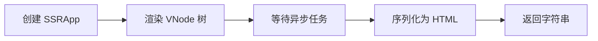
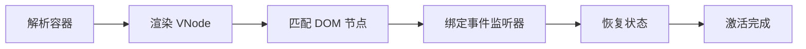

# @vitarx/runtime-ssr

Vitarx 框架的服务端渲染 (SSR) 和客户端水合 (Hydration) 模块。

## 📚 目录

- [概述](#概述)
- [安装](#安装)
- [快速开始](#快速开始)
- [核心概念](#核心概念)
- [API 参考](#api-参考)
- [高级用法](#高级用法)
- [最佳实践](#最佳实践)
- [注意事项](#注意事项)
- [API 索引](#api-索引)

## 概述

`@vitarx/runtime-ssr` 提供了 Vitarx 框架的服务端渲染 (Server-Side Rendering) 和客户端水合 (Client Hydration) 解决方案。通过 SSR，您可以在服务器端生成完整的 HTML 内容，提升首屏加载速度和 SEO 表现。

### 核心特性

| 特性            | 说明                              |
|---------------|---------------------------------|
| 🚀 **多种渲染模式** | 支持同步 (sync) 和流式 (stream) 两种渲染模式 |
| ⏳ **异步组件支持**  | 自动等待异步组件完成后再序列化                 |
| 🔄 **客户端水合**  | 复用服务端渲染的 DOM，快速激活交互功能           |
| 📦 **状态管理**   | 服务端注入状态，客户端自动恢复                 |
| 🎯 **指令支持**   | 支持 v-show、v-html 等内置指令          |
| 🔒 **XSS 防护** | 自动转义 HTML 特殊字符，防止 XSS 攻击        |

## 安装

```bash
npm install @vitarx/runtime-ssr
```

或使用其他包管理器：

```bash
# pnpm
pnpm add @vitarx/runtime-ssr

# yarn
yarn add @vitarx/runtime-ssr
```

## 快速开始

### 服务端渲染示例

```tsx
import { createSSRApp, renderToString } from '@vitarx/runtime-ssr'

// 定义组件
function App() {
  return (
    <div>
      <h1>欢迎使用 Vitarx SSR</h1>
      <p>这是服务端渲染的内容</p>
    </div>
  )
}

// 服务端渲染
const app = createSSRApp(App)
const html = await renderToString(app)

console.log(html) // <div><h1>欢迎使用 Vitarx SSR</h1><p>这是服务端渲染的内容</p></div>
```

### 客户端水合示例

```tsx
import { createSSRApp } from '@vitarx/runtime-ssr'

function App() {
  return (
    <div>
      <h1>欢迎使用 Vitarx SSR</h1>
      <button onClick={() => alert('点击!')}>Click me</button>
    </div>
  )
}

// 客户端水合
const app = createSSRApp(App)
app.mount('#app') // 自动检测并水合服务端渲染的 HTML
```

### 完整全栈示例

**服务端 (Node.js + Express):**

```tsx
import express from 'express'
import { createSSRApp, renderToString } from '@vitarx/runtime-ssr'
import App from './App'

const server = express()

server.get('*', async (req, res) => {
  const app = createSSRApp(App)
  const context = {}
  
  const html = await renderToString(app, context)
  
  res.send(`
    <!DOCTYPE html>
    <html>
      <head>
        <title>Vitarx SSR App</title>
      </head>
      <body>
        <div id="app">${html}</div>
        <script src="/client.js"></script>
      </body>
    </html>
  `)
})

server.listen(3000)
```

**客户端:**

```tsx
import { createSSRApp } from '@vitarx/runtime-ssr'
import App from './App'

const app = createSSRApp(App)
app.mount('#app')
```

## 核心概念

### SSR 原理

服务端渲染的基本流程如下：



**工作原理：**

1. **VNode 构建**：调用组件的 render 函数构建虚拟 DOM 树
2. **异步等待**：收集所有异步组件的 Promise，等待完成
3. **字符串序列化**：遍历 VNode 树，将每个节点转换为 HTML 字符串
4. **HTML 输出**：返回完整的 HTML 字符串

### 客户端水合

水合 (Hydration) 是将静态 HTML 激活为可交互应用的过程：



**工作原理：**

1. **DOM 解析**：获取服务端渲染的 DOM 结构
2. **VNode 匹配**：按顺序遍历 VNode 树，将每个 VNode 与对应的 DOM 节点关联
3. **事件绑定**：为元素绑定事件监听器
4. **状态恢复**：恢复服务端注入的状态
5. **激活完成**：应用变为完全可交互的状态

### 渲染模式

#### string 模式 (renderToString)

等待所有异步任务完成后，一次性输出完整的 HTML 字符串。

**适用场景：**
- 页面内容较少
- 需要完整的 HTML 用于缓存
- 预渲染静态页面

#### stream 模式 (renderToStream)

渐进式输出 HTML 内容，遇到异步组件时阻塞等待。

**适用场景：**
- 大型页面，需要尽快显示首屏内容
- 减少 TTFB (Time To First Byte)
- 需要流式响应的场景

**模式对比：**

| 特性   | string 模式 | stream 模式 |
|------|-----------|-----------|
| 输出方式 | 一次性输出     | 渐进式输出     |
| TTFB | 较高        | 较低        |
| 内存占用 | 较高        | 较低        |
| 适用场景 | 小页面、缓存    | 大页面、流式响应  |

## API 参考

### 应用创建

#### `createSSRApp(Widget)`

创建一个 SSR 应用实例。

**函数签名：**

```tsx
export declare function createSSRApp(root: VNode | WidgetType, config?: AppConfig): SSRApp;
```

**参数：**

| 参数     | 类型                | 必填 | 说明      |
|--------|-------------------|----|---------|
| `root` | `VNode \| Widget` | 是  | 根组件或根节点 |

**返回值：** `SSRApp` - SSR 应用实例

**示例：**

```tsx
import { createSSRApp } from '@vitarx/runtime-ssr'

function App() {
  return <div>Hello SSR</div>
}

const app = createSSRApp(App)
```

#### `SSRApp`

SSR 应用类，继承自 `App`。

**方法：**

##### `mount(container, context?)`

将应用挂载到指定容器。客户端会自动检测是否需要水合。
> 仅客户端支持

**参数：**

| 参数          | 类型                  | 必填 | 说明                     |
|-------------|---------------------|----|------------------------|
| `container` | `string \| Element` | 是  | 挂载容器，可以是 DOM 元素或选择器字符串 |
| `context`   | `SSRContext`        | 否  | SSR 上下文对象              |

**返回值：** `this` - 支持链式调用

**示例：**

```tsx
const app = createSSRApp(App)
app.mount('#app')
```

### 服务端渲染

#### `renderToString(root, context?)`

将应用渲染为 HTML 字符串（同步模式）。

**函数签名：**

```tsx
export declare function renderToString(root: SSRApp | VNode, context?: SSRContext): Promise<string>;
```

**参数：**

| 参数        | 类型                | 必填 | 默认值  | 说明            |
|-----------|-------------------|----|------|---------------|
| `root`    | `SSRApp \| VNode` | 是  | -    | SSR 应用实例或虚拟节点 |
| `context` | `SSRContext`      | 否  | `{}` | SSR 上下文对象     |

**返回值：** `Promise<string>` - HTML 字符串

**示例：**

```tsx
import { createSSRApp, renderToString } from '@vitarx/runtime-ssr'
function App() {
  return <div>Hello SSR</div>
}
const app = createSSRApp(App)
const html = await renderToString(app)

console.log(html) // <div>Hello SSR</div>
```

#### `renderToStream(root, context, options)`

将应用渲染为流（流式阻塞模式）。

**函数签名：**

```ts
export declare function renderToStream(root: SSRApp | VNode, context: SSRContext | undefined, options: StreamingSink): Promise<void>;
```

**参数：**

| 参数        | 类型                    | 必填 | 说明            |
|-----------|-----------------------|----|---------------|
| `root`    | `SSRApp \| VNode`     | 是  | SSR 应用实例或虚拟节点 |
| `context` | `SSRContext`          | 是  | SSR 上下文对象     |
| `options` | `StreamRenderOptions` | 是  | 流式渲染选项        |

**StreamRenderOptions 类型：**

```ts
interface StreamRenderOptions {
  push(content: string): void  // 推送内容到流
  close(): void                // 关闭流
  error(error: Error): void    // 处理错误
}
```

**示例：**

```ts
import { renderToStream } from '@vitarx/runtime-ssr'
import { createSSRApp } from '@vitarx/runtime-ssr'

const app = createSSRApp(App)

await renderToStream(app, {}, {
  push(content) {
    res.write(content)
  },
  close() {
    res.end()
  },
  error(err) {
    console.error(err)
    res.status(500).end()
  }
})
```

#### `renderToReadableStream(root, context?)`

创建 Web Streams API 的 ReadableStream。

**函数签名：**

```ts
export declare function renderToReadableStream(root: SSRApp | VNode, context?: SSRContext): ReadableStream<string>;
```

**示例：**

```ts
const stream = await renderToReadableStream(app)
return new Response(stream, {
  headers: { 'Content-Type': 'text/html' }
})
```

#### `renderToNodeStream(root, context?)`

创建 Node.js 的 Readable 流。

**函数签名：**

```tsx
export declare function renderToNodeStream(root: SSRApp | VNode, context?: SSRContext): Promise<NodeJS.ReadableStream>;
```

**示例：**

```tsx
const stream = await renderToNodeStream(app)
stream.pipe(res)
```

### 客户端水合

#### `hydrate(app, container, context?)`

将服务端渲染的 HTML 水合为可交互的应用。

**函数签名：**

```ts
export declare function hydrate(app: SSRApp, container: string | HostParentElement, context?: SSRContext): Promise<void>;
```

**参数：**

| 参数          | 类型                  | 必填 | 说明        |
|-------------|---------------------|----|-----------|
| `app`       | `SSRApp`            | 是  | SSR 应用实例  |
| `container` | `string \| Element` | 是  | 挂载容器      |
| `context`   | `SSRContext`        | 否  | SSR 上下文对象 |

**示例：**

```tsx
import { createSSRApp, hydrate } from '@vitarx/runtime-ssr'

const app = createSSRApp(App)
app.mount('#app') // app.mount 自动执行水合
await app.hydrate('#app') // app.hydrate 和 app.mount 一致，只是返回了 Promise
await hydrate(app,'#app') // 主动调用 hydrate
// 以上三种方式的结果相同，只能选择其中一种方式使用！！！
```

> **注意：** 通常您不需要手动调用 `hydrate`，`SSRApp.mount()` 会自动检测并水合。

### 上下文 API

#### `useSSRContext()`

在组件中获取 SSR 上下文。

**函数签名：**

```tsx
export declare function useSSRContext<T = Record<string, any>>(): SSRContext<T> | undefined
```

**返回值：** `SSRContext | undefined` - SSR 上下文对象，非 SSR 环境返回 undefined

**示例：**

```tsx
import { useSSRContext } from '@vitarx/runtime-ssr'

function MyComponent() {
  const ctx = useSSRContext()
  
  if (ctx) {
    // 服务端渲染时写入数据
    ctx.title = 'My Page Title'
  }
  
  return <div>Content</div>
}
```

#### `isSSR()`

判断当前是否处于服务端渲染上下文。

**函数签名：**

```tsx
export declare function isSSR(): boolean;
```

**示例：**

```tsx
import { isSSR } from '@vitarx/runtime-ssr'

if (isSSR()) {
  console.log('正在服务端渲染')
}
```

#### `isHydrating()`

判断当前是否处于水合阶段。

**函数签名：**

```tsx
export declare function isHydrating(): boolean;
```

**示例：**

```tsx
import { isHydrating } from '@vitarx/runtime-ssr'

if (isHydrating()) {
  console.log('正在水合')
}
```

#### `SSRContext` 类型

SSR 上下文对象类型，可用于在服务端和客户端之间传递状态。

```tsx
type SSRContext<T = Record<string, any>> = T & {
  $nodeAsyncMap?: WeakMap<VNode, Promise<unknown>>  // 内部使用
  $isHydrating?: boolean  // 内部使用
}
```

### 工具函数

#### `escapeHTML(text)`

转义 HTML 特殊字符。

**函数签名：**

```tsx
export declare function escapeHTML(text: string): string;
```

**示例：**

```tsx
import { escapeHTML } from '@vitarx/runtime-ssr'

const safe = escapeHTML('<script>alert("xss")</script>')
console.log(safe) // &lt;script&gt;alert(&quot;xss&quot;)&lt;/script&gt;
```

#### `serializeAttributes(props)`

将属性对象序列化为 HTML 属性字符串。

**函数签名：**

```ts
export declare function serializeAttributes(props: Record<string, any>): string;
```

**示例：**

```ts
import { serializeAttributes } from '@vitarx/runtime-ssr'

const attrs = serializeAttributes({
  id: 'test',
  class: 'foo bar',
  disabled: true
})
console.log(attrs) // ' id="test" class="foo bar" disabled'
```

## 高级用法

### 异步组件 SSR

#### Lazy 组件支持

Vitarx SSR 自动支持异步组件，在服务端渲染时会等待异步组件加载完成。

```tsx
import { Lazy } from '@vitarx/runtime-core'

const AsyncComponent = Lazy(() => import('./HeavyComponent'))

function App() {
  return (
    <div>
      <AsyncComponent />
    </div>
  )
}

// 服务端渲染会等待 AsyncComponent 加载完成
const html = await renderToString(createSSRApp(App))
```

#### 异步数据获取

在 `onRender` 生命周期中获取异步数据：

```tsx
import { Widget } from '@vitarx/runtime-core'

class UserProfile extends Widget {
  user = null
  
  async onRender() {
    // 服务端渲染时会等待这个 Promise
    const response = await fetch('/api/user')
    this.user = await response.json()
  }
  
  build() {
    if (!this.user) return <div>Loading...</div>
    return <div>Hello {this.user.name}</div>
  }
}
```

#### 错误处理

在渲染过程中捕获错误：

```tsx
try {
  const html = await renderToString(app, context)
  res.send(html)
} catch (error) {
  console.error('SSR 渲染失败:', error)
  // 降级为客户端渲染
  res.send(`
    <!DOCTYPE html>
    <html>
      <body>
        <div id="app"></div>
        <script src="/client.js"></script>
      </body>
    </html>
  `)
}
```

### 指令支持

#### v-show 指令

`v-show` 指令会在 SSR 时转换为 inline style：

```tsx
import { withDirectives } from '@vitarx/runtime-core'

function App() {
  return  <div v-show={false}>Content</div>
}

// 渲染结果：<div style="display: none;">Content</div>
```

#### v-html 指令

`v-html` 指令允许插入原始 HTML：

```tsx
function App() {
  const rawHTML = '<span class="highlight">Important</span>'
  return <div v-html={rawHTML} />
}

// 渲染结果：<div><span class="highlight">Important</span></div>
```

> **警告：** 使用 `v-html` 时必须确保内容来源可信，否则可能导致 XSS 攻击。

### 状态管理

#### 服务端状态注入

在服务端渲染时写入状态：

```tsx
import { useSSRContext } from '@vitarx/runtime-ssr'

function App() {
  const ctx = useSSRContext()
  
  if (ctx) {
    ctx.initialData = {
      user: { id: 1, name: 'John' },
      theme: 'dark'
    }
  }
  
  return <div>App Content</div>
}

// 服务端
const context = {}
const html = await renderToString(app, context)

// 将 context 注入到 HTML
const fullHTML = `
  <!DOCTYPE html>
  <html>
    <body>
      <div id="app">${html}</div>
      <script>
        window.__VITARX_STATE__ = ${JSON.stringify(context)}
      </script>
      <script src="/client.js"></script>
    </body>
  </html>
`
```

#### 客户端状态恢复

客户端水合时自动恢复状态：

```tsx
import { useSSRContext } from '@vitarx/runtime-ssr'

function App() {
  const ctx = useSSRContext()
  
  // 客户端可以访问服务端注入的状态
  const initialData = ctx?.initialData || {}
  
  return <div>User: {initialData.user?.name}</div>
}
```

### 性能优化

#### 流式渲染优化

对于大型页面，使用流式渲染减少 TTFB：

```tsx
import { renderToNodeStream } from '@vitarx/runtime-ssr'

app.get('*', async (req, res) => {
  res.writeHead(200, { 'Content-Type': 'text/html' })
  
  // 立即发送 HTML 头部
  res.write('<!DOCTYPE html><html><body><div id="app">')
  
  const stream = await renderToNodeStream(createSSRApp(App))
  stream.pipe(res, { end: false })
  
  stream.on('end', () => {
    res.end('</div><script src="/client.js"></script></body></html>')
  })
})
```

#### 水合性能优化

分批水合大型应用：

```tsx
// 先水合关键内容
const app = createSSRApp(App)
await hydrate(app, '#app')

// 然后延迟加载非关键内容
setTimeout(() => {
  // 加载其他组件
}, 0)
```

#### 缓存策略

缓存 SSR 渲染结果：

```tsx
const cache = new Map()

app.get('*', async (req, res) => {
  const url = req.url
  
  // 检查缓存
  if (cache.has(url)) {
    return res.send(cache.get(url))
  }
  
  const html = await renderToString(createSSRApp(App))
  cache.set(url, html)
  
  res.send(html)
})
```

## 最佳实践

### 服务端渲染最佳实践

#### 避免使用浏览器 API

在服务端渲染时，避免使用浏览器特有的 API：

```jsx
function MyComponent() {
  // ✗ 错误：服务端没有 window 对象
  // const width = window.innerWidth
  
  // ✓ 正确：检查环境
  const width = typeof window !== 'undefined' ? window.innerWidth : 0
  
  return <div>Width: {width}</div>
}
```

#### 生命周期限制

服务端渲柕仅执行部分生命周期钩子：

| 钩子            | 服务端 | 客户端 |
|---------------|-----|-----|
| `onCreate`    | ✓   | ✓   |
| `onRender`    | ✓   | ✓   |
| `onMounted`   | ✗   | ✓   |
| `onUpdated`   | ✗   | ✓   |
| `onUnmounted` | ✗   | ✓   |

```tsx
import { Widget } from '@vitarx/runtime-core'

class MyWidget extends Widget {
  onCreate() {
    // 服务端和客户端都会执行
    console.log('Component created')
  }
  
  onMounted() {
    // 仅客户端执行
    console.log('Component mounted')
    this.startTimer()
  }
  
  build() {
    return <div>Content</div>
  }
}
```

### 水合一致性保证

#### 确保渲染结果一致

服务端和客户端必须渲染相同的结果：

```tsx
// ✗ 错误：不一致
function App() {
  const isServer = typeof window === 'undefined'
  return <div>{isServer ? 'Server' : 'Client'}</div>
}

// ✓ 正确：一致性
function App() {
  return <div>Content</div>
}
```

#### 处理随机数和时间戳

避免在渲染过程中使用随机数或当前时间：

```tsx
// ✗ 错误：每次渲染结果不同
function App() {
  return <div>Random: {Math.random()}</div>
}

// ✓ 正确：使用上下文传递
function App() {
  const ctx = useSSRContext()
  const randomValue = ctx?.randomValue || 0
  return <div>Random: {randomValue}</div>
}
```

### SEO 优化

#### Meta 标签处理

动态设置 meta 标签：

```tsx
import { useSSRContext } from '@vitarx/runtime-ssr'

function App() {
  const ctx = useSSRContext()
  
  if (ctx) {
    ctx.title = 'My Page Title'
    ctx.meta = [
      { name: 'description', content: 'Page description' },
      { property: 'og:title', content: 'My Page Title' }
    ]
  }
  
  return <div>Content</div>
}

// 服务端
const context = {}
const html = await renderToString(app, context)

const fullHTML = `
  <!DOCTYPE html>
  <html>
    <head>
      <title>${context.title}</title>
      ${context.meta?.map(m => 
        `<meta ${Object.entries(m).map(([k, v]) => `${k}="${v}"`).join(' ')} />`
      ).join('\n')}
    </head>
    <body>
      <div id="app">${html}</div>
    </body>
  </html>
`
```

### 错误处理策略

#### 水合失败降级

`hydrate()` 会自动处理水合失败，如果水合失败后，会清空容器内容，并回退到正常渲染模式。

## 注意事项

### 生命周期钩子在 SSR 中的行为

- `onCreate` 和 `onRender` 在服务端和客户端都会执行
- `onMounted`、`onUpdated`、`onUnmounted` 仅在客户端执行
- 避免在 `onCreate` 和 `onRender` 中访问 DOM

### 浏览器 API 限制

服务端环境不支持以下 API：

- `window`、`document`、`navigator`
- `localStorage`、`sessionStorage`
- `setTimeout`、`setInterval`（在 `onMounted` 中使用）
- DOM 操作 API

### 内存泄漏预防

- 在 `onMounted` 中添加事件监听器，在 `onUnmounted` 中移除
- 避免全局状态污染
- 及时清理定时器和订阅

## API 索引

| API                      | 类型 | 描述                               |
|--------------------------|----|----------------------------------|
| `createSSRApp`           | 函数 | 创建 SSR 应用实例                      |
| `SSRApp`                 | 类  | SSR 应用类                          |
| `renderToString`         | 函数 | 渲染为 HTML 字符串（同步）                 |
| `renderToStream`         | 函数 | 渲染为流（异步）                         |
| `renderToReadableStream` | 函数 | 创建 Web ReadableStream            |
| `renderToNodeStream`     | 函数 | 创建 Node.js Readable 流            |
| `hydrate`                | 函数 | 客户端水合                            |
| `useSSRContext`          | 函数 | 获取 SSR 上下文 useRenderContext 效果一致 |
| `isSSR`                  | 函数 | 判断是否在 SSR 环境                     |
| `isHydrating`            | 函数 | 判断是否在水合阶段                        |
| `escapeHTML`             | 函数 | 转义 HTML 特殊字符                     |
| `serializeAttributes`    | 函数 | 序列化属性对象                          |
| `SSRContext`             | 类型 | SSR 上下文类型定义                      |

## 许可证

[MIT](LICENSE)
